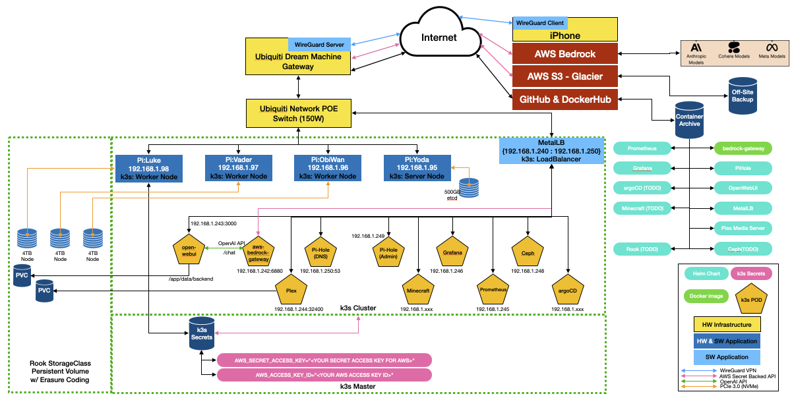
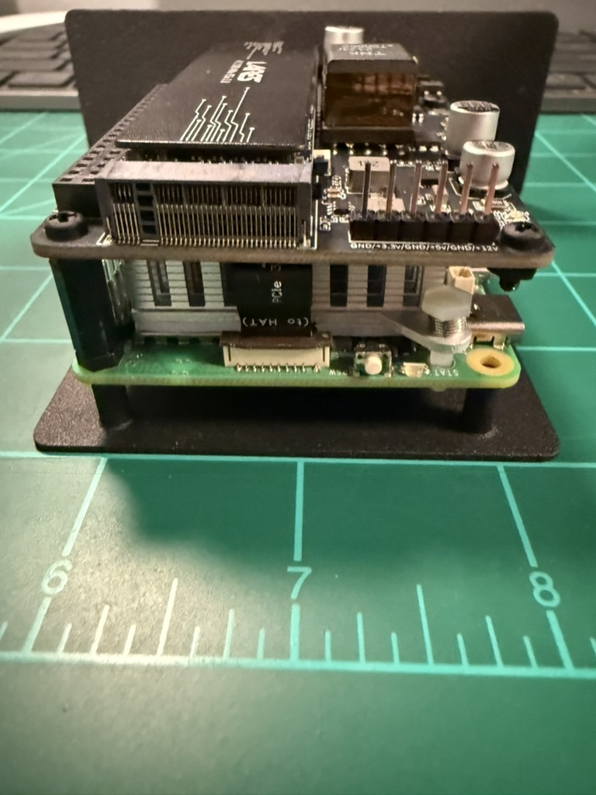
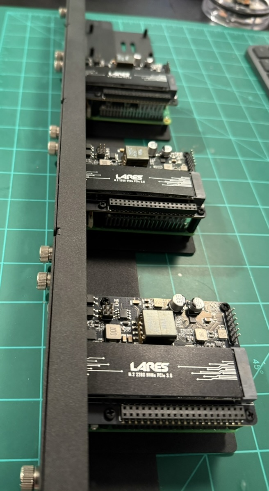
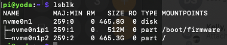
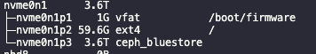

# HomeLab Raspberry Pi k3s Deployment Guide

## Architecture Overview




## Project Status
For detailed, up-to-date information about the project's context, architecture, and progress, please refer to the `memory-bank/` directory.

### Current Working State

### Core Infrastructure

1. Node Configuration
   - Control Plane: yoda (192.168.1.95)
   - Workers: anakin.local, obiwan.local, rey.local
   - K3s Version: v1.32.6+k3s1
   - OS: Debian GNU/Linux 12 (bookworm)
   - Kernel: 6.6.51+rpt-rpi-2712

2. Storage System (Rook-Ceph)
   - Status: HEALTH_OK
   - Capacity: 11 TiB total available
   - Configuration:
     * 3 OSDs using NVMe devices
     * 1 active MDS with 1 hot standby
     * Erasure-coded data pool (2+1)
     * Replicated metadata pool (size 3)
   - See `memory-bank/rook-ceph-ec-filesystem-lessons.md` for detailed configuration lessons and troubleshooting

3. Network Configuration
   - MetalLB IP Range: 192.168.1.241-254
   - Service IP Assignments:
     * Traefik: 192.168.1.241
     * Bedrock Gateway: 192.168.1.242
     * OpenWebUI: 192.168.1.243
     * Prometheus: 192.168.1.244
     * Grafana: 192.168.1.245
     * Alertmanager: 192.168.1.246
     * ArgoCD: 192.168.1.247
     * Ceph Dashboard: 192.168.1.248 (Password managed in `ansible/config.yml`)
     * PiHole Web: 192.168.1.249
     * PiHole DNS: 192.168.1.250
     * Plex: 192.168.1.251
     * N8N: 192.168.1.252

### Deployed Applications

1. Core Services
   - Rook-Ceph: Distributed storage solution
   - MetalLB: Load balancer for bare metal
   - ArgoCD: GitOps deployment management
   - Traefik: Ingress controller

2. User Services
   - PiHole: DNS and ad blocking
   - OpenWebUI: Web interface for AI interactions
   - Bedrock Access Gateway: AWS Bedrock integration
   - N8N: Workflow automation

### Storage Classes
   - rook-ceph-filesystem-ec: Erasure-coded filesystem (default for shared storage)
   - ceph-block: RBD block storage (default for block storage)
   - local-path: Local storage provisioner

All components are managed through ArgoCD, ensuring GitOps practices and consistent deployment states.


## Architecture Decision Records (ADRs)

### ADR-001: NFS Ganesha Configuration for Rook-Ceph v1.17.7

- **Status:** Implemented & Verified
- **Date:** 2025-08-10

#### Context

The project required a stable, persistent, and shareable storage solution for various applications within the Kubernetes cluster (e.g., Plex, N8N). The chosen storage backend is a Rook-Ceph cluster utilizing an erasure-coded CephFS filesystem for data efficiency. The goal was to expose this CephFS filesystem via an NFS share.

Initial attempts to configure the NFS share using high-level abstractions provided by Rook-Ceph failed. Specifically, for Rook version `v1.17.7`, the following approaches were unsuccessful:
1.  Defining the NFS server and export via the `cephNFS` block in the Helm `values.yaml` for the `rook-ceph-cluster` chart.
2.  Creating a `CephNFSExport` Custom Resource Definition (CRD) to define the share.
3.  Using the `ceph fs export create` command from within the `rook-ceph-tools` pod, which was not available in this version.

These failures led to the conclusion that the standard, documented methods were not applicable to this specific, and somewhat dated, version of Rook-Ceph. The deployment consistently failed during the Ansible task designed to verify the NFS Ganesha server startup, with the `rook-ceph-nfs` pod entering a `CrashLoopBackOff` state.

#### Decision

We adopted a low-level configuration approach that bypasses the high-level Rook APIs and interacts directly with the underlying RADOS (Reliable Autonomic Distributed Object Store) layer of Ceph. This method is the canonical way Ganesha itself is configured when using Ceph as a backend.

The implemented solution, codified within the `seadogger-homelab/ansible/tasks/rook_ceph_deploy.yml` playbook, involved several key fixes:

1.  **Correct `cephx` User ID Format:** The primary issue causing the `CrashLoopBackOff` was an authentication failure within Ganesha. The `User_Id` in the `FSAL` block of the RADOS export configuration was incorrectly specified as `"client.nfs.nfs-ec"`. Ganesha automatically prepends the `client.` prefix, resulting in a malformed user ID (`client.client.nfs.nfs-ec`) and a `Permission denied` error. The fix was to provide the `User_Id` without the prefix.

    ```yaml
    # Snippet from the corrected EXPORT object configuration
    EXPORT {
      # ... other parameters
      FSAL {
        Name = CEPH;
        User_Id = "nfs.nfs-ec"; # Corrected: Removed "client." prefix
        Secret_Access_Key = "{{ nfs_user_key }}";
        Filesystem = "ec-fs";
      }
    }
    ```

2.  **Robust Verification Task:** The Ansible task to verify the Ganesha export was made more resilient. It was modified to use `/bin/bash` explicitly to avoid `pipefail` errors on certain shells and the log-checking regex was improved for more reliable detection of the successful export creation.

3.  **Playbook Cleanup:** A redundant `Create Ganesha metadata pool` task was removed from the playbook. Rook automatically creates the necessary `.nfs` pool, making this task unnecessary and a potential source of conflict.

4.  **RADOS Configuration Update:** The core logic remains the same: create a RADOS object for the export configuration and update the main Ganesha config object (`conf-nfs.nfs-ec`) to point to it using a `%url` directive.

    ```
    %url "rados://.nfs/nfs-ec/export-100"
    ```

5.  **Pod Reload:** After the RADOS configuration is updated, the `nfs-nfs-ec-*` pods are reloaded to force them to read the new configuration from RADOS and apply the changes.

This entire process is now idempotent and fully automated via the Ansible playbook, ensuring the NFS share can be reliably provisioned.

#### Consequences

-   **Positive:**
    -   Provides a stable, working NFS share on the desired erasure-coded CephFS backend. The Ansible playbook now completes successfully.
    -   The solution is automated and idempotent, aligning with the project's GitOps principles.
    -   The configuration and the logic behind the fix are now explicitly documented and managed in source control.

-   **Negative:**
    -   The solution is highly specific to this version of Rook-Ceph and the underlying Ganesha implementation. It may break with future upgrades if the low-level configuration mechanism changes.
    -   It requires a deeper understanding of Ceph and RADOS to troubleshoot, as the configuration is abstracted away from the more user-friendly Kubernetes CRDs.

-   **Next Steps:**
    -   The NFS deployment is now fully functional.

### ADR-006: Refactor Ansible Playbooks to Fix Circular Dependency

- **Status:** Implemented & Verified
- **Date:** 2025-08-16

#### Context

A circular dependency was identified in the Ansible playbooks where ArgoCD was responsible for deploying MetalLB, but ArgoCD itself required a LoadBalancer from MetalLB to be fully functional. This created a bootstrapping problem and made the deployment process fragile.

#### Decision

The deployment process was refactored to follow a logical, sequential deployment of infrastructure components *before* any applications are deployed.

1.  **Refactored `main.yml` Deployment Order:** The `main.yml` playbook was restructured to deploy Rook-Ceph, then MetalLB, then ArgoCD, and finally the applications.
2.  **Created New Native Helm Deployment Tasks:** New tasks were created to deploy MetalLB and ArgoCD directly using Helm, removing the dependency on ArgoCD for their installation.
3.  **Refactored `cleanup.yml`:** The `cleanup.yml` playbook was updated to reflect the new deployment order, ensuring that applications are removed before the infrastructure they depend on.
4.  **Updated `config.yml` and Documentation:** The `config.yml` and `example.config.yml` files were updated to include new flags for the native deployments, and the documentation was updated to reflect the new deployment and cleanup procedures.
5.  **Cleaned Up Old Files:** The old, now-redundant deployment files were deleted.

#### Consequences

-   **Positive:**
    -   The circular dependency between ArgoCD and MetalLB has been resolved.
    -   The deployment process is now more logical, robust, and idempotent.
-   **Negative:**
    -   None. The change corrected a fundamental design flaw.

### ADR-007: Cluster Wipe and Cleanup Playbook Hardening

- **Status:** Implemented & Verified
- **Date:** 2025-08-16

#### Context

During a routine test of the refactored `cleanup.yml` playbook, the cluster was found to be in a severely corrupted state from a previous failed installation. Resources were stuck in a "Terminating" state, namespaces could not be deleted, and the `etcd` datastore was inconsistent. This prevented any automated cleanup or installation playbooks from running successfully, necessitating a deep debugging and hardening session.

#### Decision

The `wipe_k3s_cluster.yml` task was significantly refactored and hardened to transform it from a simple script into a robust, idempotent, and intelligent disaster recovery tool. The `cleanup.yml` playbook was also improved to correctly orchestrate the wipe.

1.  **Refactored `cleanup.yml` Logic:** The playbook was restructured into a two-play playbook. The first play targets the `control_plane` for API-dependent tasks (like deleting namespaces), and the second play targets `all` nodes for the destructive wipe actions (like running `k3s-uninstall.sh`). This ensures the correct nodes are targeted for each task.

2.  **Removed Faulty "Graceful" Cleanup:** A redundant and error-prone "graceful cleanup" section was removed from the beginning of the `wipe_k3s_cluster.yml` task. This logic was unreliable on a corrupted cluster and was duplicative of the main wipe actions.

3.  **Intelligent Service/File Checks:** All tasks that stop services or run uninstall scripts were updated to first check for the existence of the service or script using the `stat` module. This makes the playbook idempotent, allowing it to run on a clean or partially cleaned system without generating "file not found" or "service not found" errors.

4.  **Robust Final Verification:** A sophisticated verification block was added to the end of the playbook to assert the final state of the Ceph storage partition (`/dev/nvme0n1p3`). This assertion is intelligent and adapts its expectation based on the `perform_physical_disk_wipe` flag, ensuring the cluster is left in the desired state.

    ```yaml
    # Final verification logic
    - name: "Assert partition state matches expected policy"
      ansible.builtin.assert:
        that:
          - >
            (perform_physical_disk_wipe | default(false))
            | ternary(
                (fs_check.stdout | trim) == "",
                (fs_check.stdout | trim) in ["", "ceph_bluestore"]
              )
    ```

#### Consequences

-   **Positive:**
    -   The `wipe_k3s_cluster.yml` playbook is now a highly reliable and idempotent tool for disaster recovery, capable of cleaning a cluster in almost any state.
    -   The playbook can be run multiple times on a clean system without producing errors, which is a key principle of good automation.
    -   The risk of failed cleanup runs leaving the cluster in an inconsistent state is significantly reduced.
-   **Negative:**
    -   None. The changes dramatically improved the reliability and robustness of the cluster management automation.

### ADR-005: Ansible Playbook Robustness and Logic Corrections

- **Status:** Implemented & Verified
- **Date:** 2025-08-15

#### Context
During a deployment attempt on a freshly imaged cluster, a cascading series of failures occurred in the Ansible playbooks. The initial root cause was traced to unstable power from a faulty PoE network switch port, which led to filesystem corruption on one node. Resolving this uncovered several latent bugs in the playbooks that prevented them from running successfully in a clean environment.

#### Decision
A series of fixes were implemented to make the Ansible automation more robust, idempotent, and logically correct. For a full chronological detail of the debugging session, see the entry `memory-bank/2025-08-15-ansible-playbook-debugging-session.md`.

The key decisions were:

1.  **Add `iptables` Dependency:** The `wipe_k3s_cluster.yml` playbook failed with a "command not found" error because it assumed `iptables` was installed. A task was added to the beginning of the playbook to ensure the `iptables` package is present on all nodes.

2.  **Correct `localhost` Delegation:** Multiple tasks delegated to `localhost` (the Ansible controller) were failing with `sudo: a password is required` or `Read-only file system: /root` errors. This was caused by tasks inheriting a play-level `become: true` and Ansible incorrectly resolving the user's home directory.
    -   All delegated `localhost` tasks had `become: false` added to prevent unnecessary privilege escalation.
    -   The `{{ ansible_env.HOME }}` variable was replaced with `{{ lookup('env', 'HOME') }}` to ensure the correct local user's home directory is always used.

3.  **Fix Undefined `env_vars` Variable:** The `rook_ceph_deploy_part2.yml` playbook failed because it referenced an undefined variable `env_vars`. This was corrected by replacing the reference with the proper `environment: { KUBECONFIG: ... }` block for `kubectl` commands.

4.  **Stricter `config.yml` Logic:** The logic for enabling application deployments in `config.yml` was changed from `or` to `and`. This provides more granular control, requiring both the global stage flag (e.g., `cold_start_stage_3_install_applications`) and the individual application's manual flag (e.g., `manual_install_prometheus`) to be `true` for a deployment to run.

#### Consequences

-   **Positive:**
    -   The playbooks are now significantly more robust and can run successfully on freshly imaged nodes without manual intervention.
    -   The logic for enabling/disabling deployment stages is stricter and less prone to accidental execution.
    -   The fixes for `localhost` delegation follow Ansible best practices.
-   **Negative:**
    -   None. The changes corrected clear bugs and improved the automation's reliability.

### ADR-002: MetalLB Webhook and ArgoCD Configuration

- **Status:** Implemented & Verified
- **Date:** 2025-08-11

#### Context

Following the successful deployment of the Rook-Ceph NFS server, the `mount` command from a client failed with a timeout. Investigation revealed that the `rook-nfs-loadbalancer` service had a `<pending>` external IP, indicating that MetalLB was failing to assign one.

#### Decision

The investigation traced the failure to the `metallb-config` ArgoCD application, which was failing to sync because a required `metallb-webhook-service` was not found. The root cause was an incorrect configuration in the main `metallb` ArgoCD application within `seadogger-homelab/ansible/tasks/metallb_deploy.yml`. It was using a `valueFiles` entry that pointed to a raw manifest instead of a Helm values file, which prevented the main MetalLB chart from deploying all its required components.

The fix involved removing the incorrect `valueFiles` override from the `metallb` ArgoCD application definition. This allowed the main MetalLB chart to deploy correctly, including the essential webhook service. Once the webhook was running, the `metallb-config` application could sync successfully, create the `IPAddressPool`, and assign the external IP to the NFS service.

#### Consequences

-   **Positive:**
    -   MetalLB now deploys correctly and reliably assigns IP addresses to LoadBalancer services.
    -   The NFS share is now accessible from outside the cluster.
-   **Negative:**
    -   None. The change corrected a fundamental misconfiguration.

### ADR-003: NFS Client Incompatibility (macOS)

- **Status:** Known Limitation
- **Date:** 2025-08-11

### ADR-004: Prometheus Stack Network Policy Configuration

- **Status:** Implemented & Verified
- **Date:** 2025-08-15

#### Context
The Prometheus monitoring stack deployment initially faced accessibility issues due to restrictive network policies. The default policies from kube-prometheus only allowed internal cluster communication, preventing external access to the Prometheus, Grafana, and Alertmanager UIs through their LoadBalancer services.

#### Decision
We implemented custom network policies in the Ansible deployment playbook to allow external access while maintaining security. The solution involved:

1. Creating separate network policies for each component:
   - Prometheus (port 9090)
   - Grafana (port 3000)
   - Alertmanager (port 9093)

2. Using pod label selectors to precisely target each component:
   ```yaml
   podSelector:
     matchLabels:
       app.kubernetes.io/name: prometheus  # Similar for grafana and alertmanager
   ```

3. Allowing ingress traffic to specific ports while maintaining existing internal cluster communication rules.

4. Integrating the network policy deployment into our Ansible playbook to ensure consistent application through our GitOps workflow.

#### Consequences

- **Positive:**
  - All monitoring UIs are now accessible via their LoadBalancer IPs
  - Security is maintained through specific port and pod targeting
  - Configuration is version controlled and automated
  - Solution integrates cleanly with our existing GitOps practices

- **Negative:**
  - None significant. The implementation follows best practices for network security while enabling required functionality.

- **Next Steps:**
  - Configure Grafana dashboards
  - Set up alerting rules
  - Configure external service monitoring

#### Context

After successfully configuring the Rook-Ceph NFS server and verifying its accessibility from a Linux client (`yoda.local`), all attempts to mount the NFS share from a macOS client failed. The error message on the macOS client was `rpc.gssapi.mechis.mech_gss_log_status: a gss_display_status() failed`, which misleadingly suggested a Kerberos or GSSAPI authentication issue, even though the server was configured for simple `AUTH_SYS`.

#### Decision

To diagnose the issue at a protocol level, a packet capture (`tcpdump`) was performed on the macOS client during a mount attempt. Analysis of the resulting `nfs_traffic.pcap` file in Wireshark revealed the true root cause.

The macOS client initiated the connection using NFSv4.0. The Rook-Ceph Ganesha NFS server, which was expecting a v4.1+ session, responded to the client's initial request with an `NFS4ERR_MINOR_VERS_MISMATCH` error. This error indicates a fundamental incompatibility between the specific minor version of the NFSv4 protocol implemented by the macOS client and the one implemented by the NFS-Ganesha server in this version of Rook-Ceph.

Since this is a protocol-level incompatibility and not a configuration error on our part, no further configuration changes on the server can resolve it. The decision is to accept this as a known limitation of the current setup.

#### Consequences

-   **Positive:**
    -   The root cause of the mount failure is definitively identified and understood.
    -   Prevents future time wasted on debugging this specific client-server combination.
    -   The NFS service remains fully functional and accessible for compatible clients (e.g., Linux).

-   **Negative:**
    -   The NFS share cannot be used by macOS clients in its current state.
    -   Future workarounds might involve using a different file sharing protocol for macOS (like Samba) or waiting for future updates to either the macOS client or the NFS-Ganesha server that might resolve the version mismatch.

## Prerequisites

### Hardware Requirements
- Raspberry Pi5 nodes (1 server node and 3 worker nodes)
- POE switch (recommended: Ubiquiti Dream @Machine SE)
  - Powers Raspberry Pis via POE HAT
  - Simplifies the wiring and setup, but not totally neccessary.  
  - **If you do not use POE, adjust the BoM (e.g. rack mounted solution will be different, likely)**
- Ethernet cables for hardwired connections
  - WiFi is disabled and not recommended for k3s clusters

### Network Setup
- DHCP static IP assignments for all Raspberry Pis
  - Configured on network switch for centralized management
  - Static IPs required for k3s cluster nodes
- DHCP service range configuration
  - Reserve IPs up to 192.168.1.239
  - Leaves space for MetalLB allocation above this range
  - NOTE - If you are using a different subnet, there is a lot of changes to apply throughout the deployment scripts.  
  `TODO: centralize the subnet in the ansible manifest config.yaml`
- WireGuard (optional)
  - Required only for remote access
  - Provides encrypted tunnels for services like OpenWebUI, PiHole when you are not on your network

### Software Requirements
- SSH enabled on all Raspberry Pis
- AWS account with [Bedrock](https://jrpospos.blog/posts/2024/08/using-amazon-bedrock-with-openwebui-when-working-with-sensitive-data/) API tokens
- Working knowledge of:
  - Docker containers and orchestration
  - Basic AWS services
  - Git and GitHub CLI tools

### Development Environment
- VS Code (recommended) with:
  - Continue Extension
  - SSH Remote Extension
- Alternative: SSH terminal access


# Bill of Materials

| Item | Quantity | Cost per Unit | Total Cost |
|------|----------|--------------|------------|
| [Raspberry Pi 5 8GB](https://www.digikey.com/en/products/detail/raspberry-pi/SC1112/21658257?s=N4IgjCBcpgrAnADiqAxlAZgQwDYGcBTAGhAHsoBtEAJngBYwwB2EAXRIAcAXKEAZS4AnAJYA7AOYgAviQC0dFCHSRs%2BYmUrgAzAAYdW5CUbwmYeGykyamwVjwcARgUGCAngAIOw2BaA) | 4 | $80 | $320 |
| [Raspberry Pi Rack](https://www.amazon.com/gp/product/B09D7RR6NY/ref=ewc_pr_img_2?smid=A2IAB2RW3LLT8D&psc=1) | 1 | $53 | $53 |
| [GPIO Header with shorter standoff](https://www.amazon.com/dp/B084Q4W1PW?ref=ppx_yo2ov_dt_b_fed_asin_title) | 1 | $10 | $10 |
| [Raspberry Pi 5 POE HAT with PCIe](https://www.amazon.com/dp/B0D8JC3MXQ?ref=ppx_yo2ov_dt_b_fed_asin_title) | 4 | $37 | $148 |
| [Crucial P3 4TB NVMe SSD](https://www.newegg.com/crucial-4tb-p3/p/N82E16820156298?Item=9SIA12KJ9P1073) | 3 | $225 | $675 |
| [Crucial P3 500GB NVMe SSD](https://www.newegg.com/crucial-500gb-p3-nvme/p/N82E16820156295) | 1 | $38 | $38 |
| [Nylon Standoff Kit](https://www.amazon.com/gp/product/B06XKWDSPT/ref=ox_sc_act_title_1?smid=A2XXMW1BKOEL72&psc=1) | 1 | $13 | $13 |
| [64GB sdCard](https://www.amazon.com/dp/B08879MG33?ref_=ppx_hzsearch_conn_dt_b_fed_asin_title_13&th=1) | 1 | $25 | $25 |
| **Total Cost (Excludes POE Switch)** | **-** | **-** | **$1282** |

# Get Remote PC ready for Ansible Deployment 
Clone the Ansible tasks to your remote PC to that will manage the k3s cluster
   ```bash
   git clone https://github.com/seadogger/seadogger-homelab.git
   ```

# Raspberry Pi 5 Setup

## POE HAT and Drive install

Install POE HAT with NVMe PCIe adapter on all Raspberry Pi 5s

 

> **Note**: The BoM includes nylon standoffs.  The solution I found uses an 11mm male standoff with a 2mm nut on the male standoff and a 2mm nylon nut on top with a nylon screw thru to the top nut and into the standoff.  This gives you about 15.5mm of total height between the Pi and the POE HAT.  Less than that and it will not fit over the USB ports.  More than that and the POE transformer hits the top of the rack



## NVMe Drive list recommendations

> **Note**: I have not tested all the drives from this list.   The NVMe drives in the latest BoM do work with the HAT and Pi5 

> **Note**:  [This](https://www.amazon.com/gp/product/B08DTP8LG8/ref=ewc_pr_img_1?smid=A2CP9SZGVW0PFE&th=1) NVMe drive has been tested and does not work. **DO NOT BUY this one!**


## [Raspberry Pi Setup](https://youtu.be/x9ceI0_r_Kg)

This setup assumes a Raspberry Pi5 64 bit OS Lite (no desktop) will be setup in a k3s cluster with a single server node and 3 worker nodes with 4TB in each worker node. 

The approach taken to get to here included flashing the Raspberry Pi OS (64-bit, lite) to the storage devices using Raspberry Pi Imager onto a 64GB sdCard.  This was then installed into each Pi and transferred to the NVMe in the previous section.  This should be successful before proceeding into this step.

To make network discovery and integration easier, I edit the advanced configuration in Imager, and set the following options:

  - Set hostname: `node1.local` (set to `2` for node 2, `3` for node 3, etc.)
  - Enable SSH
  - Disable WiFi

After setting all those options, and the hostname is unique to each node (and matches what is in `hosts.ini`), I inserted the microSD cards into the respective Pis, or installed the NVMe SSDs into the correct slots, and booted the cluster.


## SSH connection test

To test the SSH connection from the host or PC you intend to run Ansible from, connect to each server individually, and accepted the hostkey.  This must be done for all nodes so password is not requested by the nodes during the Ansible playbook run:

```
ssh-copy-id pi@node[X].local
ssh pi@192.168.1.[X]
ssh pi@node[X].local
```

This ensures Ansible will also be able to connect via SSH in the following steps. You can test Ansible's connection with:

```
ansible all -m ping
```

It should respond with a 'SUCCESS' message for each node.

## NVMe Boot and 4TB NVMe Drive Setup  

This guide will help you set up and use a **4TB NVMe drive** on a **Raspberry Pi 5**. This process involves partitioning, formatting, cloning partitions, updating `/etc/fstab`, and troubleshooting common issues.

`rpi-clone` seems to reset the partition table to MBR vs. GPT so we lose storage space as MBR is confined to 2TB.  These scripts are very specific the hardware stack choosen in the BoM for partition setup and reformats these partitions and you will lose any data on them.  **Use at your own risk!**

I am using a 64GB sdCard and transitioning the `/boot` and `/` mounts to a `4TB NVMe` using the `52Pi POE w/PCIe HAT`.  This will partition the NVMe just slightly larger than the partitions on the sdCard so the rsync transfers complete without error but we do not waste a ton of space.  

> **Note**: All the sector definitions are based on this size sdCard for gdisk.  If you are using a smaller or larger sdCard you will need to modify the partition tables settings in these scripts.  

### Prepare the 512GB NVMe Drive (Master Node)
```bash
   git clone https://github.com/seadogger/seadogger-homelab.git
   cd seadogger-homelab/useful-scripts
   sudo ./partition_and_boot_NVMe_master_node.sh
```

### Prepare the 4TB NVMe Drive (Worker / Storage Node)
```bash
   git clone https://github.com/seadogger/seadogger-homelab.git
   cd seadogger-homelab/useful-scripts
   sudo ./partition_and_boot_NVMe_worker_node.sh
```
> **Note**:  Rook does not want formatted partitions which is different than Longhorn so the Partitioning and Cloning script leaves the 3rd partition completely alone and unformatted.

> **Note**: Rook and Ceph are more enterprise ready and enables future growth into LakeFS

## Rook-Ceph Storage Configuration

The cluster uses Rook-Ceph for distributed storage with:
- 3 OSDs using NVMe devices
- 1 active MDS with 1 standby
- Erasure-coded data pool (2+1)
- Replicated metadata pool (size 3)

### Important Notes

1. Node Names
   - The configuration uses specific node names (anakin.local, obiwan.local, rey.local)
   - Update these in the values file if node names change

2. Storage Pool Naming
   - Data pool is named "data" in the configuration
   - Ceph automatically prefixes this with the filesystem name (e.g., "ec-fs-data")
   - This is important when referencing pools in storage class configurations

3. Resource Requirements
   - MDS requires at least 512MB memory (4GB recommended)
   - Adjust resource limits based on workload

4. Storage Classes
   - rook-ceph-filesystem-ec: For CephFS with erasure coding
   - ceph-block: For RBD (default)


## Script Summary

1. Partition the NVMe drive using GPT.
2. Format partitions (`vfat` for EFI, `ext4` for root).
3. Clone partitions from the SD card using `rsync`.
4. Update `/etc/fstab`, `/boot/firmware/config.txt`, and `/boot/firmware/cmdline.txt`
5. Cloning the sdCard to the NVMe partition structure
6. Running disk checks on the NVMe `e2fsck` and `fsck.vfat`
7. Reload systemd daemon.
8. A few manual steps after the script runs to get everything ready (Change boot order, shutdown and reboot)

> **Note**: Before you reboot after the above you need to setup for NVMe to boot first in the boot order
- Set the NVMe first in the boot order 
    ```bash
     sudo raspi-config
    ``` 
Under advanced options set the boot order to boot the NVMe first.  
> **Note**: When prompted to reboot **`decline`.  We will reboot in the next step.**

- Shutdown:
   ```bash
   sudo shutdown now
   ```
- Pull the sdCard out and reboot

- Verify partitions are correctly mounted:
   ```bash
   lsblk -o NAME,SIZE,FSTYPE,MOUNTPOINT
   ```
### Master Node


### Worker / Storage Nodes


# Raspberry Pi Cluster Mangement with Ansible

## Usage

  1. Make sure [Ansible](https://docs.ansible.com/ansible/latest/installation_guide/intro_installation.html) is installed on your remote PC (in my case it is a Macbook Air and is attached on the same subnet as my cluster).
  
  2. Copy the `example.hosts.ini` inventory file to `hosts.ini`. Make sure it has the `control_plane` and `node`(s) configured correctly.
  
  3. Copy the `example.config.yml` file to `config.yml`, and modify the variables to your setup.


## Cluster configuration, K3s, App deployment

**This is where the magic of Ansible and ArgoCD take over**

Run the installation playbook:

```
ansible-playbook main.yml
```

To perform cleanup operations, from targeted application removal to a full cluster wipe, use the new cleanup playbook:

```
ansible-playbook cleanup.yml
```
The `cleanup.yml` playbook is organized into three stages:
1.  **Application and Service Cleanup:** This stage iterates through the `pod_cleanup_list` in `config.yml` and gracefully removes each application.
2.  **Core Infrastructure Cleanup:** This stage removes the core infrastructure components (Prometheus, ArgoCD, MetalLB, and Rook-Ceph) in the correct order.
3.  **Cluster Wipe:** This stage performs a full, destructive wipe of the k3s cluster.

See the detailed instructions within `ansible/config.yml` for usage patterns.

   - Updates apt package cache
   - Configures cgroups are configured correctly in cmdline.txt.
   - Installs necessary packages
   - Enables and starts iscsid service
   - Configures PCIe settings exist in config.txt
   - Loads dm_crypt kernel module
   - Loads rbd kernel module
   - Appends dm_crypt and rbd to /etc/modules
   - Updates Raspberry Pi firmware to rpi-6.6.y
   - Setup/deploy k3s to the control_plane (e.g. server node)
   - Setup/deploy k3s to the worker node(s)

   `NOTE - if you get an error about cgroups you should perform a reboot and run the ansible script again` 

   - TODO - Need to deploy Ceph-Rook separately between these deployments
   - Deploy ArgoCD for GitOps

   - Deploy PODs/Apps thru ArgoCD  

      - MetalLB
      - Rook-Ceph
      - AWS Bedrock
      - PiHole
      - Prometheus and Grafana
      - OpenWeb UI
      - Plex Media Server
      - N8N
      - `TODO - Minecraft Server`

> **Note**: Applications are deployed declaratively through ArgoCD, ensuring GitOps best practices

## Upgrading the cluster

Run the upgrade playbook:

```
ansible-playbook upgrade.yml
```

## Benchmarking the cluster

See the README file within the `benchmarks` folder.  **Credit and Thanks to [Jeff Geerling](https://www.jeffgeerling.com)**


#### [SDCard Vs. NVMe IO Performance](https://forums.raspberrypi.com/viewtopic.php?t=362903)


## Cold Start Procedure

A full, destructive "cold start" of the cluster can be performed to validate the IaaC configuration. This process has been significantly refactored for safety and clarity.

The new workflow is a deliberate, two-playbook process:

1.  **Teardown (`cleanup.yml`)**: This playbook is the single entry point for all destructive operations.
    -   To perform a full cold start, edit `ansible/config.yml` and set `cold_start_stage_1_wipe_cluster: true`.
    -   Run the command: `ansible-playbook cleanup.yml`.
    -   This will gracefully tear down all applications and infrastructure in the correct order before wiping the k3s installation from all nodes.
    -   For an even deeper clean that includes wiping the Ceph storage partition, also set `perform_physical_disk_wipe: true`. **Warning:** This is a data-loss operation.

2.  **Installation (`main.yml`)**: This playbook is now solely responsible for installation and upgrades.
    -   To install the cluster, edit `ansible/config.yml` and set `cold_start_stage_2_install_infrastructure: true` and `cold_start_stage_3_install_applications: true`.
    -   Run the command: `ansible-playbook main.yml`.

This two-step process prevents accidental cluster wipes and ensures a clear separation between build and destroy operations. For more granular cleanup options, see the detailed instructions in `ansible/config.yml`.

## Shutting down the cluster

The safest way to shut down the cluster is to run the following command:

```
ansible all -m community.general.shutdown -b
```

You can reboot all the nodes with:

```
ansible all -m reboot -b
```

# Learning Outcomes

## Technologies
- [Kubernetes (k3s)](https://docs.k3s.io/architecture) architecture and deployment
- [kubectl](https://kubernetes.io/docs/reference/kubectl/) for cluster management
- [Deploying Plex on Kubernetes](https://www.debontonline.com/2021/01/part-14-deploy-plexserver-yaml-with.html)

## Author
The repository was forked from [Jeff Geerling](https://www.jeffgeerling.com)'s Pi-Cluster project and was modified by [seadogger]().
