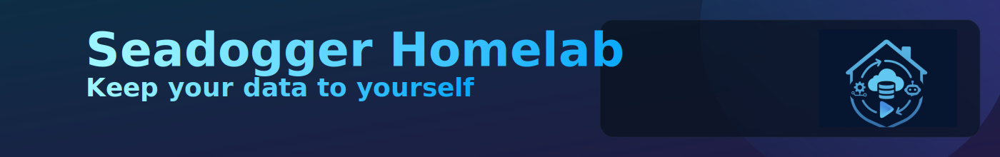

<p align="center">
  
</p>

<div align="center">

**Production-Ready Kubernetes Homelab on Raspberry Pi 5 Cluster**

[](https://github.com/seadogger-tech/seadogger-homelab/wiki) [](https://github.com/seadogger-tech/seadogger-homelab/issues) [](LICENSE)

*Enterprise-grade infrastructure • GitOps automation • Self-hosted privacy*

[Features](#-features) • [Quick Start](#-quick-start) • [Documentation](#-documentation) • [Tech Stack](#-tech-stack)

</div>

---

## 🚀 Overview

**Seadogger Homelab** is a fully automated, production-ready Kubernetes cluster running on Raspberry Pi 5 hardware. Deploy a complete self-hosted cloud platform in 30 minutes with enterprise-grade features: distributed storage, AI capabilities, media streaming, workflow automation, and comprehensive monitoring.

**Perfect for:**
- 🏠 **Homelab enthusiasts** seeking production-quality infrastructure
- 💻 **Developers** needing local Kubernetes environments
- 🎓 **Students** learning cloud-native technologies
- 🔒 **Privacy advocates** wanting full data ownership


---

## ✨ Features

### 🏗️ **Core Infrastructure**
- **K3s Kubernetes** - Lightweight, production-ready orchestration
- **ArgoCD GitOps** - Declarative, automated deployments
- **Rook-Ceph Storage** - Distributed storage with erasure coding (4+2 EC)
- **MetalLB** - Bare-metal load balancing
- **Traefik Ingress** - Automatic HTTPS with internal PKI
- **Ansible Automation** - One-command deployment

### 📦 **Applications**
- **🤖 OpenWebUI + AWS Bedrock** - AI chat with Claude/Sonnet models
- **☁️ Nextcloud** - Personal cloud storage (4TB+)
- **🎬 Jellyfin** - Media server with live TV (HDHomeRun)
- **⚙️ N8N** - Workflow automation and integrations
- **🛡️ PiHole** - Network-wide DNS and ad-blocking
- **📊 Prometheus + Grafana** - Comprehensive monitoring

### 🔐 **Security & Reliability**
- Internal PKI with cert-manager
- WireGuard VPN for remote access
- Kubernetes secrets encryption
- S3 Glacier disaster recovery (planned)
- 24/7 uptime with HA storage

---

## 🎯 Quick Start

### Prerequisites
- **Hardware:** 4× Raspberry Pi 5 (8GB RAM) - 1 control plane + 3 workers
  - Control plane: 500GB NVMe storage
  - Workers: 4TB NVMe storage each (for Rook-Ceph)
- **Network:** Static IPs, MetalLB range (192.168.1.240-254)
- **Software:** Ansible, kubectl, AWS account (for Bedrock)

### Deploy in 3 Steps

```bash
# 1. Clone repository
git clone https://github.com/seadogger-tech/seadogger-homelab.git
cd seadogger-homelab/core

# 2. Configure your cluster
cp ansible/example.config.yml ansible/config.yml
# Edit ansible/config.yml with your settings
# Edit ansible/hosts.ini with your Pi IP addresses

# 3. Deploy everything (takes ~30 minutes)
ansible-playbook ansible/main.yml
```

**That's it!** Your cluster is live with all applications deployed.

---

## 📖 Documentation

Comprehensive guides available in the **[GitHub Wiki](https://github.com/seadogger-tech/seadogger-homelab/wiki)**:

| Documentation | Description |
|---------------|-------------|
| **[Architecture](https://github.com/seadogger-tech/seadogger-homelab/wiki/02-Architecture)** | System design with interactive C4 diagrams |
| **[Bootstrap Guide](https://github.com/seadogger-tech/seadogger-homelab/wiki/04-Bootstrap-and-Cold-Start)** | Complete deployment walkthrough |
| **[Hardware Setup](https://github.com/seadogger-tech/seadogger-homelab/wiki/03-Hardware-and-Network)** | Bill of materials and network topology |
| **[Troubleshooting](https://github.com/seadogger-tech/seadogger-homelab/wiki/12-Troubleshooting)** | Common issues and solutions |
| **[Runbooks](https://github.com/seadogger-tech/seadogger-homelab/wiki/17-Runbooks)** | Operational procedures |

---

## 🏗️ Tech Stack

<table>
<tr>
<td width="50%">

**Platform**
- Raspberry Pi OS (ARM64)
- K3s Kubernetes
- Ansible automation
- ArgoCD GitOps

**Infrastructure**
- Rook-Ceph storage
- MetalLB load balancer
- Traefik ingress
- cert-manager PKI

</td>
<td width="50%">

**Monitoring**
- Prometheus metrics
- Grafana dashboards
- Alertmanager

**Applications**
- Nextcloud • Jellyfin
- OpenWebUI • N8N
- PiHole • Portal (Pro)

</td>
</tr>
</table>

---

## 📊 Project Status

**Current Version:** Production (September 2025)
**Cluster Uptime:** Running 24/7 with active users
**Data Managed:** ~4TB (Nextcloud, Jellyfin media)

### ✅ What Works
- K3s cluster (1 control plane + 3 workers)
- Rook-Ceph distributed storage (3-node, erasure coding 4+2 EC + replication)
- ArgoCD GitOps deployment pipeline
- All applications deployed and operational
- Internal PKI with automatic TLS certificates
- Prometheus/Grafana monitoring stack
- WireGuard VPN remote access

### 🚧 Roadmap
See **[Refactoring Roadmap](https://github.com/seadogger-tech/seadogger-homelab/wiki/19-Refactoring-Roadmap)** and **[GitHub Issues](https://github.com/seadogger-tech/seadogger-homelab/issues)**

**Priority 0:**
- [#24](https://github.com/seadogger-tech/seadogger-homelab/issues/24) S3 Glacier disaster recovery (4TB backup)
- [#47](https://github.com/seadogger-tech/seadogger-homelab/issues/47) ARM64 staging environment

**Priority 1:**
- [#48](https://github.com/seadogger-tech/seadogger-homelab/issues/48) Pure GitOps refactor (eliminate deployment dependencies)
- Keycloak SSO integration (Pro)

**Future Enhancements:**
- [Pro #5](https://github.com/seadogger-tech/seadogger-homelab-pro/issues/5) K3s HA control plane (3 control plane nodes)

---

## 🎓 Learning Resources

**New to Kubernetes?**
- [K3s Documentation](https://docs.k3s.io/)
- [Kubernetes Basics](https://kubernetes.io/docs/tutorials/kubernetes-basics/)

**New to GitOps?**
- [ArgoCD Getting Started](https://argo-cd.readthedocs.io/en/stable/getting_started/)
- [Kustomize Tutorial](https://kubectl.docs.kubernetes.io/guides/introduction/kustomize/)

**Raspberry Pi Clusters:**
- [Jeff Geerling's Pi Cluster](https://github.com/geerlingguy/turing-pi-cluster)

---

## 🤝 Contributing

Found a bug? Have a suggestion? Contributions welcome!

- **🐛 Bug Reports:** [Open an issue](https://github.com/seadogger-tech/seadogger-homelab/issues/new)
- **💡 Feature Requests:** [Start a discussion](https://github.com/seadogger-tech/seadogger-homelab/discussions)
- **🔧 Pull Requests:** Fork, branch, and submit a PR

---

## 📜 License

This project is licensed under the MIT License - see [LICENSE](LICENSE) for details.

---

## 🙏 Acknowledgments

Originally forked from [Jeff Geerling's Pi Cluster](https://www.jeffgeerling.com) project and extensively modified for production homelab deployment.

**Built with:**
- AWS Bedrock Gateway from [aws-samples](https://github.com/aws-samples/bedrock-access-gateway)
- Rook-Ceph storage from [Rook Project](https://rook.io)
- ArgoCD from [Argo Project](https://argoproj.github.io)

---

<div align="center">

**Built with ❤️ using Raspberry Pi, Kubernetes, and Open Source**

[📖 Wiki](https://github.com/seadogger-tech/seadogger-homelab/wiki) • [🐛 Issues](https://github.com/seadogger-tech/seadogger-homelab/issues) • [💬 Discussions](https://github.com/seadogger-tech/seadogger-homelab/discussions)

⭐ **Star this repo if you find it useful!**

</div>