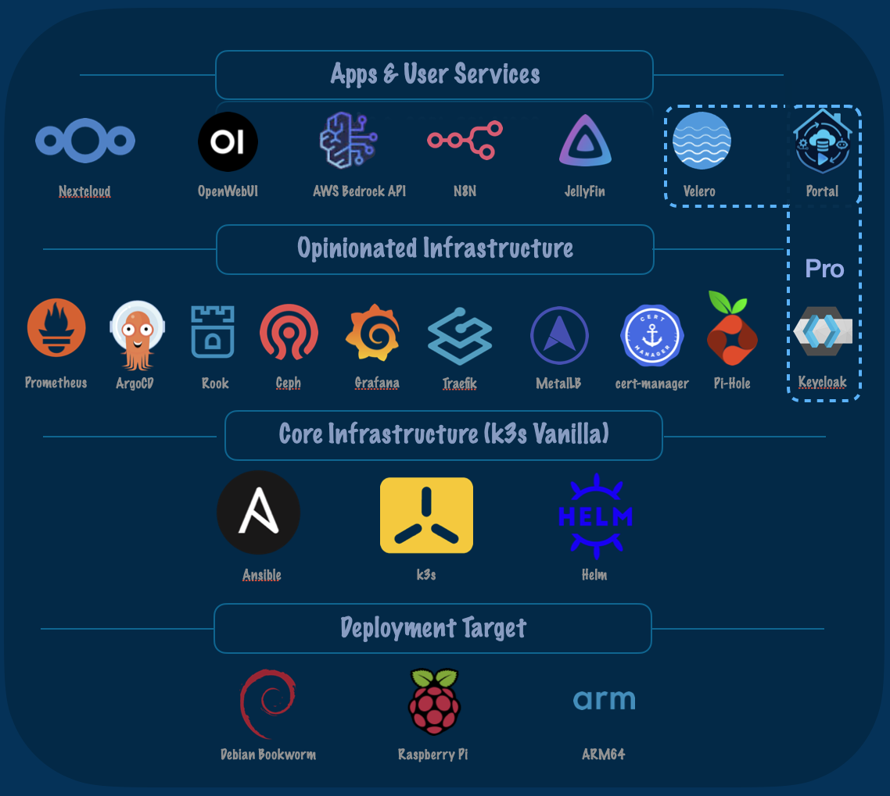

# Overview

Test new org push

The primary goal of this project is to create a robust and well-documented guide for deploying a Kubernetes (k3s) cluster on a set of Raspberry Pi 5 nodes. The deployment should be automated using Ansible and manage applications via ArgoCD, following GitOps best practices.

# Problem Statement

Setting up a personal homelab, especially a Kubernetes cluster on Raspberry Pi hardware, can be a complex and error-prone process. Many guides are incomplete, outdated, or lack the automation needed for a reliable and maintainable setup. This project aims to solve that by providing a comprehensive, automated, and well-documented solution.

# Key Goals

*   **Reproducibility:** The setup and deployment process should be clearly documented and scripted to allow others to reproduce the homelab environment with minimal effort.
*   **Automation:** Leverage Ansible for infrastructure provisioning and configuration to ensure consistency and reduce manual intervention.
*   **GitOps:** Use ArgoCD to manage all Kubernetes applications, ensuring that the cluster state is defined declaratively in a Git repository.
*   **Comprehensive Documentation:** Provide detailed guides, diagrams, and explanations covering hardware setup, software configuration, and operational procedures.
*   **Extensibility:** The architecture should be modular to allow for the addition of new services and applications over time.

# Target Audience

*   **Hobbyists and Enthusiasts:** Individuals interested in learning about Kubernetes, cloud-native technologies, and running their own services at home.
*   **Developers:** Engineers who want a local development environment that mirrors production cloud environments.
*   **Students and Learners:** Anyone looking for a hands-on project to understand modern infrastructure and DevOps practices.

# How It Works

The project provides a set of Ansible playbooks and Kubernetes and Helm manifests that automate the entire setup process, from configuring the Raspberry Pi nodes to deploying a suite of useful applications. Users clone the repository, customize a few configuration files, and run a single command to bring up the entire cluster.

# User Experience Goals

*   **Simplicity:** The setup process should be as simple as possible, abstracting away much of the underlying complexity.
*   **Clarity:** The documentation should be clear, concise, and easy to follow, with diagrams and examples to aid understanding.
*   **Reliability:** The resulting homelab should be stable and reliable, providing a solid platform for running various services.
*   **Flexibility:** While providing a default set of applications, the project should be flexible enough to allow users to easily add or remove services to suit their needs.

# Core Technologies

*   **Operating System:** Debian GNU/Linux 12 (bookworm) on all Raspberry Pi nodes.
*   **Container Orchestration:** Kubernetes (k3s)
*   **Infrastructure Automation:** Ansible
*   **GitOps:** ArgoCD
*   **Distributed Storage:** Rook-Ceph
*   **Ingress Controller:** Traefik
*   **PKI:** Cert-Manager w/ Traefik TLS termination
*   **Load Balancer & IP L2Advertisement:** MetalLB
*   **Monitoring:** Prometheus, Alertmanager, & Grafana
*   **DNS & Ad-Blocking:** PiHole
*   **User Apps/Services:** Nextcloud, Jellyfin, OpenwebUI, N8N
*   **Hardware:** Raspberry Pi 5 nodes. While it may be adaptable to other hardware, the documentation and scripts are tailored to this platform.
*   **Networking:** The project assumes a specific networking setup including static IP assignments, designated IP range for MetalLB, and Traefik routing 
*   **Storage:** Rook-Ceph

# Development Environment

*   **Code Editor:** VS Code is recommended, particularly with the SSH Remote and Continue extensions.
*   **Configuration Files:** The primary configuration files for the user are `hosts.ini` and `config.yml` within the `ansible/` directory.
*   **Git:** A working knowledge of Git and GitHub is required for managing the repository and contributing.

# Dependencies

*   **Ansible:** Must be installed on the machine used to manage the cluster.
*   **kubectl:** Required for interacting with the Kubernetes cluster.
*   **AWS Account:** An AWS account with Bedrock API tokens is needed for the Bedrock Access Gateway service.

# Project Status
The project is current fully functional as of 09-07-2025. The core infrastructure is solid and is able to be deployed with a single button press (takes about 30 minutes).  The remaining integration issues are quality of life updates identified above.

## What Works

*   **Core Infrastructure:** The Kubernetes (k3s) cluster is up and running on the Raspberry Pi 5 nodes.
*   **Node Configuration:** The control plane and worker nodes are configured and managed by Ansible.
*   **Storage System:** Rook-Ceph is deployed and providing distributed storage with both erasure-coded and replicated pools.
*   **Network Configuration:** MetalLB and Traefik are functioning, providing load balancing and ingress for deployed services.
*   **GitOps:** ArgoCD is successfully managing the deployment of most applications.
*   **Monitoring Stack:** The Prometheus and Grafana deployments are stable.
*   **User Apps & Services:** PiHole, OpenWebUI, Bedrock Access Gateway, N8N, JellyFin, and Nextcloud are deployed and operational.

## What's Left to Build

*   **Portal:** Single pane of glass to access applications and monitor tech stack.  Everything is a separate dashboard (functional but not ideal)
*   **Single Sign On Integration:** Enable single sign on thru Keycloak.

## Known Issues

*   **NFS Compatibility:** Ganesha NFS (via CephFS) has compatibility issues with macOS clients, so this was deprecated and replaced with Nextcloud
*   **Plex Media Server:** Plex states support for k3s but Plex Pass is a PITA to deploy locally w/o Plex supervision.  Replaced media capabilities with JellyFin

# Prerequisites

## Hardware Requirements
- Raspberry Pi5 nodes (1 server node and 3 worker nodes)
- POE switch (recommended: Ubiquiti Dream @Machine SE)
  - Powers Raspberry Pis via POE HAT
  - Simplifies the wiring and setup, but not totally neccessary.  
  - **If you do not use POE, adjust the BoM (e.g. rack mounted solution will be different, likely)**
- Ethernet cables for hardwired connections
  - WiFi is disabled and not recommended for k3s clusters

## Network Setup
- DHCP static IP assignments for all Raspberry Pis
  - Configured on network switch for centralized management
  - Static IPs required for k3s cluster nodes
- DHCP service range configuration
  - Reserve IPs up to 192.168.1.239
  - Leaves space for MetalLB allocation above this range
  - NOTE - If you are using a different subnet, there is a lot of changes to apply throughout the deployment scripts.  
  `TODO: centralize the subnet in the ansible manifest config.yaml`
- WireGuard (optional)
  - Required only for remote access
  - Provides encrypted tunnels for services like OpenWebUI, PiHole when you are not on your network

## Software Requirements
- SSH enabled on all Raspberry Pis
- AWS account with [Bedrock](https://jrpospos.blog/posts/2024/08/using-amazon-bedrock-with-openwebui-when-working-with-sensitive-data/) API tokens
- Working knowledge of:
  - Docker containers and orchestration
  - Basic AWS services
  - Git and GitHub CLI tools

# Learning Outcomes

## Technologies
- [Kubernetes (k3s)](https://docs.k3s.io/architecture) architecture and deployment
- [kubectl](https://kubernetes.io/docs/reference/kubectl/) for cluster management

# Author
The repository was forked from [Jeff Geerling](https://www.jeffgeerling.com)'s Pi-Cluster project and was modified by [seadogger]().
