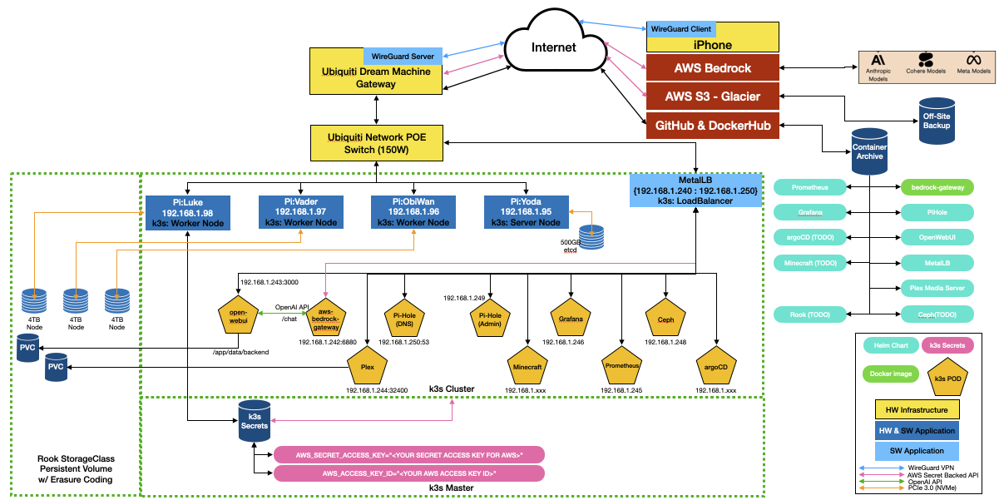

# Architecture

This document describes the system architecture, key technical decisions, and design patterns used in the `seadogger-homelab` project.

## Core Architecture

The architecture is based on a Kubernetes (k3s) cluster running on a group of Raspberry Pi 5 nodes.

*   **Control Plane:** A single Raspberry Pi 5 node acts as the master, running the Kubernetes control plane components.
*   **Worker Nodes:** Three additional Raspberry Pi 5 nodes serve as workers, running the application workloads.
*   **Storage:** A distributed storage solution, Rook-Ceph, is deployed across the worker nodes, providing persistent storage for stateful applications.
*   **Networking:** MetalLB is used to provide LoadBalancer services for exposing applications to the local network. Traefik is used as the Ingress controller.

## Key Technical Decisions

*   **Kubernetes Distribution:** k3s was chosen for its lightweight nature and suitability for resource-constrained environments like the Raspberry Pi.
*   **Infrastructure as Code:** Ansible is used for provisioning and configuring the cluster nodes, ensuring a declarative and repeatable setup process.
*   **GitOps:** ArgoCD is the cornerstone of the application deployment strategy. All application configurations are stored in a Git repository, and ArgoCD ensures the cluster state matches the desired state in Git. The only portion of the project which is not managed by Argo is the deployment of Rook-Ceph.
*   **Distributed Storage:** Rook-Ceph is used to provide a resilient and scalable storage layer, abstracting the underlying NVMe drives on the worker nodes.

## Design Patterns

*   **Declarative Configuration:** All aspects of the system, from infrastructure to applications, are defined declaratively in configuration files (Ansible playbooks, Kubernetes manifests).
*   **Immutable Infrastructure:** The goal is to treat the cluster nodes as immutable. Changes are made by updating the Ansible playbooks and re-running them, rather than making manual changes to the nodes.
*   **Separation of Concerns:** The project is structured to separate concerns:
    *   `.github/workflow/`: Automated workflow that will sync the Wiki docs when anything is checked into the source repo.
    *   `ansible/`: Infrastructure provisioning.
    *   `benchmarks/`: Scripts to benchmark system storage capabilities.
    *   `certificates/`: Manifests which create TLS certs from the cert-manager for each app.
    *   `deployments/`: This directory contains Helm values files and Kubernetes manifests that are referenced by ArgoCD for application deployment.
    *   `docs/wiki/`: Project Wiki repository.
    *   `ingress/`: Manifest which setup ingress routes for each app thru Traefik.
    *   `useful_scripts/`: Scripts for partitioning 4TB NVMe drive as well as getting the RPi5 to boot from the NVMe vs. SDCard.
    *   `memory-bank/`: Project documentation waiting to be integrated into the project Wiki.
*   **Application Deployment Workflow:** Each application (POD) deployment follows a consistent pattern:
    1.  **Ansible Task:** An Ansible task is responsible for the entire lifecycle of an application. This task can be enabled or disabled via the `config.yml` file.
    2.  **Cleanup:** The task begins by cleaning up any resources from previous deployments to ensure a clean state.
    3.  **Namespace Creation:** A dedicated Kubernetes namespace is created for the application.
    4.  **ArgoCD Application:** The task deploys an ArgoCD `Application` resource, which points to the application's configuration (Helm values or Kubernetes manifests) in the Git repository.
    5.  **Synchronization:** ArgoCD then takes over, continuously monitoring the Git repository and ensuring the deployed application's state matches the configuration.

