# Architecture

This document describes the system architecture, key technical decisions, and design patterns used in the `seadogger-homelab` project.

## Interactive Architecture Diagrams

Visual representations at different levels of abstraction, following C4 model principles.

---
> **🌙 Diagram Viewing Recommendation**
>
> The interactive Mermaid diagrams below are **optimized for GitHub Dark Mode** to provide maximum readability and visual impact.
>
> **To enable Dark Mode:** GitHub Settings → Appearance → Theme → **Dark default**
>
> *Light mode users can still view the diagrams, though colors may appear less vibrant.*
---

### Level 1: System Context

Shows the homelab system, users, and external integrations.

**Key Access Patterns:**
- **LAN Users:** Direct access to homelab services (HTTPS only)
- **External Users:** WireGuard VPN through Ubiquiti Dream Machine → Homelab
- **Administrators:** Direct kubectl/Ansible access for management
- **Security:** All external traffic encrypted via VPN tunnel

### Level 2: Container Diagram - K3s Infrastructure

Shows major services and applications within the cluster.

```mermaid
graph TB
    User([👤 User<br/>LAN or VPN])

    subgraph K3s["K3s Cluster"]
        subgraph Infrastructure["🏗️ Infrastructure"]
            Traefik[Traefik<br/>Ingress Controller]
            MetalLB[MetalLB<br/>Load Balancer]
            Ceph[Rook-Ceph<br/>Distributed Storage]
            CertMgr[cert-manager<br/>TLS Certificates]
            ArgoCD[ArgoCD<br/>GitOps Engine]
            Prom[Prometheus Stack<br/>Monitoring]
            PiHole[PiHole<br/>DNS & Ad-Blocking]
        end

        subgraph Apps["📦 Open Source Apps"]
            Nextcloud[Nextcloud<br/>File Storage]
            Jellyfin[Jellyfin<br/>Media Server]
            OpenWebUI[OpenWebUI<br/>AI Chat]
            N8N[N8N<br/>Automation]
            Bedrock_GW[Bedrock Gateway<br/>AWS Proxy]
        end

        subgraph Pro["💼 Pro Features"]
            Portal[Portal<br/>Dashboard]
            Keycloak[Keycloak<br/>SSO - Future]
        end
    end

    subgraph Secrets["🔐 Encrypted Secrets"]
        AWS_Secret[aws-credentials<br/>K8s Secret]
    end

    GitHub[🔧 GitHub]
    AWS[☁️ AWS Bedrock]
    S3[💾 S3 Glacier]

    User -->|HTTPS:443| Traefik
    User -->|DNS:53| PiHole

    Traefik --> Nextcloud
    Traefik --> Jellyfin
    Traefik --> OpenWebUI
    Traefik --> N8N
    Traefik --> Portal
    Traefik --> Prom
    Traefik --> Bedrock_GW

    ArgoCD -->|Deploys| Apps
    ArgoCD -->|Deploys| Pro
    ArgoCD -->|Syncs| GitHub

    MetalLB -->|192.168.1.241| Traefik
    MetalLB -->|192.168.1.250| PiHole
    MetalLB -->|192.168.1.242| Bedrock_GW

    CertMgr -->|TLS Certs| Traefik

    Nextcloud --> Ceph
    Jellyfin --> Ceph
    Prom --> Ceph

    Bedrock_GW --> AWS_Secret
    AWS_Secret -.->|Encrypted| Bedrock_GW

    Prom -->|Scrapes| Apps
    OpenWebUI -->|HTTP:6880| Bedrock_GW
    Bedrock_GW -->|HTTPS + TLS 1.3| AWS
    Nextcloud -->|Encrypted| S3

    style Infrastructure fill:#1e3a5f,stroke:#4a90e2,stroke-width:3px
    style Apps fill:#2d5016,stroke:#5a9216,stroke-width:3px
    style Pro fill:#7b1fa2,stroke:#9c27b0,stroke-width:3px,stroke-dasharray: 5 5
    style K3s fill:#1e3a5f,stroke:#4a90e2,stroke-width:3px
    style Secrets fill:#7b1fa2,stroke:#9c27b0,stroke-width:2px
```

**Legend:**
- 🏗️ Infrastructure - Core cluster services
- 📦 Open Source - Community applications
- 💼 Pro Features - Commercial/premium (dashed border)
- 🔐 Secrets - Kubernetes secrets (encrypted at rest)

**AWS Bedrock Integration:**
- **OpenWebUI** → HTTP requests to **Bedrock Gateway** (192.168.1.242:6880)
- **Bedrock Gateway** → Authenticates using Kubernetes secrets (aws-credentials)
- **Bedrock Gateway** → HTTPS + TLS 1.3 to AWS Bedrock API (Claude/Sonnet models)
- Gateway built from [aws-samples/bedrock-access-gateway](https://github.com/aws-samples/bedrock-access-gateway)
- Auto-rebuilds via GitHub Actions when upstream changes (every 6 hours check)

**Security Notes:**
- AWS credentials stored as Kubernetes secrets (encrypted at rest)
- Bedrock Gateway proxies requests with TLS 1.3 encryption to AWS
- All ingress traffic uses TLS certificates from cert-manager
- External access requires WireGuard VPN authentication

### Level 3: GitOps Deployment Pipeline

Shows how ArgoCD deploys applications from Git to cluster.

```mermaid
graph LR
    subgraph Git["📠Git Repository"]
        Manifests[Kubernetes<br/>Manifests]
        Kustomize[Kustomize<br/>Overlays]
        Helm[Helm<br/>Values]
    end

    subgraph ArgoCD["🔄 ArgoCD"]
        RepoServer[Repo Server<br/>Fetch & Render]
        AppController[Application<br/>Controller]
        SyncWaves[Sync Waves<br/>Wave 0→1→2+]
    end

    subgraph K3s["â˜¸ï¸ K3s API"]
        CRDs[Custom Resources<br/>Application CRDs]
        Controllers[K8s Controllers<br/>Reconcile]
    end

    subgraph Cluster["🚀 Running Workloads"]
        Infra[Infrastructure<br/>Wave 0-1]
        Applications[Applications<br/>Wave 2+]
    end

    Manifests --> RepoServer
    Kustomize --> RepoServer
    Helm --> RepoServer

    RepoServer --> AppController
    AppController --> CRDs

    CRDs --> Controllers
    SyncWaves -.->|Orders| Controllers

    Controllers -->|Deploy| Infra
    Controllers -->|Deploy| Applications

    style Git fill:#24292e,stroke:#ffffff,stroke-width:2px,color:#fff
    style ArgoCD fill:#ff9900,stroke:#ff9900,stroke-width:2px
    style K3s fill:#1e3a5f,stroke:#4a90e2,stroke-width:2px
    style Cluster fill:#2d5016,stroke:#5a9216,stroke-width:2px
```

### Level 3: Storage Architecture

Shows Rook-Ceph distributed storage with actual storage classes.

```mermaid
graph TB
    subgraph RookCeph["🗄️ Rook-Ceph Cluster"]
        Operator[Rook Operator<br/>Lifecycle Manager]

        subgraph Daemons["Ceph Daemons"]
            MON[MON × 3<br/>Cluster Monitors]
            MGR[MGR × 1<br/>Management]
            OSD[OSD × 3<br/>Storage Daemons]
            MDS[MDS × 2<br/>Metadata Servers]
        end
    end

    subgraph Storage["💾 Storage Classes"]
        direction TB
        Default[ceph-block-data<br/>RBD Replicated<br/>DEFAULT]
        Bucket[ceph-bucket<br/>S3-compatible<br/>Object Storage]
        FSEC[ceph-fs-data-ec<br/>CephFS Erasure Coded<br/>4+2 EC]
        FSRep[ceph-fs-data-replicated<br/>CephFS Replicated<br/>3× Replica]
        LocalPath[local-path<br/>K3s Local Storage<br/>Single Node]
    end

    subgraph Hardware["🖥️ Physical Hardware"]
        NVMe1[yoda:/dev/nvme0n1<br/>4TB NVMe]
        NVMe2[anakin:/dev/nvme0n1<br/>4TB NVMe]
        NVMe3[obiwan:/dev/nvme0n1<br/>4TB NVMe]
    end

    subgraph AppsLayer["📦 Application Usage"]
        PrometheusApp[Prometheus<br/>→ ceph-block-data]
        NextcloudApp[Nextcloud<br/>→ ceph-fs-data-ec]
        JellyfinApp[Jellyfin<br/>→ ceph-fs-data-ec]
        N8NApp[N8N<br/>→ ceph-block-data]
        OpenWebUIApp[OpenWebUI<br/>→ ceph-block-data]
        JellyfinMedia[Jellyfin Media<br/>Read-Only]
    end

    Operator --> MON
    Operator --> MGR
    Operator --> OSD
    Operator --> MDS

    OSD --> NVMe1
    OSD --> NVMe2
    OSD --> NVMe3

    Default --> OSD
    Bucket --> OSD
    FSEC --> MDS
    FSRep --> MDS
    MDS --> OSD

    PrometheusApp --> Default
    NextcloudApp --> FSEC
    JellyfinApp --> FSEC
    N8NApp --> Default
    OpenWebUIApp --> Default

    style RookCeph fill:#1e3a5f,stroke:#4a90e2,stroke-width:3px
    style Storage fill:#7b1fa2,stroke:#9c27b0,stroke-width:3px
    style Hardware fill:#8b4513,stroke:#d2691e,stroke-width:3px
    style AppsLayer fill:#2d5016,stroke:#5a9216,stroke-width:3px
    style Default fill:#2c5aa0,stroke:#4a90e2,stroke-width:2px,color:#fff
```

**Storage Classes Details:**
- **ceph-block-data** (DEFAULT): Block storage with replication (RBD)
  - Used by: N8N (n8n-main-persistence), OpenWebUI (open-webui)
- **ceph-bucket**: S3-compatible object storage for backups
- **ceph-fs-data-ec**: CephFS with erasure coding (4+2 EC) for large files
  - Used by: Nextcloud (nextcloud-nextcloud), Jellyfin config/cache (jellyfin-config, jellyfin-cache)
- **ceph-fs-data-replicated**: CephFS with 3× replication for high availability
- **local-path**: K3s built-in, single-node local storage
- **No storage class**: Read-only volume mounts (e.g., Jellyfin media library)

**Reclaim Policy:** All Ceph storage classes use `Retain` policy to prevent accidental data loss

### Level 3: Network & Security

Shows traffic flow and TLS encryption paths.

```mermaid
graph TB
    LAN([👤 LAN User])
    VPN([👤 VPN User])

    subgraph UDM["🛡️ Ubiquiti Dream Machine"]
        WG[WireGuard<br/>VPN Server]
    end

    subgraph MetalLB["⚖️ MetalLB"]
        Speaker[Speaker<br/>DaemonSet]
        Controller[Controller<br/>IP Assignment]
        IPPool[IP Pool<br/>192.168.1.241-254]
    end

    subgraph Traefik["🔀 Traefik Ingress"]
        EntryPoint[EntryPoints<br/>:80 :443]
        Router[IngressRoutes<br/>Routing Rules]
        TLSStore[TLS Store<br/>Certificates]
        Note1[Note: HTTP→HTTPS<br/>redirect not yet<br/>implemented]
    end

    subgraph CertManager["🔐 cert-manager"]
        CMController[Controller<br/>Issue Certs]
        Issuer[ClusterIssuer<br/>internal-local-issuer]
        RootCA[Root CA<br/>Self-Signed]
        IntermediateCA[Intermediate CA<br/>Signs App Certs]
    end

    subgraph Apps["📦 Applications"]
        Nextcloud[Nextcloud]
        Prometheus[Prometheus]
    end

    subgraph Encryption["🔐 AWS Encryption"]
        Secret[K8s Secret<br/>aws-credentials]
        BG[Bedrock Gateway<br/>Proxy]
        AWS[AWS Bedrock API]
    end

    LAN -->|HTTPS:443| EntryPoint
    VPN -->|WireGuard Tunnel| WG
    WG -->|HTTPS:443| EntryPoint

    Controller --> IPPool
    Speaker --> EntryPoint

    EntryPoint --> Router
    Router --> TLSStore
    Router --> Nextcloud
    Router --> Prometheus

    Note1 -.->|Future: Issue #4| Router

    CMController --> Issuer
    Issuer --> IntermediateCA
    IntermediateCA --> RootCA
    CMController --> TLSStore

    Apps -->|HTTP Internal| BG
    BG -->|Reads| Secret
    BG -->|HTTPS + TLS 1.3| AWS

    style UDM fill:#1e3a5f,stroke:#4a90e2,stroke-width:3px
    style MetalLB fill:#1e3a5f,stroke:#4a90e2,stroke-width:3px
    style Traefik fill:#1e3a5f,stroke:#4a90e2,stroke-width:3px
    style CertManager fill:#2d5016,stroke:#5a9216,stroke-width:3px
    style Apps fill:#2d5016,stroke:#5a9216,stroke-width:3px
    style Encryption fill:#7b1fa2,stroke:#9c27b0,stroke-width:2px
    style Note1 fill:#ffeb3b,stroke:#fbc02d,stroke-width:2px,stroke-dasharray: 5 5
```

**Security Features:**
- **External Access:** WireGuard VPN required for remote access
- **TLS Everywhere:** All ingress traffic uses cert-manager certificates
- **AWS Encryption:** Bedrock API calls use TLS 1.3 with AWS credentials from Kubernetes secrets
- **Future:** HTTP→HTTPS redirect middleware ([Pro #4](https://github.com/seadogger-tech/seadogger-homelab-pro/issues/4))

### Deployment Order (Sync Waves)

Shows ArgoCD sync wave deployment sequence.

```mermaid
graph TD
    subgraph Wave0["🌊 Wave 0: Operators & Base"]
        MetalLB[MetalLB]
        RookOp[Rook-Ceph<br/>Operator]
        CertMgr[cert-manager]
    end

    subgraph Wave1["🌊 Wave 1: Clusters & PKI"]
        RookCluster[Rook-Ceph<br/>Cluster + Storage Classes]
        PKI[Internal PKI<br/>CA + ClusterIssuer]
    end

    subgraph Wave2["🌊 Wave 2: Monitoring"]
        Prometheus[Prometheus<br/>Stack]
    end

    subgraph Wave3["🌊 Wave 3+: Applications"]
        Apps[Nextcloud, Jellyfin<br/>OpenWebUI, N8N<br/>PiHole]
    end

    subgraph WavePro["🌊 Wave 4: Pro Features"]
        Pro[Portal<br/>Keycloak Future]
    end

    Wave0 --> Wave1
    Wave1 --> Wave2
    Wave2 --> Wave3
    Wave3 --> WavePro

    style Wave0 fill:#1e3a5f,stroke:#4a90e2,stroke-width:3px
    style Wave1 fill:#1e3a5f,stroke:#4a90e2,stroke-width:3px
    style Wave2 fill:#1e3a5f,stroke:#4a90e2,stroke-width:3px
    style Wave3 fill:#2d5016,stroke:#5a9216,stroke-width:3px
    style WavePro fill:#7b1fa2,stroke:#9c27b0,stroke-width:3px,stroke-dasharray: 5 5
```

**Wave Ordering Rationale:**
- **Wave 0:** Foundation services (MetalLB for IPs, Rook operator, cert-manager)
- **Wave 1:** Clusters that depend on operators (Ceph cluster, PKI setup)
- **Wave 2:** Monitoring (depends on storage for PVCs)
- **Wave 3:** Applications (depend on all infrastructure)
- **Wave 4:** Pro features (depend on base applications)

## Diagram Legend

| Symbol | Meaning |
|--------|---------|
| 👤 | User (LAN or VPN) |
| 🛡️ | Network Security Device |
| ☁️ | External Cloud Service |
| 🔧 | External Tool/Platform |
| 🏠 | System Boundary |
| 📦 | Application/Container |
| 💼 | Pro Feature (dashed border) |
| 🗄️ | Storage System |
| ⚖️ | Load Balancer |
| 🔀 | Ingress/Router |
| 🔐 | Security/Certificates/Secrets |
| 🌊 | Deployment Wave |

## Core Architecture

The architecture is based on a Kubernetes (k3s) cluster running on a group of Raspberry Pi 5 nodes.

*   **Control Plane:** A single Raspberry Pi 5 node acts as the master, running the Kubernetes control plane components.
*   **Worker Nodes:** Three additional Raspberry Pi 5 nodes serve as workers, running the application workloads.
*   **Storage:** A distributed storage solution, Rook-Ceph, is deployed across the worker nodes, providing persistent storage for stateful applications.
*   **Networking:** MetalLB is used to provide LoadBalancer services for exposing applications to the local network. Traefik is used as the Ingress controller.

## Key Technical Decisions

*   **Kubernetes Distribution:** k3s was chosen for its lightweight nature and suitability for resource-constrained environments like the Raspberry Pi.
*   **Infrastructure as Code:** Ansible is used for provisioning and configuring the cluster nodes, ensuring a declarative and repeatable setup process.
*   **GitOps:** ArgoCD is the cornerstone of the application deployment strategy. All application configurations are stored in a Git repository, and ArgoCD ensures the cluster state matches the desired state in Git. Currently, some infrastructure (MetalLB, Rook-Ceph) is deployed via Ansible, but migration to pure GitOps is in progress (see [[21-Deployment-Dependencies]]).
*   **Distributed Storage:** Rook-Ceph is used to provide a resilient and scalable storage layer, abstracting the underlying NVMe drives on the worker nodes.
*   **External Access:** WireGuard VPN through Ubiquiti Dream Machine for secure remote access
*   **Encryption:** TLS certificates for all services, encrypted VPN tunnels, and Kubernetes secrets for AWS credentials

## Design Patterns

*   **Declarative Configuration:** All aspects of the system, from infrastructure to applications, are defined declaratively in configuration files (Ansible playbooks, Kubernetes manifests).
*   **Immutable Infrastructure:** The goal is to treat the cluster nodes as immutable. Changes are made by updating the Ansible playbooks and re-running them, rather than making manual changes to the nodes.
*   **Separation of Concerns:** The project is structured to separate concerns:
    *   `.github/workflow/`: Automated workflow that will sync the Wiki docs when anything is checked into the source repo.
    *   `ansible/`: Infrastructure provisioning.
    *   `benchmarks/`: Scripts to benchmark system storage capabilities.
    *   `certificates/`: Manifests which create TLS certs from the cert-manager for each app.
    *   `deployments/`: This directory contains Helm values files and Kubernetes manifests that are referenced by ArgoCD for application deployment.
    *   `docs/wiki/`: Project Wiki repository.
    *   `ingress/`: Manifest which setup ingress routes for each app thru Traefik.
    *   `useful_scripts/`: Scripts for partitioning 4TB NVMe drive as well as getting the RPi5 to boot from the NVMe vs. SDCard.
    *   `memory-bank/`: Project documentation waiting to be integrated into the project Wiki.
*   **Application Deployment Workflow:** Application deployments follow a GitOps pattern:
    1.  **Git Configuration:** Application manifests, Helm values, or Kustomize overlays are stored in Git
    2.  **ArgoCD Application:** ArgoCD `Application` resources define what to deploy and where
    3.  **Automated Sync:** ArgoCD continuously monitors Git and ensures cluster state matches desired state
    4.  **Self-Healing:** ArgoCD automatically corrects drift from the desired state

    **Current State:** Most applications follow this pattern. Infrastructure components (MetalLB, Rook-Ceph) are transitioning from Ansible deployment to ArgoCD Applications with Kustomize (see [[21-Deployment-Dependencies]]).

## See Also

- **[[21-Deployment-Dependencies]]** - Detailed analysis of deployment dependencies and GitOps migration plan
- **[[13-ADR-Index]]** - Architecture Decision Records documenting key technical choices
- **[[14-Design-Deep-Dives]]** - In-depth technical discussions on specific topics
- **[[19-Refactoring-Roadmap]]** - Current development priorities and improvement roadmap

**Related Issues:**
- [#48 - Deployment Dependencies Refactor](https://github.com/seadogger-tech/seadogger-homelab/issues/48) - GitOps migration progress
- [#50 - Move infrastructure to ArgoCD](https://github.com/seadogger-tech/seadogger-homelab/issues/50) - Implementing sync waves
- [Pro #4 - HTTP→HTTPS redirect middleware](https://github.com/seadogger-tech/seadogger-homelab-pro/issues/4) - Security enhancement