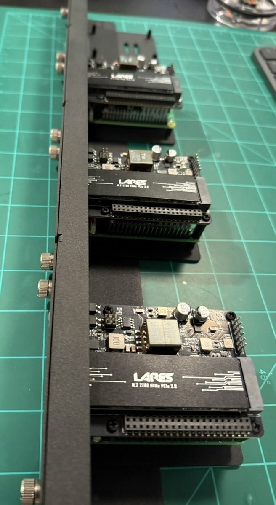

# Architecture
*Generated — 2025-09-07 23:19 UTC*

> **More diagrams**
- 

## MetalLB Address Pools (discovered)
- `192.168.1.241-192.168.1.254  # Replace with your IP range, `

## StorageClasses (discovered)
- `Add`
- `Apply`
- `Assert`
- `Check`
- `Create`
- `Detect`
- `Display`
- `Download`
- `Install`
- `Set`
- `Unset`
- `Wait`
- `argocd`
- `ceph-fs`
- `ceph-fs-data-ec`
- `metallb`
- `metallb-system`
- `nfs-cephfs`
- `prometheus-stack`
- `rook-ceph`
- `rook-ceph-dashboard-password`
- `rook-csi-cephfs-node`
- `rook-csi-cephfs-provisioner`
- `rook-nfs-loadbalancer`

## Workloads (discovered)
- `Verify`
- `argocd-server`
- `bedrock-access-gateway`
- `cert-manager-webhook`

## From the Memory Bank
- [Rook-Ceph NFS Ganesha Debugging Summary](memory_bank/2025-08-10-rook-ceph-nfs-debug-summary.md)
- [Summary of Rook-Ceph NFS Debugging Session (2025-08-11)](memory_bank/2025-08-11-rook-ceph-nfs-debug-summary.md)
- [Internal PKI and HTTPS Data Flow Architecture](memory_bank/2025-08-12-internal-pki-and-https-flow.md)
- [Ansible Playbook Debugging Session - 2025-08-15](memory_bank/2025-08-15-ansible-playbook-debugging-session.md)
- [K3s Cluster Cold Start Procedure (Revised)](memory_bank/2025-08-15-k3s-cold-start-procedure.md)
- [Prometheus Stack Deployment Verification](memory_bank/2025-08-15-prometheus-deployment-verification.md)
- [Ansible Deployment Idempotency Refactor Plan](memory_bank/2025-08-16-ansible-idempotency-refactor-plan.md)
- [Ceph Dashboard Exposure and Password Management Troubleshooting](memory_bank/2025-08-16-ceph-dashboard-troubleshooting.md)
- [Summary of Cluster Recovery and Playbook Hardening Session](memory_bank/2025-08-16-cluster-recovery-and-playbook-hardening.md)
- [Ansible Idempotency and Cold Start Test Plan](memory_bank/2025-08-16-cold-start-test-plan.md)
- [Rook-Ceph Storage Architecture Update](memory_bank/2025-08-17-rook-ceph-storage-architecture-update.md)
- [Stable Deployment and Cold Start Procedure](memory_bank/2025-08-17-stable-deployment-and-cold-start-procedure.md)
- [Active Context: seadogger-homelab](memory_bank/activeContext.md)
- [Progress: seadogger-homelab](memory_bank/progress.md)
- [Project Brief: seadogger-homelab](memory_bank/projectbrief.md)
- [Rook-Ceph CephFS with Erasure Coding Lessons](memory_bank/rook-ceph-ec-filesystem-lessons.md)
- [System Patterns: seadogger-homelab](memory_bank/systemPatterns.md)
- [Technical Context: seadogger-homelab](memory_bank/techContext.md)
