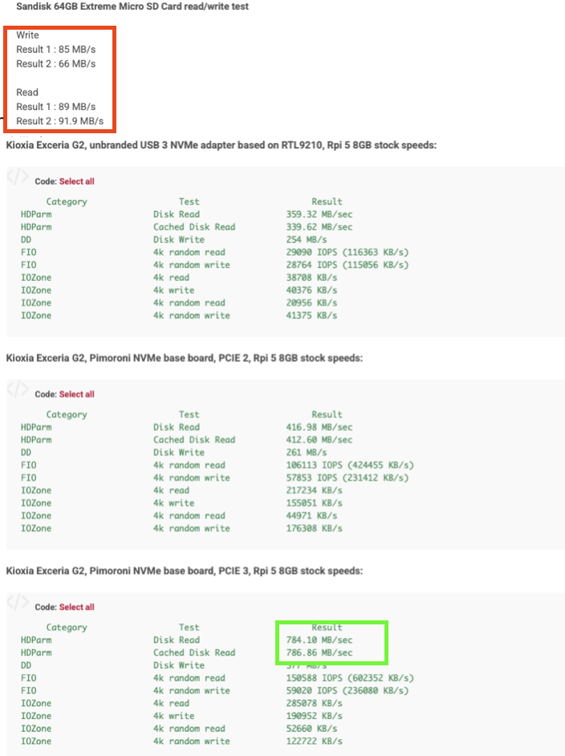

# Hardware & Network
*Generated — 2025-09-07 23:19 UTC*

## Bill of Materials (example)
- Raspberry Pi 5 nodes
- NVMe per node
- Managed switch, UPS

## From the Memory Bank
- [Summary of Rook-Ceph NFS Debugging Session (2025-08-11)](memory_bank/2025-08-11-rook-ceph-nfs-debug-summary.md)
- [Ansible Playbook Debugging Session - 2025-08-15](memory_bank/2025-08-15-ansible-playbook-debugging-session.md)
- [K3s Cluster Cold Start Procedure (Revised)](memory_bank/2025-08-15-k3s-cold-start-procedure.md)
- [Prometheus Stack Deployment Verification](memory_bank/2025-08-15-prometheus-deployment-verification.md)
- [Ceph Dashboard Exposure and Password Management Troubleshooting](memory_bank/2025-08-16-ceph-dashboard-troubleshooting.md)
- [Summary of Cluster Recovery and Playbook Hardening Session](memory_bank/2025-08-16-cluster-recovery-and-playbook-hardening.md)
- [Ansible Idempotency and Cold Start Test Plan](memory_bank/2025-08-16-cold-start-test-plan.md)
- [Stable Deployment and Cold Start Procedure](memory_bank/2025-08-17-stable-deployment-and-cold-start-procedure.md)
- [Active Context: seadogger-homelab](memory_bank/activeContext.md)
- [Product Context: seadogger-homelab](memory_bank/productContext.md)
- [Progress: seadogger-homelab](memory_bank/progress.md)
- [Project Brief: seadogger-homelab](memory_bank/projectbrief.md)
- [System Patterns: seadogger-homelab](memory_bank/systemPatterns.md)
- [Technical Context: seadogger-homelab](memory_bank/techContext.md)
