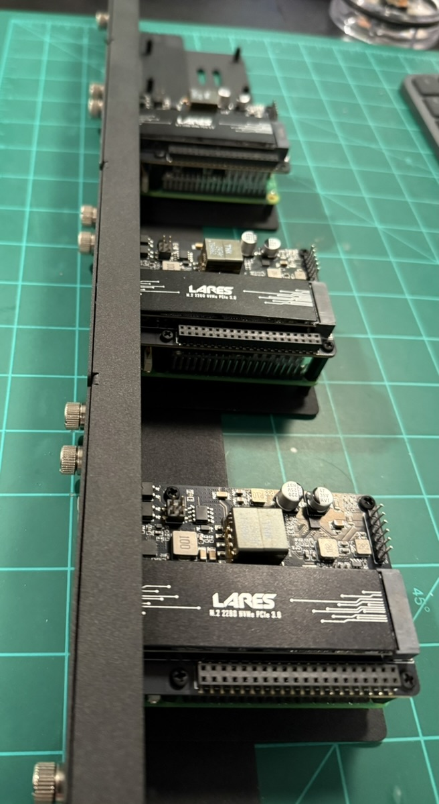

# Bootstrap & Cold Start (IaC)

## Raspberry Pi 5 Setup

### POE HAT and Drive install

Install POE HAT with NVMe PCIe adapter on all Raspberry Pi 5s

 

> **Note**: The BoM includes nylon standoffs.  The solution I found uses an 11mm male standoff with a 2mm nut on the male standoff and a 2mm nylon nut on top with a nylon screw thru to the top nut and into the standoff.  This gives you about 15.5mm of total height between the Pi and the POE HAT.  Less than that and it will not fit over the USB ports.  More than that and the POE transformer hits the top of the rack



### NVMe Drive list recommendations

> **Note**: I have not tested all the drives from this list.   The NVMe drives in the latest BoM do work with the HAT and Pi5 

> **Note**:  [This](https://www.amazon.com/gp/product/B08DTP8LG8/ref=ewc_pr_img_1?smid=A2CP9SZGVW0PFE&th=1) NVMe drive has been tested and does not work. **DO NOT BUY this one!**


### [Raspberry Pi Setup](https://youtu.be/x9ceI0_r_Kg)

This setup assumes a Raspberry Pi5 64 bit OS Lite (no desktop) will be setup in a k3s cluster with a single server node and 3 worker nodes with 4TB in each worker node. 

The approach taken to get to here included flashing the Raspberry Pi OS (64-bit, lite) to the storage devices using Raspberry Pi Imager onto a 64GB sdCard.  This was then installed into each Pi and transferred to the NVMe in the previous section.  This should be successful before proceeding into this step.

To make network discovery and integration easier, I edit the advanced configuration in Imager, and set the following options:

  - Set hostname: `node1.local` (set to `2` for node 2, `3` for node 3, etc.)
  - Enable SSH
  - Disable WiFi

After setting all those options, and the hostname is unique to each node (and matches what is in `hosts.ini`), I inserted the microSD cards into the respective Pis, or installed the NVMe SSDs into the correct slots, and booted the cluster.

### Get Remote PC ready for Ansible Deployment 
Clone the Ansible tasks to your remote PC to that will manage the k3s cluster
   ```bash
   git clone https://github.com/seadogger/seadogger-homelab.git
   ```

### SSH connection test

To test the SSH connection from the host or PC you intend to run Ansible from, connect to each server individually, and accepted the hostkey.  This must be done for all nodes so password is not requested by the nodes during the Ansible playbook run:

```
ssh-copy-id pi@node[X].local
ssh pi@192.168.1.[X]
ssh pi@node[X].local
```

This ensures Ansible will also be able to connect via SSH in the following steps. You can test Ansible's connection with:

```
ansible all -m ping
```

It should respond with a 'SUCCESS' message for each node.

### NVMe Boot and 4TB NVMe Drive Setup  

This guide will help you set up and use a **4TB NVMe drive** on a **Raspberry Pi 5**. This process involves partitioning, formatting, cloning partitions, updating `/etc/fstab`, and troubleshooting common issues.

`rpi-clone` seems to reset the partition table to MBR vs. GPT so we lose storage space as MBR is confined to 2TB.  These scripts are very specific the hardware stack choosen in the BoM for partition setup and reformats these partitions and you will lose any data on them.  **Use at your own risk!**

I am using a 64GB sdCard and transitioning the `/boot` and `/` mounts to a `4TB NVMe` using the `52Pi POE w/PCIe HAT`.  This will partition the NVMe just slightly larger than the partitions on the sdCard so the rsync transfers complete without error but we do not waste a ton of space.  

> **Note**: All the sector definitions are based on this size sdCard for gdisk.  If you are using a smaller or larger sdCard you will need to modify the partition tables settings in these scripts.  

#### Prepare the 512GB NVMe Drive (Master Node)
```bash
   git clone https://github.com/seadogger/seadogger-homelab.git
   cd seadogger-homelab/useful-scripts
   sudo ./partition_and_boot_NVMe_master_node.sh
```

#### Prepare the 4TB NVMe Drive (Worker / Storage Node)
```bash
   git clone https://github.com/seadogger/seadogger-homelab.git
   cd seadogger-homelab/useful-scripts
   sudo ./partition_and_boot_NVMe_worker_node.sh
```
> **Note**:  Rook does not want formatted partitions which is different than Longhorn so the Partitioning and Cloning script leaves the 3rd partition completely alone and unformatted.

> **Note**: Rook and Ceph are more enterprise ready and enables future growth into LakeFS


### Script Summary

1. Partition the NVMe drive using GPT.
2. Format partitions (`vfat` for EFI, `ext4` for root).
3. Clone partitions from the SD card using `rsync`.
4. Update `/etc/fstab`, `/boot/firmware/config.txt`, and `/boot/firmware/cmdline.txt`
5. Cloning the sdCard to the NVMe partition structure
6. Running disk checks on the NVMe `e2fsck` and `fsck.vfat`
7. Reload systemd daemon.
8. A few manual steps after the script runs to get everything ready (Change boot order, shutdown and reboot)

> **Note**: Before you reboot after the above you need to setup for NVMe to boot first in the boot order
- Set the NVMe first in the boot order 
    ```bash
     sudo raspi-config
    ``` 
Under advanced options set the boot order to boot the NVMe first.  
> **Note**: When prompted to reboot **`decline`.  We will reboot in the next step.**

- Shutdown:
   ```bash
   sudo shutdown now
   ```
- Pull the sdCard out and reboot

- Verify partitions are correctly mounted:
   ```bash
   lsblk -o NAME,SIZE,FSTYPE,MOUNTPOINT
   ```
#### Master Node


#### Worker / Storage Nodes


## Raspberry Pi Cluster Mangement with Ansible

### Usage

  1. Make sure [Ansible](https://docs.ansible.com/ansible/latest/installation_guide/intro_installation.html) is installed on your remote PC (in my case it is a Macbook Air and is attached on the same subnet as my cluster).
  
  2. Copy the `example.hosts.ini` inventory file to `hosts.ini`. Make sure it has the `control_plane` and `node`(s) configured correctly.
  
  3. Copy the `example.config.yml` file to `config.yml`, and modify the variables to your setup.


### Cluster configuration, K3s, App deployment

**This is where the magic of Ansible and ArgoCD take over**


### Cold Start Procedure

A full, destructive "cold start" of the cluster can be performed to validate the IaaC configuration. This process has been significantly refactored for safety and clarity.

The new workflow is a deliberate, two-playbook process:

1.  **Teardown (`cleanup.yml`)**: This playbook is the single entry point for all destructive operations.
    -   To perform a full cold start, edit `ansible/config.yml` and set `cold_start_stage_1_wipe_cluster: true`.
    -   Run the command: `ansible-playbook cleanup.yml`.
    -   This will gracefully tear down all applications and infrastructure in the correct order before wiping the k3s installation from all nodes.
    -   For an even deeper clean that includes wiping the Ceph storage partition, also set `perform_physical_disk_wipe: true`. **Warning:** This is a data-loss operation.
    -   Application and Service Cleanup: This stage iterates through the `pod_cleanup_list` in `config.yml` and gracefully removes each application.
    -   Core Infrastructure Cleanup: This stage removes the core infrastructure components (Prometheus, ArgoCD, MetalLB, and Rook-Ceph) in the correct order.
    -   Cluster Wipe: This stage performs a full, destructive wipe of the k3s cluster.


2.  **Installation (`main.yml`)**: This playbook is now solely responsible for installation and upgrades.
    -   To install the cluster, edit `ansible/config.yml` and set `cold_start_stage_2_install_infrastructure: true` and `cold_start_stage_3_install_applications: true`.
    -   Run the command:.
        ```
        ansible-playbook main.yml
        ```

        See the detailed instructions within `ansible/config.yml` for usage patterns.

        - Updates apt package cache
        - Configures cgroups are configured correctly in cmdline.txt.
        - Installs necessary packages
        - Enables and starts iscsid service
        - Configures PCIe settings exist in config.txt
        - Loads dm_crypt kernel module
        - Loads rbd kernel module
        - Appends dm_crypt and rbd to /etc/modules
        - Updates Raspberry Pi firmware to rpi-6.6.y
        - Setup/deploy k3s to the control_plane (e.g. server node)
        - Setup/deploy k3s to the worker node(s)

        `NOTE - if you get an error about cgroups you should perform a reboot and run the ansible script again` 

        - Deploy MetalLB
        - Deploy Ceph-Rook separately between these deployments
        - Deploy ArgoCD for GitOps

        - Deploy PODs/Apps thru ArgoCD  

            - MetalLB
            - AWS Bedrock
            - PiHole
            - Prometheus and Grafana
            - OpenWeb UI
            - JellyFin
            - N8N

        > **Note**: Applications are deployed declaratively through ArgoCD, ensuring GitOps best practices

This two-step process prevents accidental cluster wipes and ensures a clear separation between build and destroy operations. For more granular cleanup options, see the detailed instructions in `ansible/config.yml`.


### Shutting down the cluster

The safest way to shut down the cluster is to run the following command:

```
ansible all -m community.general.shutdown -b
```

### Rebooting the cluster

```
ansible all -m reboot -b
```

# K3s Cluster Cold Start Procedure (Revised)

- **Date:** 2025-08-16
- **Service:** Cold Start
- **Type** Architectural Capability
- **Status:** Complete

## Overview

This document outlines the official procedure for performing a full, destructive "cold start" of the Kubernetes cluster. This process is used to validate the Infrastructure as Code (IaaC) configuration from a clean slate.

The cold start process has been significantly refactored to improve safety, clarity, and reliability. It is now a deliberate, two-playbook process that separates destruction from installation.

## IaaC Corrections and Hardening

To support the new architecture and improve reliability, the following changes were made to the Infrastructure-as-Code (IaaC) repository:

1.  **Ansible Playbooks:** All playbooks (`rook_ceph_deploy_part1.yml`, `cleanup_infrastructure.yml`) were updated to use the new, consistent naming scheme for filesystems, pools, and storage classes.
2.  **Application `values.yaml`:** The Helm `values.yaml` files for all stateful applications were audited and corrected to reference the new, correct `storageClassName`.
3.  **Race Condition Fixes:** Validation tasks were added to the Ansible playbooks to prevent race conditions, such as attempting to create a service in a namespace before the namespace exists.
4.  **Code Cleanup:** The old, monolithic `rook_ceph_deploy.yml` was deleted to prevent its use.

## Procedure

### Step 1: Cluster Teardown (`cleanup.yml`)

The `cleanup.yml` playbook is the single entry point for all destructive operations.

1.  **Configure Teardown:** Open `ansible/config.yml` and set the following master switch to `true`:
    ```yaml
    cold_start_stage_1_wipe_cluster: true
    ```
2.  **(Optional) Configure Disk Wipe:** For a complete teardown that includes wiping the Ceph OSD partitions, also set the following flag to `true`.
    ```yaml
    # WARNING: This is a data-loss operation for the Ceph cluster.
    perform_physical_disk_wipe: true
    ```
3.  **Execute Teardown:** Run the cleanup playbook from the `ansible` directory.
    ```bash
    ansible-playbook cleanup.yml
    ```
    This command will execute a graceful, ordered teardown of all applications and infrastructure *before* wiping the k3s installation from all nodes.

The `cleanup.yml` playbook is organized into three stages:
1.  **Application and Service Cleanup:** This stage iterates through the `pod_cleanup_list` in `config.yml` and gracefully removes each application.
2.  **Core Infrastructure Cleanup:** This stage removes the core infrastructure components (Prometheus, ArgoCD, MetalLB, and Rook-Ceph) in the correct order.
3.  **Cluster Wipe:** This stage performs a full, destructive wipe of the k3s cluster.

### Step 2: Cluster Installation (`main.yml`)

The `main.yml` playbook is now solely responsible for installation and idempotent upgrades.

1.  **Configure Installation:** Open `ansible/config.yml` and set the following master switches to `true`. Ensure the wipe switches from Step 1 are set back to `false`.
    ```yaml
    cold_start_stage_2_install_infrastructure: true
    cold_start_stage_3_install_applications: true
    ```
    This will enable the native deployment of MetalLB and ArgoCD as part of the infrastructure stage.
2.  **Execute Installation:** Run the main playbook from the `ansible` directory.
    ```bash
    ansible-playbook main.yml
    ```
    This command will configure the nodes, install k3s, deploy the core infrastructure, and then deploy all applications.

## Known Issues

- The initial installation of Rook-Ceph can sometimes be slow or require a second run if the OSDs take a long time to initialize. The playbook has been made more robust, but this remains an area for observation.


# Ansible Deployment Idempotency Refactor Plan

- **Date:** 2025-08-16
- **Service:** Cold Start
- **Type** Refactor
- **Status:** Complete

## 1. Problem Statement

The current Ansible deployment process for many applications follows a destructive "delete namespace and redeploy" pattern. This causes instability and failures, particularly with shared infrastructure components like MetalLB and Rook-Ceph, which cannot be torn down without affecting other running applications. The goal of this refactor is to move to a fully idempotent deployment model, where playbooks can be run multiple times safely, only applying changes as needed.

## 2. Core Strategy

The strategy is to externalize all cleanup and teardown logic from the deployment playbooks into a new, centralized, and intelligent cleanup mechanism. Deployment playbooks will be refactored to be purely idempotent, responsible only for installation and upgrades.

## 3. Deployment Classification

To handle the unique needs of different components, deployments are classified into three patterns:

| Pattern | Components | Characteristics |
| :--- | :--- | :--- |
| **Infrastructure** | `rook-ceph`, `metallb` | Core services with complex dependencies, CRDs, and potential for hanging finalizers. Require a careful, ordered teardown. |
| **Hybrid** | `prometheus` | An application that also installs cluster-wide CRDs. Requires special cleanup handling for these CRDs. |
| **POD Application**| All others (`plex`, `pihole`, `n8n`, etc.) | Self-contained applications, managed via ArgoCD. Can be cleaned up uniformly, with consideration for PVCs and pre-deployment secrets. |

## 4. Phase 1: New Multi-Stage Cleanup Playbook

A new `ansible/cleanup.yml` playbook will be the single entry point for all teardown operations, from targeted application removal to a full cluster wipe. It will orchestrate a graceful, multi-stage teardown.

- **Correct Teardown Order:**
    1.  **Clean POD Applications:** (`tasks/cleanup_pods.yml`) Terminates user-facing apps, releasing dependencies on infrastructure.
    2.  **Clean Prometheus (Hybrid):** (`tasks/cleanup_prometheus.yml`) A dedicated task to tear down the monitoring stack and its CRDs.
    3.  **Clean Infrastructure:** (`tasks/cleanup_infrastructure.yml`) Safely terminates MetalLB and Rook-Ceph after all dependents are gone.

- **Features (Hybrid Model):**
    - **Discovery-Based Cleanup:** For the POD Application pattern, the cleanup task will use a label selector to automatically discover and delete all associated namespaced resources (Services, Deployments, etc.). This reduces configuration and adapts to changes in Helm charts.
    - **Explicit Control for Critical Resources:**
        - **PVCs:** A `delete_pvc: true/false` flag in the config provides a deliberate safety mechanism to prevent accidental data loss.
        - **CRDs:** Cleanup of cluster-scoped CRDs (for Prometheus, Rook-Ceph) will be handled explicitly in dedicated, ordered tasks, never via discovery.
    - The infrastructure cleanup for Rook-Ceph remains a surgical, ordered process that **will not** touch physical disks.

## 5. Phase 2: Refactor All Deployment Playbooks

Every deployment task file in `ansible/tasks/` will be refactored:

- **All destructive logic will be removed.** No more `helm uninstall`, `kubectl delete namespace`, or disk wiping commands.
- The standard deployment method will be `helm upgrade --install --create-namespace` or `kubectl apply`, ensuring idempotency.
- Playbooks will be simplified to only handle secrets/config creation and the idempotent deployment itself.
- Unique characteristics, like the `kubectl patch` in the `n8n` deploy, will be preserved.

## 6. Phase 3: Overhaul `wipe_k3s_cluster.yml` (Cold Start)

The cold start playbook will be made safer and more reliable.

1.  **Consolidate Teardown Logic:** The `wipe_k3s_cluster` task will be removed from `main.yml` and integrated as the final stage into the `cleanup.yml` playbook. This creates a clear separation of concerns: `main.yml` builds, `cleanup.yml` destroys.
2.  **Integrate Graceful Cleanup:** The `wipe_k3s_cluster.yml` task will now begin by executing the new three-stage cleanup process (PODs -> Prometheus -> Infrastructure). This ensures a clean state before attempting to uninstall k3s.
3.  **Isolate Destructive Operations:**
    - The `wipe_ceph_disks_on_install` variable will be **removed**.
    - A new, explicit variable, `perform_physical_disk_wipe: false`, will be introduced in `config.yml`.
    - The disk wiping tasks (`sgdisk --zap-all`, `dd`) in the wipe playbook will be gated *exclusively* by this new flag, making data loss a deliberate, explicit action.

This plan ensures a transition to a robust, safe, and idempotent deployment system that respects dependencies and separates application lifecycle from destructive cluster operations.


# Summary of Cluster Recovery and Playbook Hardening Session

- **Date:** 2025-08-16
- **Service:** Cold Start
- **Type** Refactor
- **Status:** Complete

## 1. Overview

This document details an intensive debugging and hardening session that transformed the `cleanup.yml` and `wipe_k3s_cluster.yml` Ansible playbooks into a robust disaster recovery solution. The initial goal was to test a refactored cleanup process, but the effort quickly pivoted to a full-scale cluster recovery upon discovering a deeply corrupted Kubernetes state.

## 2. Initial State and Problem Discovery

The session began with the intent to run the `cleanup.yml` playbook. However, the playbook failed immediately, revealing that the cluster was in a non-responsive state. Initial investigation using `kubectl` showed multiple resources, including the `rook-ceph` and `ingress-nginx` namespaces, stuck in a "Terminating" state. Even a full reboot of all cluster nodes failed to resolve the issue, indicating a persistent corruption in the `etcd` datastore.

## 3. Troubleshooting and Manual Intervention

With the automated playbooks unable to proceed, we shifted to manual intervention using `kubectl`:

- **Forced Namespace Deletion:** We attempted to forcefully delete the stuck namespaces by removing their finalizers. This involved retrieving the namespace definition as JSON, removing the `finalizers` array, and `PUT`ing the modified definition back to the API server via a temporary proxy.

- **Identifying the Root Cause:** The inability to delete namespaces even after removing finalizers confirmed that the `etcd` datastore, the core of the Kubernetes control plane, was irreparably corrupted. At this point, the only viable path forward was a complete and destructive wipe of the k3s installation on all nodes.

## 4. Hardening the `wipe_k3s_cluster.yml` Playbook

The focus shifted to improving the `wipe_k3s_cluster.yml` playbook to ensure it could reliably clean a cluster in any state, including the corrupted one we faced. The following key improvements were made iteratively:

1.  **Correct Play Targeting:** The parent `cleanup.yml` playbook was refactored. API-dependent cleanup tasks (like deleting resources) were targeted specifically at the `control_plane`, while the destructive wipe tasks were targeted at `all` nodes. This corrected a fundamental logic error.

2.  **Elimination of Faulty Logic:** A "graceful cleanup" section at the beginning of the wipe playbook was removed. It was redundant and prone to failure on a corrupted cluster, preventing the more robust wipe commands from ever running.

3.  **Idempotency via `stat` Checks:** The playbook was made idempotent by adding checks before acting. Instead of blindly trying to stop services or run uninstall scripts (and failing if they didn't exist), we used the `stat` module to verify their existence first. This allows the playbook to run successfully on a clean system without generating errors.

4.  **Intelligent Final State Verification:** The most critical improvement was the addition of a final verification block. This block uses `lsblk` to check the filesystem type of the Ceph storage partition (`/dev/nvme0n1p3`) and asserts that its state matches the desired policy.
    -   If `perform_physical_disk_wipe` is `true`, it asserts the partition is completely empty.
    -   If `perform_physical_disk_wipe` is `false`, it asserts the partition is either empty or still formatted as `ceph_bluestore`.
    -   This provides definitive proof that the playbook achieved the desired end state.

## 5. Final Outcome

After multiple iterations and refinements, the final version of the `cleanup.yml` and `wipe_k3s_cluster.yml` playbooks was run against the corrupted cluster. The playbook executed flawlessly from start to finish, successfully wiping the k3s installation, cleaning up all associated files, and leaving the nodes in a pristine state, ready for a fresh installation. The final verification step passed, confirming the success of the operation.

## 6. Lessons Learned

-   **Robust Automation is Crucial:** A simple uninstall script is not enough for disaster recovery. A truly robust playbook must be idempotent and intelligent enough to handle unexpected states without failing.
-   **Verification is Key:** Don't just assume a task succeeded. A good automation process includes final verification steps to assert that the system is in the expected state.
-   **Understand the System:** When automation fails, a deep understanding of the underlying system (in this case, Kubernetes `etcd` and finalizers) is essential for effective manual intervention.


## Clean/Wipe
- Remove finalizers; delete stuck namespaces; wipe storage only when intended.
- After wipe, re-run Stage 1 → Stage 2 → Stage 3 progressively.


