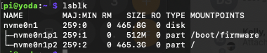
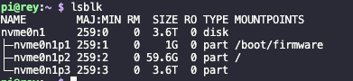
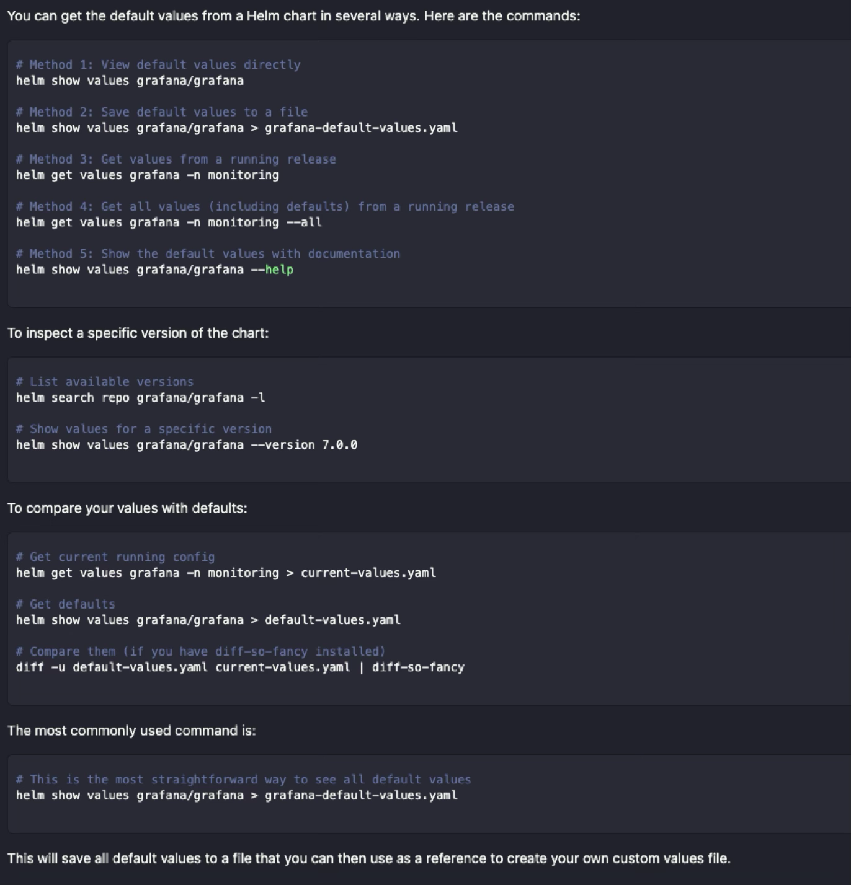

# Bootstrap & Cold Start (IaC)

A streamlined, playbook-aligned path to stand up (or reset) the cluster.


## Pre‑flight (once per environment)
1) Controller setup
- Install Ansible on your admin machine
- Clone this repo and enter `core/ansible`

2) Inventory and config
- Copy `example.hosts.ini` → `hosts.ini` and set `control_plane` + `nodes` (yoda/anakin/obiwan/rey)
- Copy `example.config.yml` → `config.yml`
- Set network keys: `ipv4_subnet_prefix`, `ipv4_gateway`, `dns4_servers`
- Choose deployment stages and `manual_install_*` flags as needed

3) SSH access
- Ensure passwordless SSH to all nodes
  ```
  ssh-copy-id pi@node[X].local
  ansible all -m ping
  ```

4) Optional — NVMe boot prep on Raspberry Pi 5
- Hardware mount NVMe (POE HAT w/ PCIe); see photos in [[03-Hardware-and-Network]].
- On each node, run the appropriate script from `seadogger-homelab/useful-scripts`:
  - `partition_and_boot_NVMe_master_node.sh` (control plane)
  - `partition_and_boot_NVMe_worker_node.sh` (workers)
- Set boot order to NVMe in `raspi-config` and verify with `lsblk`.
- Rook‑Ceph expects the data partition unformatted; the scripts leave it blank for Rook to claim.


## Stage 2 — Install Infrastructure (`main.yml`)
Enable in `ansible/config.yml`: `cold_start_stage_2_install_infrastructure: true`

Run:
```
ansible-playbook main.yml
```

What this runs (mapped to task files):
- Raspberry Pi tuning (cgroups, kernel modules, PCIe) — `raspberry_pi_config.yml`
- Firmware update — `raspberry_pi_config.yml`
- k3s control plane — `k3s_control_plane.yml`
- k3s workers — `k3s_workers.yml`
- MetalLB (native) — `metallb_native_deploy.yml`
- Rook‑Ceph Part 1 (operators/CRDs) — `rook_ceph_deploy_part1.yml`
- ArgoCD (native) — `argocd_native_deploy.yml`
- Internal PKI (cert-manager, Root/Intermediate, ClusterIssuer, per‑app certs) — `internal_pki_deploy.yml`


## Stage 3 — Deploy Applications (via ArgoCD)
Enable in `ansible/config.yml`: `cold_start_stage_3_install_applications: true` and the specific `manual_install_*` flags.

Run:
```
ansible-playbook main.yml
```

Applications (examples):
- Pi-hole — `pihole_deploy.yml`
- Prometheus/Grafana/Alertmanager — `prometheus_deploy.yml`
- OpenWebUI — `openwebui_deploy.yml`
- n8n — `n8n-deploy.yml`
- Jellyfin — `jellyfin_deploy.yml`
- Nextcloud — `nextcloud_deploy.yml`

> ArgoCD reconciles the app state from `core/deployments/**`. Ingress hosts use `*.seadogger-homelab`; TLS keys are issued by `internal-local-issuer` into `*-local-tls` secrets.


## Stage 1 — Optional Wipe (`cleanup.yml`) [Destructive]
Enable in `ansible/config.yml`: `cold_start_stage_1_wipe_cluster: true`

Run:
```
ansible-playbook cleanup.yml
```

What it does (in order):
- Gracefully removes applications (respects `run_pod_cleanup` and `pod_cleanup_list` with `delete_pvc` options) — `cleanup_pod_item.yml`
- Removes infrastructure (MetalLB, ArgoCD, Prometheus, Rook‑Ceph) when enabled — `cleanup_infrastructure.yml`
- Wipes k3s and cluster artifacts — `wipe_k3s_cluster.yml`
- Optional physical disk wipe when `perform_physical_disk_wipe: true` (DANGER: data loss)

This separation prevents accidental wipes; installation never performs destructive actions.


## Notes
- NVMe partition maps (for reference):
  
  

<!-- Planning/retrospective content moved to deep dives/ADRs to keep this page task-focused. -->


### Shutting down the cluster

The safest way to shut down the cluster is to run the following command:

```
ansible all -m community.general.shutdown -b
```

### Rebooting the cluster

```
ansible all -m reboot -b
```

# K3s Cluster Cold Start Procedure (Revised)

- **Date:** 2025-08-16
- **Service:** Cold Start
- **Type** Architectural Capability
- **Status:** Complete

## Overview

This document outlines the official procedure for performing a full, destructive "cold start" of the Kubernetes cluster. This process is used to validate the Infrastructure as Code (IaaC) configuration from a clean slate.

The cold start process has been significantly refactored to improve safety, clarity, and reliability. It is now a deliberate, two-playbook process that separates destruction from installation.

## IaaC Corrections and Hardening

To support the new architecture and improve reliability, the following changes were made to the Infrastructure-as-Code (IaaC) repository:

1.  **Ansible Playbooks:** All playbooks (`rook_ceph_deploy_part1.yml`, `cleanup_infrastructure.yml`) were updated to use the new, consistent naming scheme for filesystems, pools, and storage classes.
2.  **Application `values.yaml`:** The Helm `values.yaml` files for all stateful applications were audited and corrected to reference the new, correct `storageClassName`.
3.  **Race Condition Fixes:** Validation tasks were added to the Ansible playbooks to prevent race conditions, such as attempting to create a service in a namespace before the namespace exists.
4.  **Code Cleanup:** The old, monolithic `rook_ceph_deploy.yml` was deleted to prevent its use.

## Procedure

### Step 1: Cluster Teardown (`cleanup.yml`)

The `cleanup.yml` playbook is the single entry point for all destructive operations.

1.  **Configure Teardown:** Open `ansible/config.yml` and set the following master switch to `true`:
    ```yaml
    cold_start_stage_1_wipe_cluster: true
    ```
2.  **(Optional) Configure Disk Wipe:** For a complete teardown that includes wiping the Ceph OSD partitions, also set the following flag to `true`.
    ```yaml
    # WARNING: This is a data-loss operation for the Ceph cluster.
    perform_physical_disk_wipe: true
    ```
3.  **Execute Teardown:** Run the cleanup playbook from the `ansible` directory.
    ```bash
    ansible-playbook cleanup.yml
    ```
    This command will execute a graceful, ordered teardown of all applications and infrastructure *before* wiping the k3s installation from all nodes.

The `cleanup.yml` playbook is organized into three stages:
1.  **Application and Service Cleanup:** This stage iterates through the `pod_cleanup_list` in `config.yml` and gracefully removes each application.
2.  **Core Infrastructure Cleanup:** This stage removes the core infrastructure components (Prometheus, ArgoCD, MetalLB, and Rook-Ceph) in the correct order.
3.  **Cluster Wipe:** This stage performs a full, destructive wipe of the k3s cluster.

### Step 2: Cluster Installation (`main.yml`)

The `main.yml` playbook is now solely responsible for installation and idempotent upgrades.

1.  **Configure Installation:** Open `ansible/config.yml` and set the following master switches to `true`. Ensure the wipe switches from Step 1 are set back to `false`.
    ```yaml
    cold_start_stage_2_install_infrastructure: true
    cold_start_stage_3_install_applications: true
    ```
    This will enable the native deployment of MetalLB and ArgoCD as part of the infrastructure stage.
2.  **Execute Installation:** Run the main playbook from the `ansible` directory.
    ```bash
    ansible-playbook main.yml
    ```
    This command will configure the nodes, install k3s, deploy the core infrastructure, and then deploy all applications.

## Known Issues

- The initial installation of Rook-Ceph can sometimes be slow or require a second run if the OSDs take a long time to initialize. The playbook has been made more robust, but this remains an area for observation.


# Ansible Deployment Idempotency Refactor Plan

- **Date:** 2025-08-16
- **Service:** Cold Start
- **Type** Refactor
- **Status:** Complete

## 1. Problem Statement

The current Ansible deployment process for many applications follows a destructive "delete namespace and redeploy" pattern. This causes instability and failures, particularly with shared infrastructure components like MetalLB and Rook-Ceph, which cannot be torn down without affecting other running applications. The goal of this refactor is to move to a fully idempotent deployment model, where playbooks can be run multiple times safely, only applying changes as needed.

## 2. Core Strategy

The strategy is to externalize all cleanup and teardown logic from the deployment playbooks into a new, centralized, and intelligent cleanup mechanism. Deployment playbooks will be refactored to be purely idempotent, responsible only for installation and upgrades.

## 3. Deployment Classification

To handle the unique needs of different components, deployments are classified into three patterns:

| Pattern | Components | Characteristics |
| :--- | :--- | :--- |
| **Infrastructure** | `rook-ceph`, `metallb` | Core services with complex dependencies, CRDs, and potential for hanging finalizers. Require a careful, ordered teardown. |
| **Hybrid** | `prometheus` | An application that also installs cluster-wide CRDs. Requires special cleanup handling for these CRDs. |
| **POD Application**| All others (`plex`, `pihole`, `n8n`, etc.) | Self-contained applications, managed via ArgoCD. Can be cleaned up uniformly, with consideration for PVCs and pre-deployment secrets. |

## 4. Phase 1: New Multi-Stage Cleanup Playbook

A new `ansible/cleanup.yml` playbook will be the single entry point for all teardown operations, from targeted application removal to a full cluster wipe. It will orchestrate a graceful, multi-stage teardown.

- **Correct Teardown Order:**
    1.  **Clean POD Applications:** (`tasks/cleanup_pods.yml`) Terminates user-facing apps, releasing dependencies on infrastructure.
    2.  **Clean Prometheus (Hybrid):** (`tasks/cleanup_prometheus.yml`) A dedicated task to tear down the monitoring stack and its CRDs.
    3.  **Clean Infrastructure:** (`tasks/cleanup_infrastructure.yml`) Safely terminates MetalLB and Rook-Ceph after all dependents are gone.

- **Features (Hybrid Model):**
    - **Discovery-Based Cleanup:** For the POD Application pattern, the cleanup task will use a label selector to automatically discover and delete all associated namespaced resources (Services, Deployments, etc.). This reduces configuration and adapts to changes in Helm charts.
    - **Explicit Control for Critical Resources:**
        - **PVCs:** A `delete_pvc: true/false` flag in the config provides a deliberate safety mechanism to prevent accidental data loss.
        - **CRDs:** Cleanup of cluster-scoped CRDs (for Prometheus, Rook-Ceph) will be handled explicitly in dedicated, ordered tasks, never via discovery.
    - The infrastructure cleanup for Rook-Ceph remains a surgical, ordered process that **will not** touch physical disks.

## 5. Phase 2: Refactor All Deployment Playbooks

Every deployment task file in `ansible/tasks/` will be refactored:

- **All destructive logic will be removed.** No more `helm uninstall`, `kubectl delete namespace`, or disk wiping commands.
- The standard deployment method will be `helm upgrade --install --create-namespace` or `kubectl apply`, ensuring idempotency.
- Playbooks will be simplified to only handle secrets/config creation and the idempotent deployment itself.
- Unique characteristics, like the `kubectl patch` in the `n8n` deploy, will be preserved.

## 6. Phase 3: Overhaul `wipe_k3s_cluster.yml` (Cold Start)

The cold start playbook will be made safer and more reliable.

1.  **Consolidate Teardown Logic:** The `wipe_k3s_cluster` task will be removed from `main.yml` and integrated as the final stage into the `cleanup.yml` playbook. This creates a clear separation of concerns: `main.yml` builds, `cleanup.yml` destroys.
2.  **Integrate Graceful Cleanup:** The `wipe_k3s_cluster.yml` task will now begin by executing the new three-stage cleanup process (PODs -> Prometheus -> Infrastructure). This ensures a clean state before attempting to uninstall k3s.
3.  **Isolate Destructive Operations:**
    - The `wipe_ceph_disks_on_install` variable will be **removed**.
    - A new, explicit variable, `perform_physical_disk_wipe: false`, will be introduced in `config.yml`.
    - The disk wiping tasks (`sgdisk --zap-all`, `dd`) in the wipe playbook will be gated *exclusively* by this new flag, making data loss a deliberate, explicit action.

This plan ensures a transition to a robust, safe, and idempotent deployment system that respects dependencies and separates application lifecycle from destructive cluster operations.


# Summary of Cluster Recovery and Playbook Hardening Session

- **Date:** 2025-08-16
- **Service:** Cold Start
- **Type** Refactor
- **Status:** Complete

## 1. Overview

This document details an intensive debugging and hardening session that transformed the `cleanup.yml` and `wipe_k3s_cluster.yml` Ansible playbooks into a robust disaster recovery solution. The initial goal was to test a refactored cleanup process, but the effort quickly pivoted to a full-scale cluster recovery upon discovering a deeply corrupted Kubernetes state.

## 2. Initial State and Problem Discovery

The session began with the intent to run the `cleanup.yml` playbook. However, the playbook failed immediately, revealing that the cluster was in a non-responsive state. Initial investigation using `kubectl` showed multiple resources, including the `rook-ceph` and `ingress-nginx` namespaces, stuck in a "Terminating" state. Even a full reboot of all cluster nodes failed to resolve the issue, indicating a persistent corruption in the `etcd` datastore.

## 3. Troubleshooting and Manual Intervention

With the automated playbooks unable to proceed, we shifted to manual intervention using `kubectl`:

- **Forced Namespace Deletion:** We attempted to forcefully delete the stuck namespaces by removing their finalizers. This involved retrieving the namespace definition as JSON, removing the `finalizers` array, and `PUT`ing the modified definition back to the API server via a temporary proxy.

- **Identifying the Root Cause:** The inability to delete namespaces even after removing finalizers confirmed that the `etcd` datastore, the core of the Kubernetes control plane, was irreparably corrupted. At this point, the only viable path forward was a complete and destructive wipe of the k3s installation on all nodes.

## 4. Hardening the `wipe_k3s_cluster.yml` Playbook

The focus shifted to improving the `wipe_k3s_cluster.yml` playbook to ensure it could reliably clean a cluster in any state, including the corrupted one we faced. The following key improvements were made iteratively:

1.  **Correct Play Targeting:** The parent `cleanup.yml` playbook was refactored. API-dependent cleanup tasks (like deleting resources) were targeted specifically at the `control_plane`, while the destructive wipe tasks were targeted at `all` nodes. This corrected a fundamental logic error.

2.  **Elimination of Faulty Logic:** A "graceful cleanup" section at the beginning of the wipe playbook was removed. It was redundant and prone to failure on a corrupted cluster, preventing the more robust wipe commands from ever running.

3.  **Idempotency via `stat` Checks:** The playbook was made idempotent by adding checks before acting. Instead of blindly trying to stop services or run uninstall scripts (and failing if they didn't exist), we used the `stat` module to verify their existence first. This allows the playbook to run successfully on a clean system without generating errors.

4.  **Intelligent Final State Verification:** The most critical improvement was the addition of a final verification block. This block uses `lsblk` to check the filesystem type of the Ceph storage partition (`/dev/nvme0n1p3`) and asserts that its state matches the desired policy.
    -   If `perform_physical_disk_wipe` is `true`, it asserts the partition is completely empty.
    -   If `perform_physical_disk_wipe` is `false`, it asserts the partition is either empty or still formatted as `ceph_bluestore`.
    -   This provides definitive proof that the playbook achieved the desired end state.

## 5. Final Outcome

After multiple iterations and refinements, the final version of the `cleanup.yml` and `wipe_k3s_cluster.yml` playbooks was run against the corrupted cluster. The playbook executed flawlessly from start to finish, successfully wiping the k3s installation, cleaning up all associated files, and leaving the nodes in a pristine state, ready for a fresh installation. The final verification step passed, confirming the success of the operation.

## 6. Lessons Learned

-   **Robust Automation is Crucial:** A simple uninstall script is not enough for disaster recovery. A truly robust playbook must be idempotent and intelligent enough to handle unexpected states without failing.
-   **Verification is Key:** Don't just assume a task succeeded. A good automation process includes final verification steps to assert that the system is in the expected state.
-   **Understand the System:** When automation fails, a deep understanding of the underlying system (in this case, Kubernetes `etcd` and finalizers) is essential for effective manual intervention.


## Clean/Wipe
- Remove finalizers; delete stuck namespaces; wipe storage only when intended.
- After wipe, re-run Stage 1 → Stage 2 → Stage 3 progressively.


