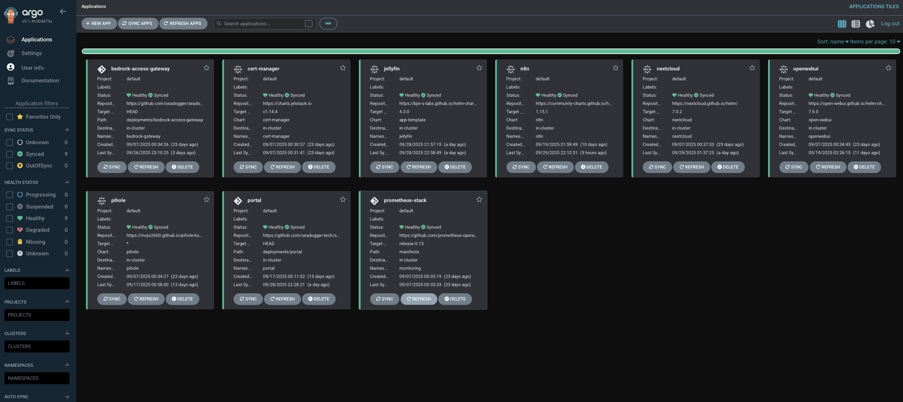

# GitOps & IaC

---
> **🌙 Diagram Viewing Recommendation**
>
> The interactive Mermaid diagrams below are **optimized for GitHub Dark Mode** to provide maximum readability and visual impact.
>
> **To enable Dark Mode:** GitHub Settings → Appearance → Theme → **Dark default**
>
> *Light mode users can still view the diagrams, though colors may appear less vibrant.*
---

This page explains how automation is split between Ansible and ArgoCD, and provides a practical test plan.

For CI/CD automation and repo workflows, see [[15-CI-CD-and-GitHub-Actions]].




## How it fits together

- Ansible is the orchestrator for infrastructure and bootstrap:
  - k3s control plane/workers, firmware, kernel settings
  - MetalLB, Rook‑Ceph (operators/CRDs), ArgoCD (native)
  - Internal PKI with cert‑manager (Root/Intermediate, ClusterIssuer, per‑app certs)
  - App deployment triggers via per‑app task files

- ArgoCD manages desired state for apps and some infra components via Git:
  - Sources from `core/deployments/**` (Helm values and manifests)
  - Reconciles Kubernetes resources for apps like Pi-hole, OpenWebUI, n8n, Jellyfin, Prometheus/Grafana/Alertmanager, Nextcloud

- Domains & certificates:
  - Services: `*.seadogger-homelab`
  - Issuer: `internal-local-issuer`
  - TLS secrets: `*-local-tls`

- Operator switches (in `ansible/config.yml`):
  - `cold_start_stage_1_wipe_cluster` (destructive; `cleanup.yml` only)
  - `cold_start_stage_2_install_infrastructure` (infra via `main.yml`)
  - `cold_start_stage_3_install_applications` (apps via `main.yml`)
  - `manual_install_*` flags per app


## Deployment Pipeline: Ansible → Helm → ArgoCD → GitHub

This section explains the complete deployment flow from initial code changes to running applications.

### Overview: The Complete Flow

```mermaid
graph LR
    Dev[👤 Developer] -->|1. Git Push| GitHub[📦 GitHub<br/>seadogger-homelab]
    GitHub -->|2. Checkout| Ansible[⚙️ Ansible<br/>Playbooks]
    Ansible -->|3a. Deploy Infra| Helm[📊 Helm<br/>Charts]
    Helm -->|3b. Install| K8s[☸️ Kubernetes<br/>Cluster]
    Ansible -->|4. Bootstrap| ArgoCD[🔄 ArgoCD]
    ArgoCD -->|5. Watch| GitHub
    ArgoCD -->|6. Sync| K8s
    GitHub -->|7. Wiki Update| WikiAction[🤖 GitHub Action]
    WikiAction -->|8. Publish| Wiki[📖 GitHub Wiki]

    style Dev fill:#7b1fa2,stroke:#9c27b0,stroke-width:2px
    style GitHub fill:#2d5016,stroke:#5a9216,stroke-width:2px
    style Ansible fill:#1e3a5f,stroke:#4a90e2,stroke-width:2px
    style Helm fill:#1e3a5f,stroke:#4a90e2,stroke-width:2px
    style K8s fill:#1e3a5f,stroke:#4a90e2,stroke-width:2px
    style ArgoCD fill:#8b4513,stroke:#d2691e,stroke-width:2px
    style WikiAction fill:#2d5016,stroke:#5a9216,stroke-width:2px
    style Wiki fill:#2d5016,stroke:#5a9216,stroke-width:2px
```



### 1. Developer Workflow

**Developer makes changes locally:**
```bash
# Edit deployment manifests, Helm values, or Ansible playbooks
cd /path/to/seadogger-homelab-pro/core
vim deployments/nextcloud/nextcloud-values.yaml

# Commit and push to core repo
git add . && git commit -m "Update Nextcloud configuration" && git push

# Update Pro repo submodule pointer
cd /path/to/seadogger-homelab-pro
git add core && git commit -m "Update core submodule: Nextcloud config" && git push
```

**What happens:** Changes are now in GitHub, ready for deployment or automated sync.

### 2. Infrastructure Bootstrap (Ansible → Helm → Kubernetes)

**Initial cluster setup uses Ansible:**


**Ansible's responsibilities:**
- **Bootstrap only** - One-time cluster setup
- **Helm wrapper** - Installs MetalLB, Rook-Ceph, ArgoCD using Helm
- **PKI setup** - Generates Root/Intermediate CA certificates
- **ArgoCD bootstrap** - Creates initial Application resources

**What Ansible does NOT do:**
- ❌ Manage application state (ArgoCD handles this)
- ❌ Update apps after initial deployment (GitOps takes over)
- ❌ Track drift (ArgoCD auto-syncs from Git)

### 3. GitOps Operation (ArgoCD ← → GitHub)

**After bootstrap, ArgoCD takes over:**


**ArgoCD's responsibilities:**
- **Continuous sync** - Polls Git every 3 minutes
- **Drift detection** - Compares cluster state to Git
- **Auto-healing** - Reverts manual changes back to Git state
- **Health checks** - Monitors application health

**Example ArgoCD Application:**
```yaml
apiVersion: argoproj.io/v1alpha1
kind: Application
metadata:
  name: nextcloud
  namespace: argocd
spec:
  project: default
  source:
    repoURL: https://github.com/seadogger-tech/seadogger-homelab
    path: deployments/nextcloud
    targetRevision: HEAD
  destination:
    server: https://kubernetes.default.svc
    namespace: nextcloud
  syncPolicy:
    automated:
      prune: true      # Delete resources removed from Git
      selfHeal: true   # Revert manual changes
    syncOptions:
      - CreateNamespace=true
```

### 4. Deployment Methods by Component

| Component | Deployed By | Method | Managed By |
|-----------|-------------|--------|------------|
| **K3s Cluster** | Ansible | Direct install | Ansible (manual upgrades) |
| **MetalLB** | Ansible | Helm (native) | Ansible + Helm (manual upgrades) |
| **Rook-Ceph** | Ansible | Helm (native) | Ansible + Helm (manual upgrades) |
| **ArgoCD** | Ansible | Helm (native) | ArgoCD (self-managed) |
| **Cert-Manager** | ArgoCD | Application CRD | ArgoCD (GitOps) |
| **Internal PKI** | Ansible | OpenSSL + kubectl | Manual (CA rotation runbook) |
| **Prometheus** | ArgoCD | Application CRD | ArgoCD (GitOps) |
| **Applications** | ArgoCD | Application CRD | ArgoCD (GitOps) |

### 5. Making Changes: Different Scenarios

#### Scenario A: Update Application Configuration

**Example: Change Nextcloud storage size**

```bash
# 1. Edit Helm values
cd core/deployments/nextcloud
vim nextcloud-values.yaml  # Change persistence.size

# 2. Commit and push
cd core
git add . && git commit -m "Increase Nextcloud storage to 6TB" && git push

# 3. Update Pro submodule pointer
cd ..
git add core && git commit -m "Update core: Nextcloud storage" && git push

# 4. Wait for ArgoCD to sync (automatic, ~3 minutes)
# Or force sync: kubectl -n argocd patch app nextcloud -p '{"operation":{"initiatedBy":{"username":"admin"},"sync":{}}}'
```

**Result:** ArgoCD detects change, updates PVC, Nextcloud pod restarts with new storage.

#### Scenario B: Add New Application

```bash
# 1. Create deployment files
mkdir core/deployments/grafana
# Add grafana-values.yaml, grafana-application.yaml

# 2. Commit to Git
cd core
git add deployments/grafana && git commit -m "Add Grafana application" && git push

# 3. Deploy Application resource
kubectl apply -f core/deployments/grafana/grafana-application.yaml

# 4. ArgoCD syncs automatically
```

**Result:** ArgoCD creates namespace, deploys Grafana from Helm chart, configures ingress.

#### Scenario C: Update Infrastructure (Currently Manual)

**Example: Upgrade MetalLB**

```bash
# 1. Update Helm chart version in Ansible
vim core/ansible/tasks/metallb_deploy.yml  # Change chart version

# 2. Run Ansible playbook
ansible-playbook main.yml  # With appropriate flags

# 3. Verify upgrade
helm list -n metallb-system
```

**Note:** Issue #50 proposes moving this to ArgoCD for GitOps management.

### 6. Wiki Documentation Pipeline

**Separate from deployment, but related:**

```mermaid
sequenceDiagram
    participant Dev
    participant GitHub
    participant Action
    participant Wiki

    Dev->>GitHub: Push to core/docs/wiki/
    GitHub->>Action: Trigger publish-wiki.yml
    Action->>GitHub: Clone wiki repo
    Action->>Action: rsync docs/wiki/ → wiki/
    Action->>Wiki: Commit and push
    GitHub->>Wiki: Render updated pages
```



**Wiki update process:**
1. Developer edits `.md` files in `core/docs/wiki/`
2. Push to `master` branch triggers GitHub Action
3. Action syncs content to wiki repository
4. GitHub renders updated wiki pages

### 7. Future State: Pure GitOps (Issue #48, #50)

**Goal:** Everything except K3s managed by ArgoCD


**Benefits of pure GitOps:**
- ✅ **Single source of truth** - Everything in Git
- ✅ **Visible in ArgoCD UI** - See all infrastructure
- ✅ **Automated sync** - No manual Ansible runs
- ✅ **Easy rollback** - Git revert + auto-sync
- ✅ **Explicit dependencies** - Via ArgoCD sync waves

### 8. Key Takeaways

1. **Ansible = Bootstrap** - One-time cluster setup, infrastructure deployment
2. **Helm = Packaging** - Kubernetes resource templates and values
3. **ArgoCD = GitOps** - Continuous sync from Git to cluster
4. **GitHub = Source of Truth** - All desired state stored in Git

**The flow:**
```
Developer → Git Push → GitHub → ArgoCD (polls) → Kubernetes → Running Apps
                     ↓
              GitHub Action → Wiki
```

**Remember:**
- Infrastructure changes currently require Ansible re-run (being refactored)
- Application changes are automatic via ArgoCD sync
- Always commit to core first, then update Pro submodule pointer
- Wiki updates automatically on push to core repo


## Test Plan


### Test Case 1: Single Non-Stateful Application (Bedrock)

1) Deploy
   - In `config.yml`, set `cold_start_stage_3_install_applications: true` and `manual_install_bedrock: true` (others `false`)
   - Run `ansible-playbook main.yml`
2) Verify
   - `bedrock-access-gateway` pods running in `bedrock-gateway`
3) Cleanup
   - Set `run_pod_cleanup: true` and keep only `bedrock-access-gateway` in `pod_cleanup_list`
   - Run `ansible-playbook cleanup.yml`
4) Verify
   - `bedrock-gateway` namespace and pods removed


### Test Case 2: Single Stateful Application (OpenWebUI)

1) Deploy
   - Set `manual_install_bedrock: false`, `manual_install_openwebui: true`
   - Run `ansible-playbook main.yml`
2) Verify
   - `openwebui` pods running and PVC bound
3) Cleanup (preserve data)
   - Set `run_pod_cleanup: true`, configure `pod_cleanup_list` with `openwebui` and `delete_pvc: false`
   - Run `ansible-playbook cleanup.yml`
4) Verify & redeploy
   - Pods removed, PVC remains; rerun deploy and confirm re‑attach
5) Cleanup (destroy data)
   - Set `delete_pvc: true` for `openwebui`
   - Run `ansible-playbook cleanup.yml`
6) Verify
   - Pods and PVC are deleted


### Test Case 3: All Applications

1) Deploy
   - Enable `cold_start_stage_3_install_applications: true` and all relevant `manual_install_*`
   - Run `ansible-playbook main.yml`
2) Cleanup
   - Set `run_pod_cleanup: true` and include all apps in `pod_cleanup_list`
   - Run `ansible-playbook cleanup.yml`
3) Verify
   - All application namespaces and resources are gone


### Test Case 4: All Applications + Prometheus

1) Deploy
   - Same as Case 3, ensure `manual_install_prometheus: true`
2) Cleanup
   - Set `run_pod_cleanup: true` and `run_prometheus_cleanup: true`
   - Run `ansible-playbook cleanup.yml`
3) Verify
   - Apps and Prometheus resources (including CRDs) are removed


### Test Case 5: All Applications + Prometheus + Infrastructure

1) Deploy
   - Set `cold_start_stage_2_install_infrastructure: true` and `cold_start_stage_3_install_applications: true`
   - Run `ansible-playbook main.yml`
2) Cleanup
   - Enable `run_pod_cleanup`, `run_prometheus_cleanup`, `run_infrastructure_cleanup`
   - Run `ansible-playbook cleanup.yml`
3) Verify
   - All apps and infra (MetalLB, Rook‑Ceph operators) are gone; bare k3s remains


### Test Case 6: Full Cold Start Cycle

1) Deploy
   - Start from a full deployment as in Case 5
2) Full teardown
   - Set `cold_start_stage_1_wipe_cluster: true` and optionally `perform_physical_disk_wipe: true`
   - Run `ansible-playbook cleanup.yml`
3) Verify teardown
   - Cluster wiped; nodes clean
4) Full reinstall
   - Reset all cleanup flags to `false`
   - Set Stage 2 + Stage 3 true; run `ansible-playbook main.yml`
5) Verify reinstall
   - Entire cluster and apps are back online


## See Also

- **[[04-Bootstrap-and-Cold-Start]]** - Initial cluster deployment procedures
- **[[15-CI-CD-and-GitHub-Actions]]** - Automated CI/CD workflows
- **[[21-Deployment-Dependencies]]** - GitOps migration and dependency analysis
- **[[02-Architecture]]** - GitOps architectural decisions

**Related Issues:**
- [#48 - Deployment Dependencies Refactor](https://github.com/seadogger-tech/seadogger-homelab/issues/48) - Pure GitOps migration
- [#50 - Move infrastructure to ArgoCD](https://github.com/seadogger-tech/seadogger-homelab/issues/50) - Converting all to Kustomize


## Deployment Order (Sync Waves)

Shows ArgoCD sync wave deployment sequence.


**Wave Ordering Rationale:**
- **Wave 0:** Foundation services (MetalLB for IPs, Rook operator, cert-manager)
- **Wave 1:** Clusters that depend on operators (Ceph cluster, PKI setup)
- **Wave 2:** Monitoring (depends on storage for PVCs)
- **Wave 3:** Applications (depend on all infrastructure)
- **Wave 4:** Pro features (depend on base applications)
