# GitOps & IaC

---
> **🌙 Diagram Viewing Recommendation**
>
> The interactive Mermaid diagrams below are **optimized for GitHub Dark Mode** to provide maximum readability and visual impact.
>
> **To enable Dark Mode:** GitHub Settings → Appearance → Theme → **Dark default**
>
> *Light mode users can still view the diagrams, though colors may appear less vibrant.*
---

This page explains how automation is split between Ansible and ArgoCD, and provides a practical test plan.

For CI/CD automation and repo workflows, see [[15-CI-CD-and-GitHub-Actions]].

## How it fits together

- Ansible is the orchestrator for infrastructure and bootstrap:
  - k3s control plane/workers, firmware, kernel settings
  - MetalLB, Rook‑Ceph (operators/CRDs), ArgoCD (native)
  - Internal PKI with cert‑manager (Root/Intermediate, ClusterIssuer, per‑app certs)
  - App deployment triggers via per‑app task files

- ArgoCD manages desired state for apps and some infra components via Git:
  - Sources from `core/deployments/**` (Helm values and manifests)
  - Reconciles Kubernetes resources for apps like Pi-hole, OpenWebUI, n8n, Jellyfin, Prometheus/Grafana/Alertmanager, Nextcloud

- Domains & certificates:
  - Services: `*.seadogger-homelab`
  - Issuer: `internal-local-issuer`
  - TLS secrets: `*-local-tls`

- Operator switches (in `ansible/config.yml`):
  - `cold_start_stage_1_wipe_cluster` (destructive; `cleanup.yml` only)
  - `cold_start_stage_2_install_infrastructure` (infra via `main.yml`)
  - `cold_start_stage_3_install_applications` (apps via `main.yml`)
  - `manual_install_*` flags per app

## Test Plan

### Test Case 1: Single Non-Stateful Application (Bedrock)

1) Deploy
   - In `config.yml`, set `cold_start_stage_3_install_applications: true` and `manual_install_bedrock: true` (others `false`)
   - Run `ansible-playbook main.yml`
2) Verify
   - `bedrock-access-gateway` pods running in `bedrock-gateway`
3) Cleanup
   - Set `run_pod_cleanup: true` and keep only `bedrock-access-gateway` in `pod_cleanup_list`
   - Run `ansible-playbook cleanup.yml`
4) Verify
   - `bedrock-gateway` namespace and pods removed

### Test Case 2: Single Stateful Application (OpenWebUI)

1) Deploy
   - Set `manual_install_bedrock: false`, `manual_install_openwebui: true`
   - Run `ansible-playbook main.yml`
2) Verify
   - `openwebui` pods running and PVC bound
3) Cleanup (preserve data)
   - Set `run_pod_cleanup: true`, configure `pod_cleanup_list` with `openwebui` and `delete_pvc: false`
   - Run `ansible-playbook cleanup.yml`
4) Verify & redeploy
   - Pods removed, PVC remains; rerun deploy and confirm re‑attach
5) Cleanup (destroy data)
   - Set `delete_pvc: true` for `openwebui`
   - Run `ansible-playbook cleanup.yml`
6) Verify
   - Pods and PVC are deleted

### Test Case 3: All Applications

1) Deploy
   - Enable `cold_start_stage_3_install_applications: true` and all relevant `manual_install_*`
   - Run `ansible-playbook main.yml`
2) Cleanup
   - Set `run_pod_cleanup: true` and include all apps in `pod_cleanup_list`
   - Run `ansible-playbook cleanup.yml`
3) Verify
   - All application namespaces and resources are gone

### Test Case 4: All Applications + Prometheus

1) Deploy
   - Same as Case 3, ensure `manual_install_prometheus: true`
2) Cleanup
   - Set `run_pod_cleanup: true` and `run_prometheus_cleanup: true`
   - Run `ansible-playbook cleanup.yml`
3) Verify
   - Apps and Prometheus resources (including CRDs) are removed

### Test Case 5: All Applications + Prometheus + Infrastructure

1) Deploy
   - Set `cold_start_stage_2_install_infrastructure: true` and `cold_start_stage_3_install_applications: true`
   - Run `ansible-playbook main.yml`
2) Cleanup
   - Enable `run_pod_cleanup`, `run_prometheus_cleanup`, `run_infrastructure_cleanup`
   - Run `ansible-playbook cleanup.yml`
3) Verify
   - All apps and infra (MetalLB, Rook‑Ceph operators) are gone; bare k3s remains

### Test Case 6: Full Cold Start Cycle

1) Deploy
   - Start from a full deployment as in Case 5
2) Full teardown
   - Set `cold_start_stage_1_wipe_cluster: true` and optionally `perform_physical_disk_wipe: true`
   - Run `ansible-playbook cleanup.yml`
3) Verify teardown
   - Cluster wiped; nodes clean
4) Full reinstall
   - Reset all cleanup flags to `false`
   - Set Stage 2 + Stage 3 true; run `ansible-playbook main.yml`
5) Verify reinstall
   - Entire cluster and apps are back online

## See Also

- **[[04-Bootstrap-and-Cold-Start]]** - Initial cluster deployment procedures
- **[[15-CI-CD-and-GitHub-Actions]]** - Automated CI/CD workflows
- **[[21-Deployment-Dependencies]]** - GitOps migration and dependency analysis
- **[[02-Architecture]]** - GitOps architectural decisions

**Related Issues:**
- [#48 - Deployment Dependencies Refactor](https://github.com/seadogger-tech/seadogger-homelab/issues/48) - Pure GitOps migration
- [#50 - Move infrastructure to ArgoCD](https://github.com/seadogger-tech/seadogger-homelab/issues/50) - Converting all to Kustomize

## Deployment Order (Sync Waves)

Shows ArgoCD sync wave deployment sequence.

```mermaid
graph TD
    subgraph Wave0["🌊 Wave 0: Operators & Base"]
        MetalLB[MetalLB]
        RookOp[Rook-Ceph<br/>Operator]
        CertMgr[cert-manager]
    end

    subgraph Wave1["🌊 Wave 1: Clusters & PKI"]
        RookCluster[Rook-Ceph<br/>Cluster + Storage Classes]
        PKI[Internal PKI<br/>CA + ClusterIssuer]
    end

    subgraph Wave2["🌊 Wave 2: Monitoring"]
        Prometheus[Prometheus<br/>Stack]
    end

    subgraph Wave3["🌊 Wave 3+: Applications"]
        Apps[Nextcloud, Jellyfin<br/>OpenWebUI, N8N<br/>PiHole]
    end

    subgraph WavePro["🌊 Wave 4: Pro Features"]
        Pro[Portal<br/>Keycloak Future]
    end

    Wave0 --> Wave1
    Wave1 --> Wave2
    Wave2 --> Wave3
    Wave3 --> WavePro

    style Wave0 fill:#1e3a5f,stroke:#4a90e2,stroke-width:3px
    style Wave1 fill:#1e3a5f,stroke:#4a90e2,stroke-width:3px
    style Wave2 fill:#1e3a5f,stroke:#4a90e2,stroke-width:3px
    style Wave3 fill:#2d5016,stroke:#5a9216,stroke-width:3px
    style WavePro fill:#7b1fa2,stroke:#9c27b0,stroke-width:3px,stroke-dasharray: 5 5
```

**Wave Ordering Rationale:**
- **Wave 0:** Foundation services (MetalLB for IPs, Rook operator, cert-manager)
- **Wave 1:** Clusters that depend on operators (Ceph cluster, PKI setup)
- **Wave 2:** Monitoring (depends on storage for PVCs)
- **Wave 3:** Applications (depend on all infrastructure)
- **Wave 4:** Pro features (depend on base applications)
