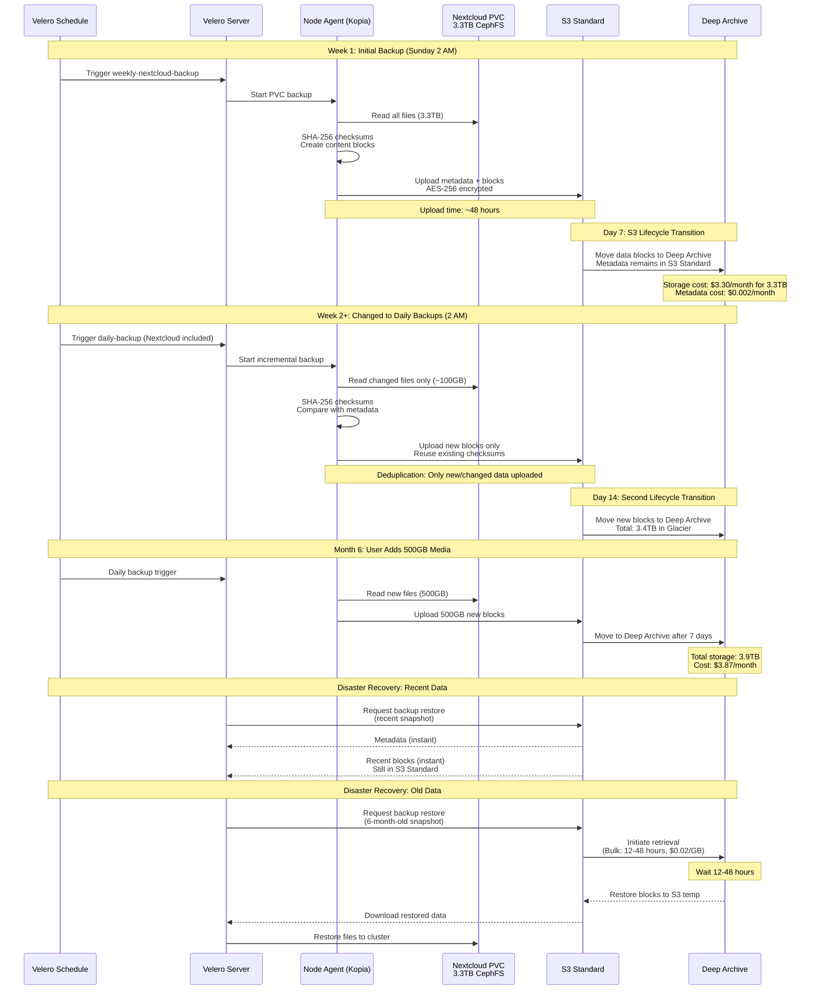

# Storage Architecture: Rook-Ceph

---
> **🌙 Diagram Viewing Recommendation**
>
> The interactive Mermaid diagrams below are **optimized for GitHub Dark Mode** to provide maximum readability and visual impact.
>
> **To enable Dark Mode:** GitHub Settings → Appearance → Theme → **Dark default**
>
> *Light mode users can still view the diagrams, though colors may appear less vibrant.*
---

The cluster's storage is managed by Rook-Ceph, providing both block and filesystem storage. The architecture is designed for a balance of performance, data redundancy, and storage efficiency.


### CEPH Block Storage
-   **Pool:** `ceph-block-data` (Replicated, size 3)
-   **Storage Class:** `ceph-block-data`
-   **Default:** Yes. This is the default storage class for all general-purpose block storage needs (e.g., application databases).


### CEPH FileSystem Storage
-   **Filesystem Name:** `ceph-fs`
-   **Pools:**
    1.  `ceph-fs-metadata` (Replicated, size 3): Stores filesystem metadata.
    2.  `ceph-fs-data-replicated` (Replicated, size 3): The required default data pool for the filesystem.
    3.  `ceph-fs-data-ec` (Erasure Coded, 2+1): For high-efficiency bulk data storage.
-   **Storage Classes:**
    1.  `ceph-fs-data-replicated`: Provides replicated, resilient filesystem storage.
    2.  `ceph-fs-data-ec`: Provides erasure-coded, high-efficiency filesystem storage for large datasets.


| StorageClass               | Type                         | Provisioner                     | ReclaimPolicy | BindingMode            | Expandable | Default | Suggested Use                                                                 | Failure Tolerance*                                   |
|--------------------------- |-----------------------------|---------------------------------|---------------|------------------------|------------|---------|--------------------------------------------------------------------------------|------------------------------------------------------|
| `ceph-block-data`          | Ceph **RBD Block**          | `rook-ceph.rbd.csi.ceph.com`    | Retain        | Immediate              | ✅         | ✅      | General/critical workloads needing block volumes (DBs, app data).            | Replicated pool (e.g., 3×) ⇒ tolerate up to (replicas-1) OSD/node failures. |
| `ceph-fs-data-ec`          | **CephFS (Erasure-Coded)**  | `rook-ceph.cephfs.csi.ceph.com` | Retain        | Immediate              | ✅         | —       | Large media & read-heavy files (e.g., Plex libraries) to maximize capacity.  | EC profile (e.g., 2+1) ⇒ tolerates ≥1 OSD/node failure.                    |
| `ceph-fs-data-replicated`  | **CephFS (Replicated)**     | `rook-ceph.cephfs.csi.ceph.com` | Retain        | Immediate              | ✅         | —       | Shared files where extra redundancy is preferred over raw capacity.          | Replicated pool (e.g., 3×) ⇒ tolerate up to (replicas-1) OSD/node failures. |
| `ceph-bucket`              | **S3-compatible Object**    | `rook-ceph.ceph.rook.io/bucket` | Delete        | Immediate              | ❌         | —       | Apps needing object storage via S3 API.                                       | Depends on RGW/RADOS pool replication; node-resilient if replicated.        |
| `local-path`               | **HostPath (Local)**        | `rancher.io/local-path`         | Delete        | WaitForFirstConsumer   | ❌         | —       | Ephemeral/dev workloads tied to a single node.                                | None (single-node; no redundancy).                                         |

\* Failure tolerance is indicative; exact resilience depends on your Ceph pool replica/EC settings.

### Storage System (Rook-Ceph)
   - Status: HEALTH_OK
   - Capacity: 11 TiB total available
   - Capacity: 3.8TB in replicated pools
   - Capacity: 6.8TB in EC pools
   - Configuration:


### Implementation and IaaC 

The new architecture was implemented by making the following changes to the `seadogger-homelab` Infrastructure-as-Code repository:

1.  **`deployments/rook-ceph/rook-ceph-cluster-values.yaml`:**
    *   Updated to define the `ceph-block` and `ceph-fs` filesystems with their corresponding pools and storage classes as detailed above.
    *   Pool names were corrected to their base names (e.g., `data-replicated`), as the Rook operator automatically prepends the filesystem name.

2.  **`ansible/tasks/rook_ceph_deploy_part1.yml`:**
    *   The validation task was updated to check for the existence of the new, correctly named pools (`ceph-fs-metadata`, `ceph-fs-data-replicated`, `ceph-fs-data-ec`).
    *   The task to set the default storage class was updated to target `ceph-block-data`.

3.  **`ansible/tasks/cleanup_infrastructure.yml`:**
    *   The teardown script was updated to correctly identify and delete the newly named StorageClasses, CephFilesystem, and CephNFS resources.

4.  **`ansible/tasks/rook_ceph_deploy.yml`:**
    *   This outdated, monolithic deployment file was deleted to prevent confusion.

5.  **Application Helm Values:**
    *   All `values.yaml` files were reviewed, and any hardcoded `storageClassName` was updated from `ceph-block` or `rook-ceph-filesystem-ec` to the new, correct names (`ceph-block-data` or `ceph-fs-data-ec`).
    *   A new `nextcloud-values.yaml` was created to ensure it uses the correct storage class.

This comprehensive update ensures the entire storage infrastructure is now correctly defined in code, leading to a reliable and repeatable deployment process.


## Backup Strategy

The cluster implements automated backup of all critical PVCs to AWS S3 Deep Archive using Velero with Kopia for incremental, deduplicated backups.

### Backup Architecture Diagram

The following C4 Container diagram shows the complete Velero backup system architecture:

```mermaid
graph TB
    subgraph K8s["🎯 Kubernetes Cluster"]
        direction TB
        subgraph VeleroNS["velero namespace"]
            VeleroServer["Velero Server<br/>Orchestration & Scheduling"]
            VeleroUI["Velero UI<br/>Management Interface"]
        end

        subgraph Nodes["Worker Nodes"]
            NodeAgent1["Node Agent (yoda)<br/>Kopia Uploader"]
            NodeAgent2["Node Agent (anakin)<br/>Kopia Uploader"]
            NodeAgent3["Node Agent (obiwan)<br/>Kopia Uploader"]
            NodeAgent4["Node Agent (rey)<br/>Kopia Uploader"]
        end

        subgraph Apps["Application Namespaces"]
            NextcloudPVC["Nextcloud PVC<br/>3.3TB CephFS EC"]
            N8NPVC["N8N PVC<br/>RBD Block"]
            JellyfinPVC["Jellyfin PVCs<br/>config + cache"]
            OtherPVCs["Other PVCs<br/>OpenWebUI, PiHole, etc."]
        end

        subgraph Storage["Rook-Ceph Storage"]
            CephFS["CephFS<br/>ceph-fs-data-ec"]
            CephRBD["RBD Block<br/>ceph-block-data"]
        end
    end

    subgraph AWS["☁️ AWS Cloud"]
        S3Bucket["S3 Bucket<br/>seadogger-homelab-backup<br/>us-east-1"]
        S3Standard["S3 Standard<br/>Kopia Metadata<br/>~100MB"]
        DeepArchive["Glacier Deep Archive<br/>Data Blocks<br/>~3.3TB"]
    end

    VeleroServer -->|"Schedule Trigger<br/>daily-backup: 2 AM<br/>weekly-nextcloud: 2 AM Sun"| NodeAgent1
    VeleroServer --> NodeAgent2
    VeleroServer --> NodeAgent3
    VeleroServer --> NodeAgent4

    NodeAgent1 -->|"Read PVC Data"| NextcloudPVC
    NodeAgent2 -->|"Read PVC Data"| N8NPVC
    NodeAgent3 -->|"Read PVC Data"| JellyfinPVC
    NodeAgent4 -->|"Read PVC Data"| OtherPVCs

    NextcloudPVC --> CephFS
    N8NPVC --> CephRBD
    JellyfinPVC --> CephFS

    NodeAgent1 -->|"Upload via Kopia<br/>AES-256 Encrypted<br/>Deduplicated"| S3Bucket
    NodeAgent2 --> S3Bucket
    NodeAgent3 --> S3Bucket
    NodeAgent4 --> S3Bucket

    S3Bucket -->|"Initial Upload"| S3Standard
    S3Standard -->|"Lifecycle: 7 days"| DeepArchive
    DeepArchive -->|"Keep Forever<br/>No Deletion"| DeepArchive

    style K8s fill:#1e3a5f,stroke:#4a90e2,stroke-width:3px
    style VeleroNS fill:#2d5016,stroke:#5a9216,stroke-width:2px
    style Nodes fill:#7b1fa2,stroke:#9c27b0,stroke-width:2px
    style Apps fill:#8b4513,stroke:#d2691e,stroke-width:2px
    style Storage fill:#2d5016,stroke:#5a9216,stroke-width:2px
    style AWS fill:#1e3a5f,stroke:#4a90e2,stroke-width:3px
    style S3Bucket fill:#2d5016,stroke:#5a9216,stroke-width:2px
    style DeepArchive fill:#7b1fa2,stroke:#9c27b0,stroke-width:2px
```



### Backup Workflow Sequence

The following sequence diagram shows the complete backup lifecycle including Week 1 initial backup strategy and ongoing incremental backups:



**Key Points:**
- **Week 1**: Weekly Nextcloud backup (Sunday 2 AM) to allow 48-hour initial upload
- **Week 2+**: Switch to daily backups for all apps including Nextcloud
- **Deduplication**: Kopia stores each unique data block once via SHA-256 checksums
- **Lifecycle**: 7 days in S3 Standard → Glacier Deep Archive forever
- **Metadata**: Stays in S3 Standard for instant snapshot queries (~100MB)
- **Recovery Time**: Recent backups (instant), Old backups (12-48 hours)

### Backup Architecture

- **Operator**: Velero v1.16.0 deployed via Helm
- **Node Agent**: Kopia uploader (replaces Restic) for file-level PVC backups
- **Backend**: AWS S3 with Glacier Deep Archive lifecycle
- **Storage**: AWS S3 bucket `seadogger-homelab-backup` (us-east-1)
- **Lifecycle**: 7 days in S3 Standard → Glacier Deep Archive
- **Encryption**: AES-256 server-side encryption (AWS S3)
- **Deduplication**: Kopia content-addressable storage
- **Monitoring**: Prometheus metrics enabled

### Backup Schedule

| Application | PVCs Backed Up | Frequency | Time (PT) | Retention |
|------------|----------------|-----------|-----------|-----------|
| **Nextcloud** | nextcloud-nextcloud (CephFS EC) | Daily | 2:00 AM | 7 daily, 4 weekly, 6 monthly |
| **N8N** | n8n-main-persistence (RBD) | Daily | 3:00 AM | 14 daily, 8 weekly, 6 monthly |
| **Jellyfin** | jellyfin-config, jellyfin-cache (CephFS EC) | Weekly (Sunday) | 4:00 AM | 4 weekly, 12 monthly |

**Notes**:
- Jellyfin media library (read-only mount) is NOT backed up due to size (media is replaceable)
- All backups include weekly integrity checks and automated pruning
- Prometheus alerts trigger on backup failures

### S3 Bucket Structure

All namespaces share a single S3 bucket (`seadogger-homelab-backup`) because Restic deduplicates data automatically. The bucket uses Restic's encrypted repository format:

```
seadogger-homelab-backup/
├── config              # Repository configuration (encrypted)
├── keys/               # Encryption keys
├── data/               # Backup data chunks (encrypted, deduplicated)
├── index/              # Index files for fast searches (encrypted)
└── snapshots/          # Snapshot metadata (encrypted)
```

**All data is encrypted** with the Restic password before upload. Even identical files across namespaces are stored only once (deduplication).

### Viewing Backups by Namespace

**Method 1 - Kubernetes Snapshots** (easiest):
```bash
kubectl get snapshots -A
```

**Method 2 - Restic CLI** (most detailed):
```bash
# Install on Mac
brew install restic

# Set credentials from config.yml
export AWS_ACCESS_KEY_ID="<k8up_aws_access_key>"
export AWS_SECRET_ACCESS_KEY="<k8up_aws_secret_key>"
export RESTIC_PASSWORD="<k8up_restic_password>"
export RESTIC_REPOSITORY="s3:https://s3.amazonaws.com/seadogger-homelab-backup"

# View snapshots (Host column = namespace)
restic snapshots

# Browse files in snapshot
restic ls <snapshot-id>
```

### Cost Estimate

- **Storage**: $0.00099/GB/month ($1/TB/month)
- **Estimated 1TB backups**: ~$1/month
- **Restore cost** (Bulk retrieval): ~$0.02/GB + 12-48 hour wait
- **Restore cost** (Expedited): ~$0.10/GB + 1-5 minutes wait

### Restore Procedures

**IMPORTANT**: S3 Deep Archive has 12-48 hour retrieval time. Plan disaster recovery operations accordingly.

For complete restore procedures, see:
- **[[23-Disaster-Recovery-Restore]]** - Full restore procedures and emergency recovery


## See Also

- **[[03-Hardware-and-Network]]** - NVMe hardware setup for Rook-Ceph
- **[[04-Bootstrap-and-Cold-Start]]** - Rook-Ceph deployment procedures
- **[[02-Architecture]]** - C4 Storage Architecture diagram
- **[[12-Troubleshooting]]** - Rook-Ceph troubleshooting
- **[[23-Disaster-Recovery-Restore]]** - Backup restore procedures

**Related Issues:**
- [#24 - Disaster Recovery](https://github.com/seadogger-tech/seadogger-homelab/issues/24) - K8up S3 backup implementation (RESOLVED)
- [#50 - Move infrastructure to ArgoCD](https://github.com/seadogger-tech/seadogger-homelab/issues/50) - Rook-Ceph GitOps migration


### Level 3: Storage Architecture

Shows Rook-Ceph distributed storage with actual storage classes.

```mermaid
graph TB
    subgraph RookCeph["🗄️ Rook-Ceph Cluster"]
        Operator[Rook Operator<br/>Lifecycle Manager]

        subgraph Daemons["Ceph Daemons"]
            MON[MON × 3<br/>Cluster Monitors]
            MGR[MGR × 1<br/>Management]
            OSD[OSD × 3<br/>Storage Daemons]
            MDS[MDS × 2<br/>Metadata Servers]
        end
    end

    subgraph Storage["💾 Storage Classes"]
        direction TB
        Default[ceph-block-data<br/>RBD Replicated<br/>DEFAULT]
        Bucket[ceph-bucket<br/>S3-compatible<br/>Object Storage]
        FSEC[ceph-fs-data-ec<br/>CephFS Erasure Coded<br/>2+1 EC]
        FSRep[ceph-fs-data-replicated<br/>CephFS Replicated<br/>3× Replica]
        LocalPath[local-path<br/>K3s Local Storage<br/>Single Node]
    end

    subgraph Hardware["🖥️ Physical Hardware"]
        NVMe1[yoda:/dev/nvme0n1<br/>4TB NVMe]
        NVMe2[anakin:/dev/nvme0n1<br/>4TB NVMe]
        NVMe3[obiwan:/dev/nvme0n1<br/>4TB NVMe]
    end

    subgraph AppsLayer["📦 Application Usage"]
        PrometheusApp[Prometheus<br/>→ ceph-block-data]
        NextcloudApp[Nextcloud<br/>→ ceph-fs-data-ec]
        JellyfinApp[Jellyfin<br/>→ ceph-fs-data-ec]
        N8NApp[N8N<br/>→ ceph-block-data]
        OpenWebUIApp[OpenWebUI<br/>→ ceph-block-data]
        JellyfinMedia[Jellyfin Media<br/>Read-Only]
    end

    Operator --> MON
    Operator --> MGR
    Operator --> OSD
    Operator --> MDS

    OSD --> NVMe1
    OSD --> NVMe2
    OSD --> NVMe3

    Default --> OSD
    Bucket --> OSD
    FSEC --> MDS
    FSRep --> MDS
    MDS --> OSD

    PrometheusApp --> Default
    NextcloudApp --> FSEC
    JellyfinApp --> FSEC
    N8NApp --> Default
    OpenWebUIApp --> Default

    style RookCeph fill:#1e3a5f,stroke:#4a90e2,stroke-width:3px
    style Storage fill:#7b1fa2,stroke:#9c27b0,stroke-width:3px
    style Hardware fill:#8b4513,stroke:#d2691e,stroke-width:3px
    style AppsLayer fill:#2d5016,stroke:#5a9216,stroke-width:3px
    style Default fill:#2c5aa0,stroke:#4a90e2,stroke-width:2px,color:#fff
```



**Storage Classes Details:**
- **ceph-block-data** (DEFAULT): Block storage with replication (RBD)
  - Used by: N8N (n8n-main-persistence), OpenWebUI (open-webui)
- **ceph-bucket**: S3-compatible object storage for backups
- **ceph-fs-data-ec**: CephFS with erasure coding (2+1 EC) for large files
  - Used by: Nextcloud (nextcloud-nextcloud), Jellyfin config/cache (jellyfin-config, jellyfin-cache)
- **ceph-fs-data-replicated**: CephFS with 3× replication for high availability
- **local-path**: K3s built-in, single-node local storage
- **No storage class**: Read-only volume mounts (e.g., Jellyfin media library)

**Reclaim Policy:** All Ceph storage classes use `Retain` policy to prevent accidental data loss
