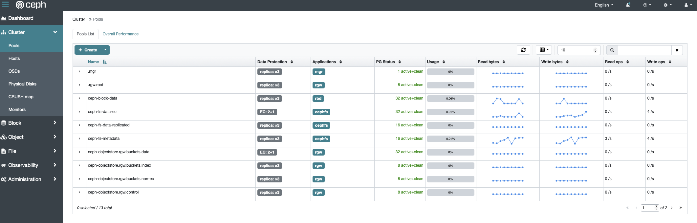

# Storage Architecture: Rook-Ceph

The cluster's storage is managed by Rook-Ceph, providing both block and filesystem storage. The architecture is designed for a balance of performance, data redundancy, and storage efficiency.

### CEPH Block Storage
-   **Pool:** `ceph-block-data` (Replicated, size 3)
-   **Storage Class:** `ceph-block-data`
-   **Default:** Yes. This is the default storage class for all general-purpose block storage needs (e.g., application databases).

### CEPH FileSystem Storage
-   **Filesystem Name:** `ceph-fs`
-   **Pools:**
    1.  `ceph-fs-metadata` (Replicated, size 3): Stores filesystem metadata.
    2.  `ceph-fs-data-replicated` (Replicated, size 3): The required default data pool for the filesystem.
    3.  `ceph-fs-data-ec` (Erasure Coded, 2+1): For high-efficiency bulk data storage.
-   **Storage Classes:**
    1.  `ceph-fs-data-replicated`: Provides replicated, resilient filesystem storage.
    2.  `ceph-fs-data-ec`: Provides erasure-coded, high-efficiency filesystem storage for large datasets.

| StorageClass               | Type                         | Provisioner                     | ReclaimPolicy | BindingMode            | Expandable | Default | Suggested Use                                                                 | Failure Tolerance*                                   |
|--------------------------- |-----------------------------|---------------------------------|---------------|------------------------|------------|---------|--------------------------------------------------------------------------------|------------------------------------------------------|
| `ceph-block-data`          | Ceph **RBD Block**          | `rook-ceph.rbd.csi.ceph.com`    | Retain        | Immediate              | ✅         | ✅      | General/critical workloads needing block volumes (DBs, app data).            | Replicated pool (e.g., 3×) ⇒ tolerate up to (replicas-1) OSD/node failures. |
| `ceph-fs-data-ec`          | **CephFS (Erasure-Coded)**  | `rook-ceph.cephfs.csi.ceph.com` | Retain        | Immediate              | ✅         | —       | Large media & read-heavy files (e.g., Plex libraries) to maximize capacity.  | EC profile (e.g., 2+1) ⇒ tolerates ≥1 OSD/node failure.                    |
| `ceph-fs-data-replicated`  | **CephFS (Replicated)**     | `rook-ceph.cephfs.csi.ceph.com` | Retain        | Immediate              | ✅         | —       | Shared files where extra redundancy is preferred over raw capacity.          | Replicated pool (e.g., 3×) ⇒ tolerate up to (replicas-1) OSD/node failures. |
| `ceph-bucket`              | **S3-compatible Object**    | `rook-ceph.ceph.rook.io/bucket` | Delete        | Immediate              | ❌         | —       | Apps needing object storage via S3 API.                                       | Depends on RGW/RADOS pool replication; node-resilient if replicated.        |
| `local-path`               | **HostPath (Local)**        | `rancher.io/local-path`         | Delete        | WaitForFirstConsumer   | ❌         | —       | Ephemeral/dev workloads tied to a single node.                                | None (single-node; no redundancy).                                         |

\* Failure tolerance is indicative; exact resilience depends on your Ceph pool replica/EC settings.

### Storage System (Rook-Ceph)
   - Status: HEALTH_OK
   - Capacity: 11 TiB total available
   - Capacity: 3.8TB in replicated pools
   - Capacity: 6.8TB in EC pools
   - Configuration:

### Implementation and IaaC 

The new architecture was implemented by making the following changes to the `seadogger-homelab` Infrastructure-as-Code repository:

1.  **`deployments/rook-ceph/rook-ceph-cluster-values.yaml`:**
    *   Updated to define the `ceph-block` and `ceph-fs` filesystems with their corresponding pools and storage classes as detailed above.
    *   Pool names were corrected to their base names (e.g., `data-replicated`), as the Rook operator automatically prepends the filesystem name.

2.  **`ansible/tasks/rook_ceph_deploy_part1.yml`:**
    *   The validation task was updated to check for the existence of the new, correctly named pools (`ceph-fs-metadata`, `ceph-fs-data-replicated`, `ceph-fs-data-ec`).
    *   The task to set the default storage class was updated to target `ceph-block-data`.

3.  **`ansible/tasks/cleanup_infrastructure.yml`:**
    *   The teardown script was updated to correctly identify and delete the newly named StorageClasses, CephFilesystem, and CephNFS resources.

4.  **`ansible/tasks/rook_ceph_deploy.yml`:**
    *   This outdated, monolithic deployment file was deleted to prevent confusion.

5.  **Application Helm Values:**
    *   All `values.yaml` files were reviewed, and any hardcoded `storageClassName` was updated from `ceph-block` or `rook-ceph-filesystem-ec` to the new, correct names (`ceph-block-data` or `ceph-fs-data-ec`).
    *   A new `nextcloud-values.yaml` was created to ensure it uses the correct storage class.

This comprehensive update ensures the entire storage infrastructure is now correctly defined in code, leading to a reliable and repeatable deployment process.
