# Networking & Ingress

---
> **🌙 Diagram Viewing Recommendation**
>
> The interactive Mermaid diagrams below are **optimized for GitHub Dark Mode** to provide maximum readability and visual impact.
>
> **To enable Dark Mode:** GitHub Settings → Appearance → Theme → **Dark default**
>
> *Light mode users can still view the diagrams, though colors may appear less vibrant.*
---

## MetalLB Address Pools
> Update to match your subnet.
- `192.168.1.241 - 192.168.1.254`

## Networking
The cluster assumes static node IPs and a dedicated MetalLB pool. If you change the subnet, update the Ansible inventory, MetalLB `IPAddressPool`, and any VIPs referenced in manifests.

Note: Prefer exposing application UIs via Ingress + TLS (cert-manager) at the Traefik VIP. Use direct MetalLB LoadBalancer IPs only where Ingress is not appropriate.

### VIP L2 Advertisements (MetalLB)
| VIP            | Purpose            |
|----------------|--------------------|
| `192.168.1.241` | Traefik (ingress)  |
| `192.168.1.242` | Bedrock Gateway    |
| `192.168.1.244` | Prometheus         |
| `192.168.1.245` | Grafana            |
| `192.168.1.246` | Alertmanager       |
| `192.168.1.250` | Pi-hole DNS        |

### Ingress Hosts (TLS terminates at Traefik `192.168.1.241`) via PiHole DNS 
- `openwebui.seadogger-homelab`
- `argocd.seadogger-homelab`
- `ceph.seadogger-homelab`
- `pihole.seadogger-homelab`
- `jellyfin.seadogger-homelab`
- `n8n.seadogger-homelab`

## See Also

- **[[03-Hardware-and-Network]]** - Network topology and IP addressing
- **[[08-Security-and-Certificates]]** - TLS certificates for Traefik
- **[[02-Architecture]]** - C4 Network & Security diagram
- **[[21-Deployment-Dependencies]]** - MetalLB dependency analysis

**Related Issues:**
- [#49 - Convert Prometheus to Ingress](https://github.com/seadogger-tech/seadogger-homelab/issues/49) - Remove unnecessary LoadBalancer IPs
- [#41 - Centralize subnet config](https://github.com/seadogger-tech/seadogger-homelab/issues/41) - Network configuration management
- [#4 (Pro) - HTTP to HTTPS redirect](https://github.com/seadogger-tech/seadogger-homelab-pro/issues/4) - Traefik middleware

### Level 3: Network & Security

Shows traffic flow and TLS encryption paths.

```mermaid
graph TB
    LAN([👤 LAN User])
    VPN([👤 VPN User])

    subgraph UDM["🛡️ Ubiquiti Dream Machine"]
        WG[WireGuard<br/>VPN Server]
    end

    subgraph MetalLB["⚖️ MetalLB"]
        Speaker[Speaker<br/>DaemonSet]
        Controller[Controller<br/>IP Assignment]
        IPPool[IP Pool<br/>192.168.1.241-254]
    end

    subgraph Traefik["🔀 Traefik Ingress"]
        EntryPoint[EntryPoints<br/>:80 :443]
        Router[IngressRoutes<br/>Routing Rules]
        TLSStore[TLS Store<br/>Certificates]
        Note1[Note: HTTP→HTTPS<br/>redirect not yet<br/>implemented]
    end

    subgraph CertManager["🔐 cert-manager"]
        CMController[Controller<br/>Issue Certs]
        Issuer[ClusterIssuer<br/>internal-local-issuer]
        RootCA[Root CA<br/>Self-Signed]
        IntermediateCA[Intermediate CA<br/>Signs App Certs]
    end

    subgraph Apps["📦 Applications"]
        Nextcloud[Nextcloud]
        Prometheus[Prometheus]
    end

    subgraph Encryption["🔐 AWS Encryption"]
        Secret[K8s Secret<br/>aws-credentials]
        BG[Bedrock Gateway<br/>Proxy]
        AWS[AWS Bedrock API]
    end

    LAN -->|HTTPS:443| EntryPoint
    VPN -->|WireGuard Tunnel| WG
    WG -->|HTTPS:443| EntryPoint

    Controller --> IPPool
    Speaker --> EntryPoint

    EntryPoint --> Router
    Router --> TLSStore
    Router --> Nextcloud
    Router --> Prometheus

    Note1 -.->|Future: Issue #4| Router

    CMController --> Issuer
    Issuer --> IntermediateCA
    IntermediateCA --> RootCA
    CMController --> TLSStore

    Apps -->|HTTP Internal| BG
    BG -->|Reads| Secret
    BG -->|HTTPS + TLS 1.3| AWS

    style UDM fill:#1e3a5f,stroke:#4a90e2,stroke-width:3px
    style MetalLB fill:#1e3a5f,stroke:#4a90e2,stroke-width:3px
    style Traefik fill:#1e3a5f,stroke:#4a90e2,stroke-width:3px
    style CertManager fill:#2d5016,stroke:#5a9216,stroke-width:3px
    style Apps fill:#2d5016,stroke:#5a9216,stroke-width:3px
    style Encryption fill:#7b1fa2,stroke:#9c27b0,stroke-width:2px
    style Note1 fill:#ffeb3b,stroke:#fbc02d,stroke-width:2px,stroke-dasharray: 5 5
```

**Security Features:**
- **External Access:** WireGuard VPN required for remote access
- **TLS Everywhere:** All ingress traffic uses cert-manager certificates
- **AWS Encryption:** Bedrock API calls use TLS 1.3 with AWS credentials from Kubernetes secrets
- **Future:** HTTP→HTTPS redirect middleware ([Pro #4](https://github.com/seadogger-tech/seadogger-homelab-pro/issues/4))
