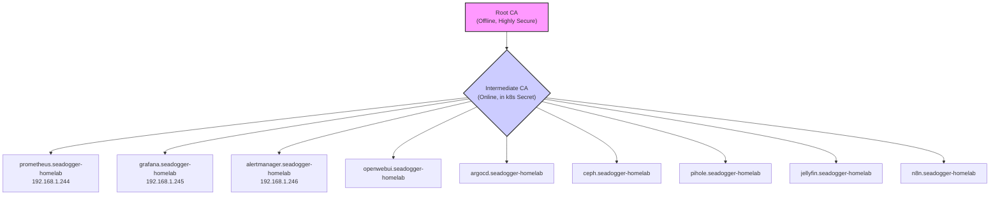
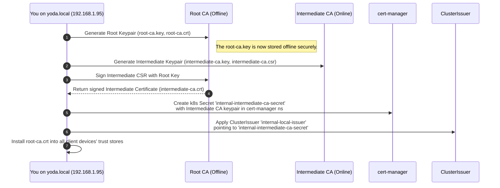
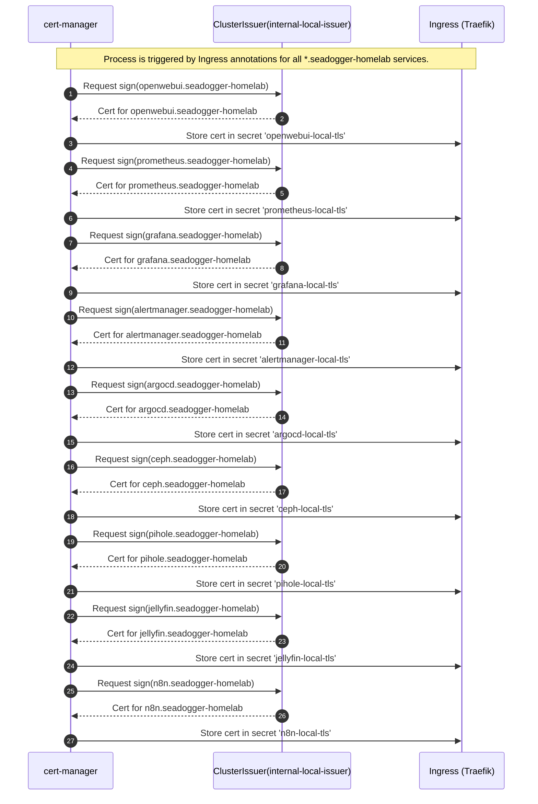
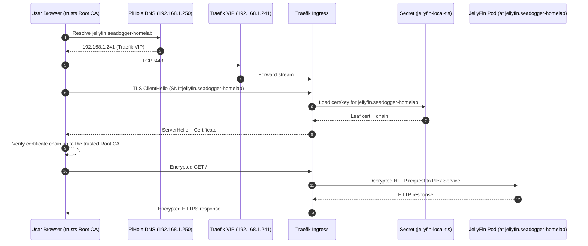
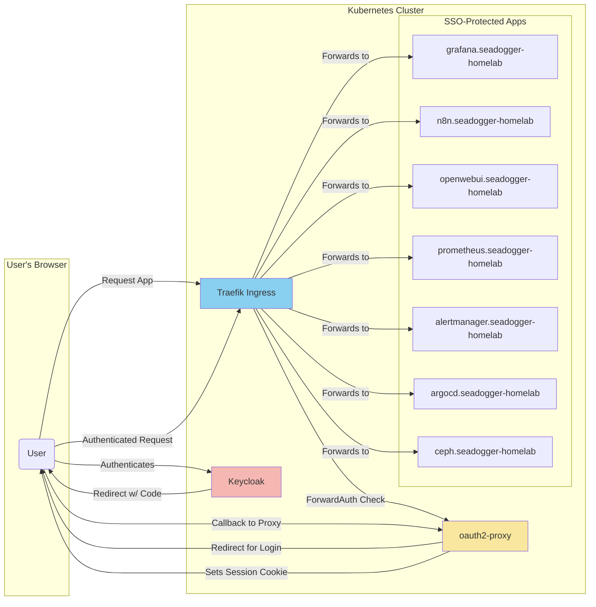
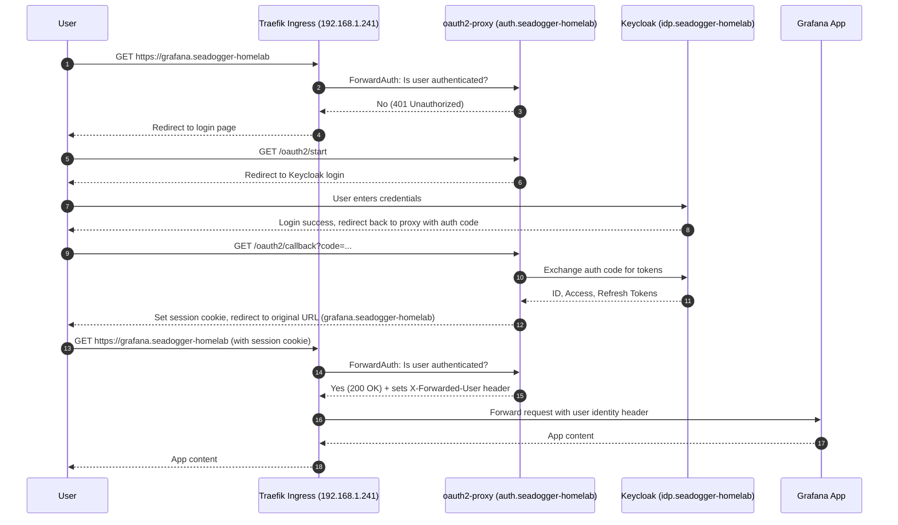
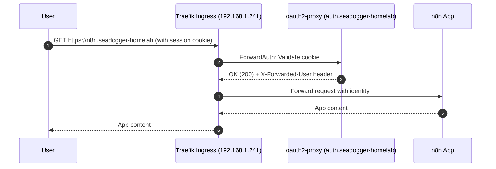
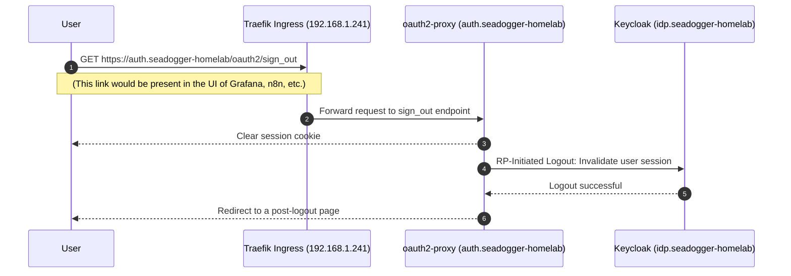

# Security & Certificates


# Internal PKI and HTTPS Data Flow Architecture

This document outlines the definitive architecture for issuing and using TLS certificates for all internal services within the Kubernetes cluster. It follows the best practice of using a dedicated **Intermediate Certificate Authority (CA)** to sign service certificates, keeping the Root CA offline and secure. All internal services use the `*.seadogger-homelab` internal domain.


### 1. The CA Hierarchy and Full Service List

A two-tier trust chain will be established. The Intermediate CA will sign leaf certificates for the following exhaustive list of services:




### 2. Bootstrap the Private CA Hierarchy

This is a one-time setup process performed on `yoda.local` (192.168.1.95).

#### Certificate Generation and Secret Management

**Secret Names:**
- Root CA Secret: `internal-root-ca-secret`
- Intermediate CA Secret: `internal-intermediate-ca-secret`
- ClusterIssuer Name: `internal-local-issuer`

**Certificate Generation Parameters**

To ensure broad compatibility and security, the following certificate generation parameters have been standardized:

1. **Root CA**
   - Key Type: RSA
   - Key Length: 4096 bits
   - Validity Period: 10 years
   - Signature Algorithm: SHA-256
   - Secret Name: `internal-root-ca-secret`

2. **Intermediate CA**
   - Key Type: RSA
   - Key Length: 2048 bits
   - Validity Period: 2 years
   - Signature Algorithm: SHA-256
   - Secret Name: `internal-intermediate-ca-secret`

3. **Leaf Certificates**
   - Key Type: RSA
   - Key Length: 2048 bits
   - Validity Period: 1 year
   - Signature Algorithm: SHA-256
   - Secret Name Pattern: `{service-name}-local-tls`

These parameters ensure:
- Compatibility with modern browsers (Safari, Chrome)
- Strong cryptographic security
- Manageable certificate rotation cycles




### 3. Issuing All Leaf Certificates

This diagram shows the complete, exhaustive flow for issuing a certificate to every service.




### 4. HTTPS Request Path (Example: `jellyfin.seadogger-homelab`)

This flow is identical for all services. The user's browser connects to the single Traefik VIP, which then routes the request to the correct internal service IP.




# Next Steps: SSO Implementation Plan

This section outlines the plan for implementing Single Sign-On (SSO) using Keycloak as the Identity Provider (IdP), enforced at the edge by `oauth2-proxy` and Traefik's `ForwardAuth` middleware.


## Goal

Centralize login with Keycloak, enforce it uniformly at the edge with `oauth2-proxy` + Traefik, and pass user identity to backend applications via HTTP headers.


## Architecture and Hostnames

*   **Keycloak (IdP):** `idp.seadogger-homelab` (will be assigned a new VIP, e.g., 192.168.1.253)
*   **oauth2-proxy:** `auth.seadogger-homelab` (internal service, no dedicated VIP)
*   **Traefik (Ingress):** `192.168.1.241` (existing VIP)
*   **Protected Applications:** `grafana.seadogger-homelab`, `n8n.seadogger-homelab`, `openwebui.seadogger-homelab`, `prometheus.seadogger-homelab`, `alertmanager.seadogger-homelab`, `argocd.seadogger-homelab`, `ceph.seadogger-homelab`.


## Secrets & Credentials

- Do not commit real credentials to git. Store sensitive values with Ansible Vault (e.g., `ansible-vault encrypt_string`) and use GitHub Actions secrets for CI (e.g., `WIKI_TOKEN`). If any secrets were committed previously, rotate them immediately (create new credentials, update Vault/CI, disable the old ones).


## Client Trust: Export and Install the Root CA

To avoid browser “untrusted site” warnings when accessing the portal and other internal services, install your internal Root CA on your devices.

### 1) Export the Root CA (and optional Intermediate)
Get the Root CA PEM (the trust anchor to install on devices):
```
kubectl -n cert-manager get secret internal-root-ca-secret \
  -o jsonpath='{.data.root-ca\.crt}' | base64 -d > seadogger-rootCA.pem
```

Optional — export the Intermediate CA (for inspection/chain debugging):
```
kubectl -n cert-manager get secret internal-intermediate-ca-secret \
  -o jsonpath='{.data.tls\.crt}' | base64 -d > seadogger-intermediateCA.pem
```

### 2) Install on Devices
- iPhone / iPad (iOS & iPadOS)
  - AirDrop or email `seadogger-rootCA.pem` to the device
  - Tap to install: Settings > General > VPN & Device Management > Profiles
  - Then: Settings > General > About > Certificate Trust Settings → enable “Full Trust” for “SeaDogger Root CA”

- Mac (macOS)
  - Double‑click `seadogger-rootCA.pem` → opens in Keychain Access
  - Install into the System keychain
  - Right‑click the certificate → Get Info → Trust → set to “Always Trust”

- Chrome
  - Uses the OS trust store
  - On macOS: inherits Keychain trust (works after steps above)
  - On iOS/iPadOS: uses system trust (works after enabling “Full Trust”)

After installation, your browser will trust certificates issued for `*.seadogger-homelab` by your internal CA.


### SSO Component Block Diagram

This diagram shows the high-level relationship between the components and explicitly lists all applications that will be protected.



## SSO Login Flow (First Time Access)

This diagram shows a user accessing a protected application (`grafana.seadogger-homelab`) for the first time.



## Authenticated Request Flow

Once the user has a valid session cookie, every subsequent request is validated quickly at the edge.



## Global Logout Flow

This shows how logging out from one application logs the user out of the entire SSO session.




## See Also

- **[[07-Networking-and-Ingress]]** - Traefik TLS termination
- **[[04-Bootstrap-and-Cold-Start]]** - Internal PKI deployment
- **[[02-Architecture]]** - C4 Network & Security diagram
- **[[21-Deployment-Dependencies]]** - Cert-manager dependency analysis

**Related Issues:**
- [#42 - Document encryption strategy](https://github.com/seadogger-tech/seadogger-homelab/issues/42) - Encryption ADR
- [#25 - Encryption verification](https://github.com/seadogger-tech/seadogger-homelab/issues/25) - End-to-end encryption checks
- [#48 - Deployment Dependencies](https://github.com/seadogger-tech/seadogger-homelab/issues/48) - Simplify PKI bootstrap
