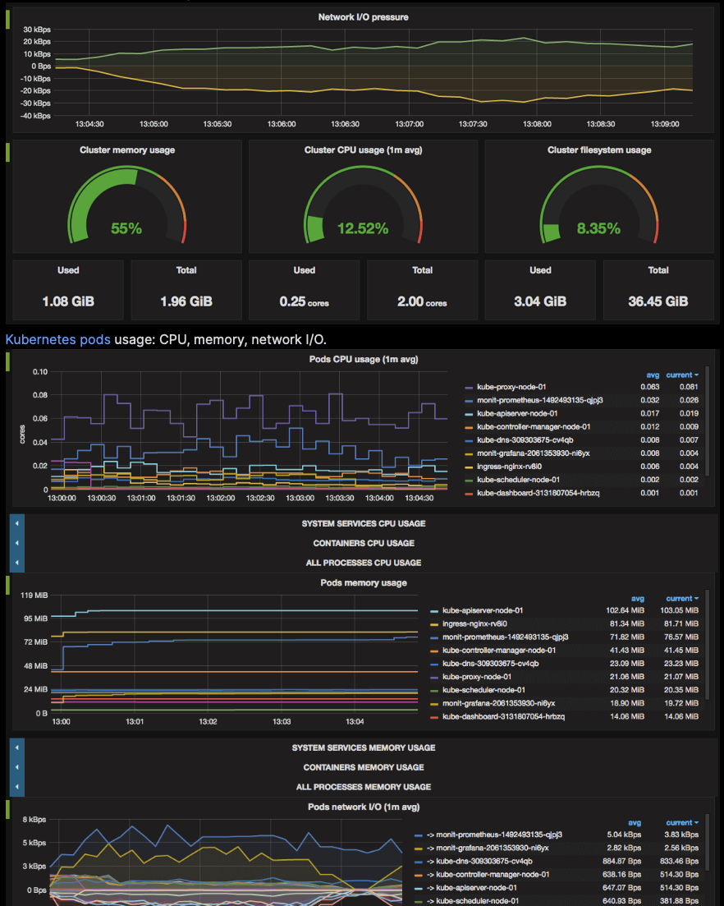

# Applications
*Generated — 2025-09-07 23:19 UTC*

## Discovered Workloads
- `Verify`
- `argocd-server`
- `bedrock-access-gateway`
- `cert-manager-webhook`

## From the Memory Bank

- [Internal PKI and HTTPS Data Flow Architecture](memory_bank/2025-08-12-internal-pki-and-https-flow.md)
- [Ansible Deployment Idempotency Refactor Plan](memory_bank/2025-08-16-ansible-idempotency-refactor-plan.md)
- [Ansible Idempotency and Cold Start Test Plan](memory_bank/2025-08-16-cold-start-test-plan.md)
- [Rook-Ceph Storage Architecture Update](memory_bank/2025-08-17-rook-ceph-storage-architecture-update.md)
- [Stable Deployment and Cold Start Procedure](memory_bank/2025-08-17-stable-deployment-and-cold-start-procedure.md)
- [Active Context: seadogger-homelab](memory_bank/activeContext.md)
- [Product Context: seadogger-homelab](memory_bank/productContext.md)
- [Progress: seadogger-homelab](memory_bank/progress.md)
- [Technical Context: seadogger-homelab](memory_bank/techContext.md)
