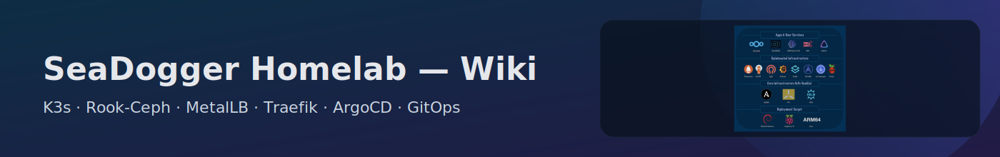
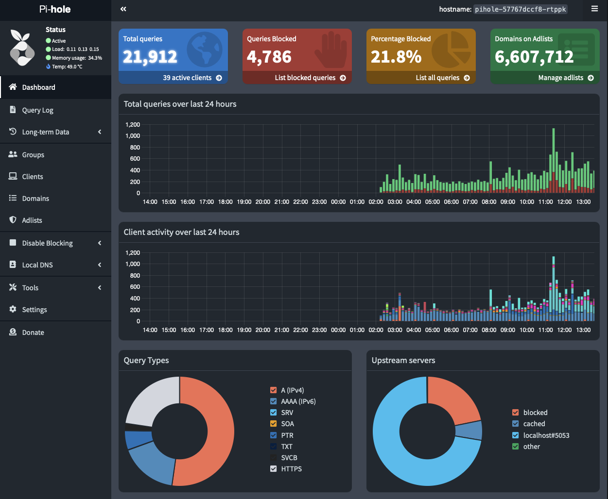
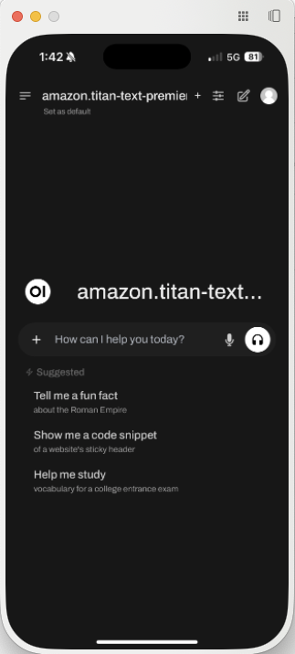
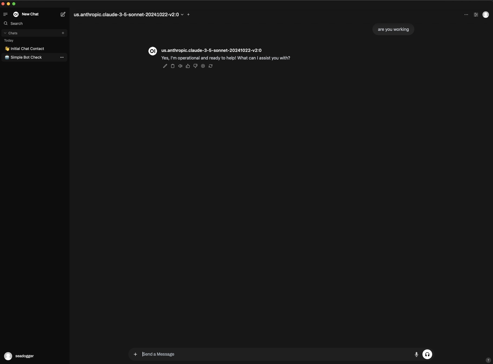
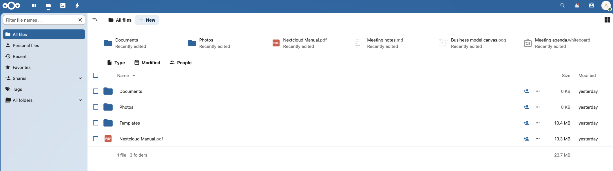
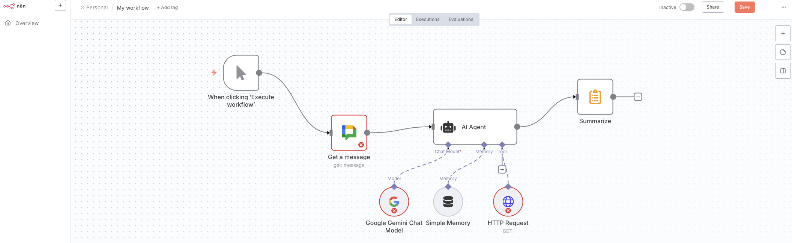
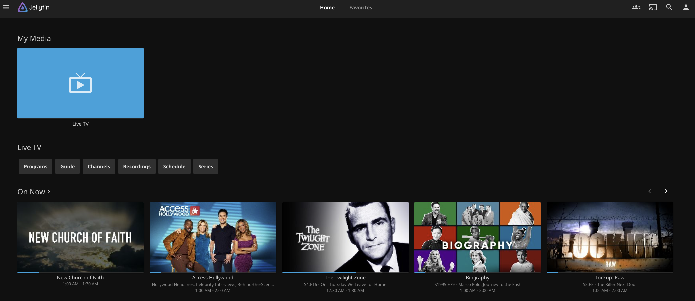

# Applications
User facing applications that are applied thru ArgoCD on top of the k3s tech stack

## PiHole: **Website:** [https://pi-hole.net](https://pi-hole.net)
- Network-wide DNS sinkhole for ads and tracking.
- Blocks ads at the network level (including in-app and smart-TV).
- Web admin interface and API; ideal on Raspberry Pi or any Linux box.

## OpenWebUI: **Website:** [https://open-webui.com](https://open-webui.com)
- Self-hosted web UI for local/remote LLMs.
- Works offline; supports multiple LLM runners; chat, RAG, and extensions.
- Installable as a PWA for a smooth mobile experience.

  
  &nbsp;&nbsp;&nbsp;
  

## NextCloud: **Website:** [https://nextcloud.com](https://nextcloud.com)
- Open-source, self-hosted content-collaboration and file-sync platform.
- Files & sharing, Office (collaborative editing), Calendar, Contacts, Talk (chat/video).
- Desktop & mobile clients; extensible via a large app ecosystem.

## N8N: **Website:** [https://n8n.io](https://n8n.io)
- Source-available, self-hostable workflow-automation platform.
- Visual editor + optional code; 500+ integrations and webhooks/triggers.
- Run self-hosted (Docker/Kubernetes) or use n8n Cloud.
- Great for API automations and AI/agent workflows.

## JellyFin: **Website:** [https://jellyfin.org](https://jellyfin.org)
- Free, open-source, self-hosted media server.
- Lets you organize and stream movies, TV, music, and photos to many devices.
- Runs on Windows, Linux, macOS, Docker, and more.
- Web UI and apps; supports Live TV/DVR and DLNA.
- Hardware-accelerated transcoding via FFmpeg when available.
- 100% free—no tracking and no premium tiers.

