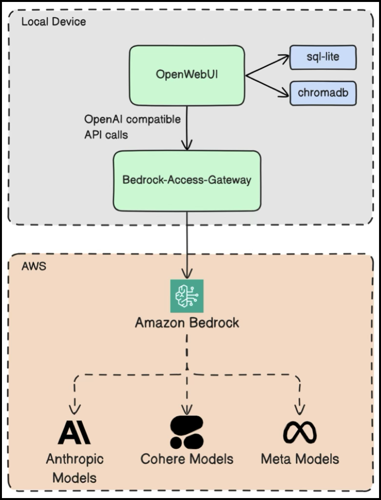

# Applications
User facing applications that are applied thru ArgoCD on top of the k3s tech stack


## PiHole: **Website:** [https://pi-hole.net](https://pi-hole.net)
- Network-wide DNS sinkhole for ads and tracking.
- Blocks ads at the network level (including in-app and smart-TV).
- Web admin interface and API; ideal on Raspberry Pi or any Linux box.


## OpenWebUI: **Website:** [https://open-webui.com](https://open-webui.com)
- Self-hosted web UI for local/remote LLMs.
- Works offline; supports multiple LLM runners; chat, RAG, and extensions.
- Installable as a PWA for a smooth mobile experience.

<p align="center">
  
  &nbsp;&nbsp;&nbsp;
  
</p>


## AWS Bedrock Access Gateway: **Website/Repo:** [https://github.com/aws-samples/bedrock-access-gateway](https://github.com/aws-samples/bedrock-access-gateway)
- Open-source gateway that exposes **OpenAI-compatible REST APIs** for **Amazon Bedrock**.
- Lets existing OpenAI SDKs/tools (e.g., OpenAI Python/JS, LangChain-OpenAI, AutoGen) work with Bedrock **without code changes**.
- Supports **SSE streaming**, **Chat Completions**, **Embeddings**, **Tool/function calling**, **Multimodal**, **Models API**, **Cross-region inference**, and **Application Inference Profiles**.
- **Easy deployment:** 1-click CloudFormation to **ALB + Lambda** or **ALB + Fargate**; also runs **locally** or in **containers/Kubernetes**.
- Regions & models: follows **Bedrock-supported regions**; use the **Models API** to discover availability.



## NextCloud: **Website:** [https://nextcloud.com](https://nextcloud.com)
- Open-source, self-hosted content-collaboration and file-sync platform.
- Files & sharing, Office (collaborative editing), Calendar, Contacts, Talk (chat/video).
- Desktop & mobile clients; extensible via a large app ecosystem.


## HDHomeRun Guide Utility

A tiny Python utility that pulls the HDHomeRun XMLTV guide and stores it locally.  
It can be run with:

```bash
# Default (no target, saves to xmltv.xml in current directory)
./fetch_hdhomerun_guide.py \
    --discover-url http://192.168.1.70/discover.json

# Save to a specific location
./fetch_hdhomerun_guide.py \
    --discover-url http://192.168.1.70/discover.json \
    --target /media/data/HomeMedia/files/Live_TV_Guide/xmltv.xml
```

The script lives in `seadogger-homelab-pro/core/useful_scripts/fetch_hdhomerun_guide.py` and is documented in the wiki page **[HDHomeRun Guide Utility](20-HDHomeRun-Guide.md)**.


## N8N: **Website:** [https://n8n.io](https://n8n.io)
- Source-available, self-hostable workflow-automation platform.
- Visual editor + optional code; 500+ integrations and webhooks/triggers.
- Run self-hosted (Docker/Kubernetes) or use n8n Cloud.
- Great for API automations and AI/agent workflows.


## JellyFin: **Website:** [https://jellyfin.org](https://jellyfin.org)
- Free, open-source, self-hosted media server.
- Lets you organize and stream movies, TV, music, and photos to many devices.
- Runs on Windows, Linux, macOS, Docker, and more.
- Web UI and apps; supports Live TV/DVR and DLNA.
- Hardware-accelerated transcoding via FFmpeg when available.
- 100% free—no tracking and no premium tiers.

