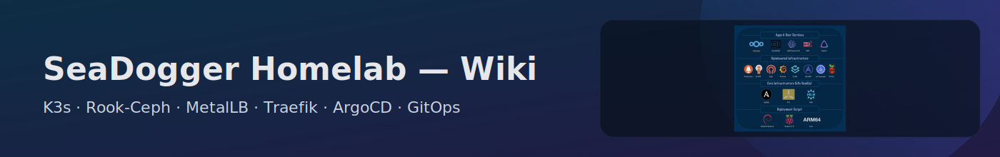
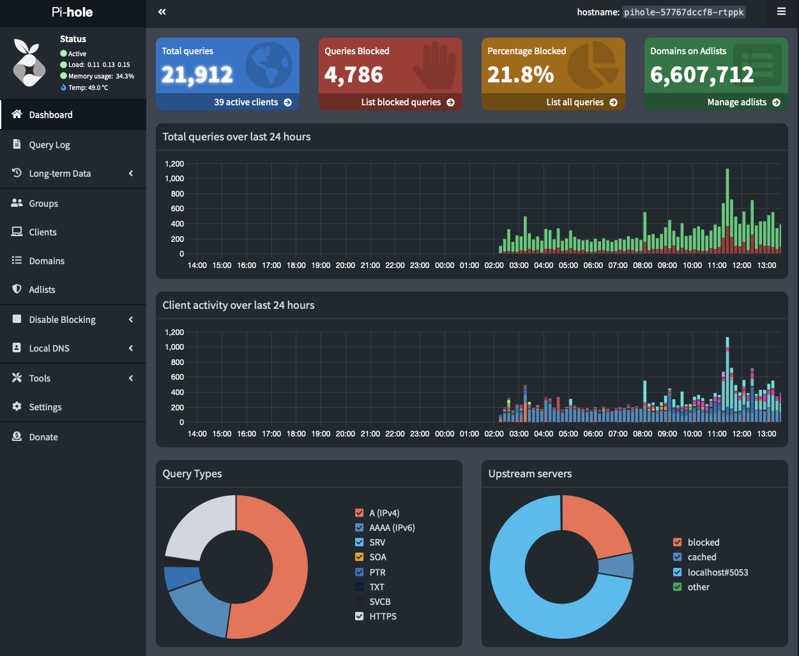
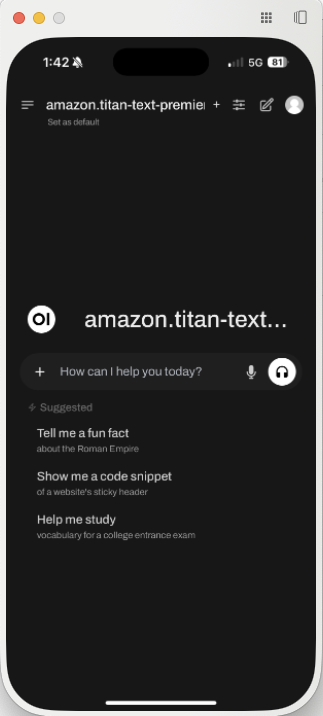
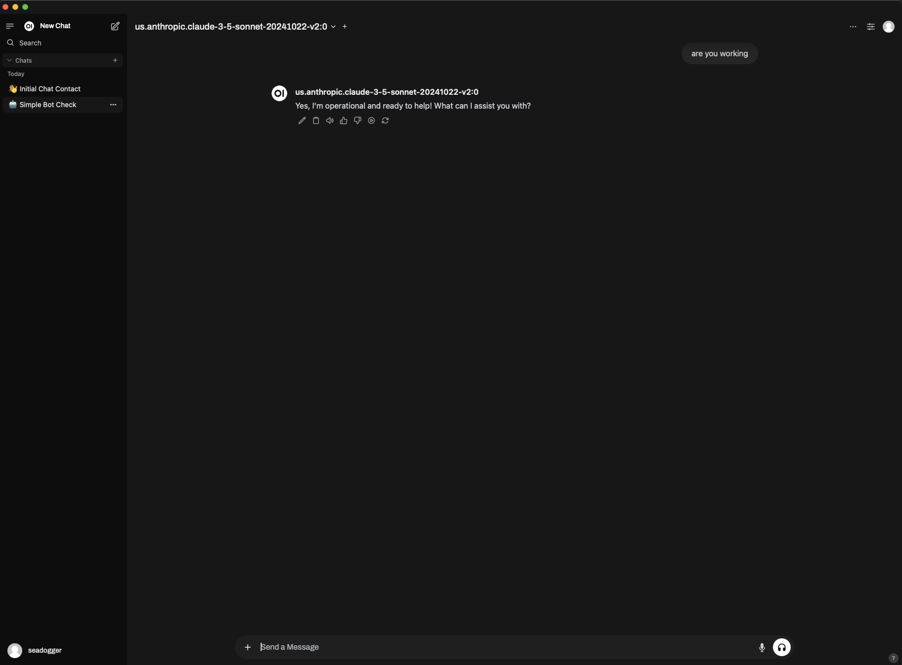
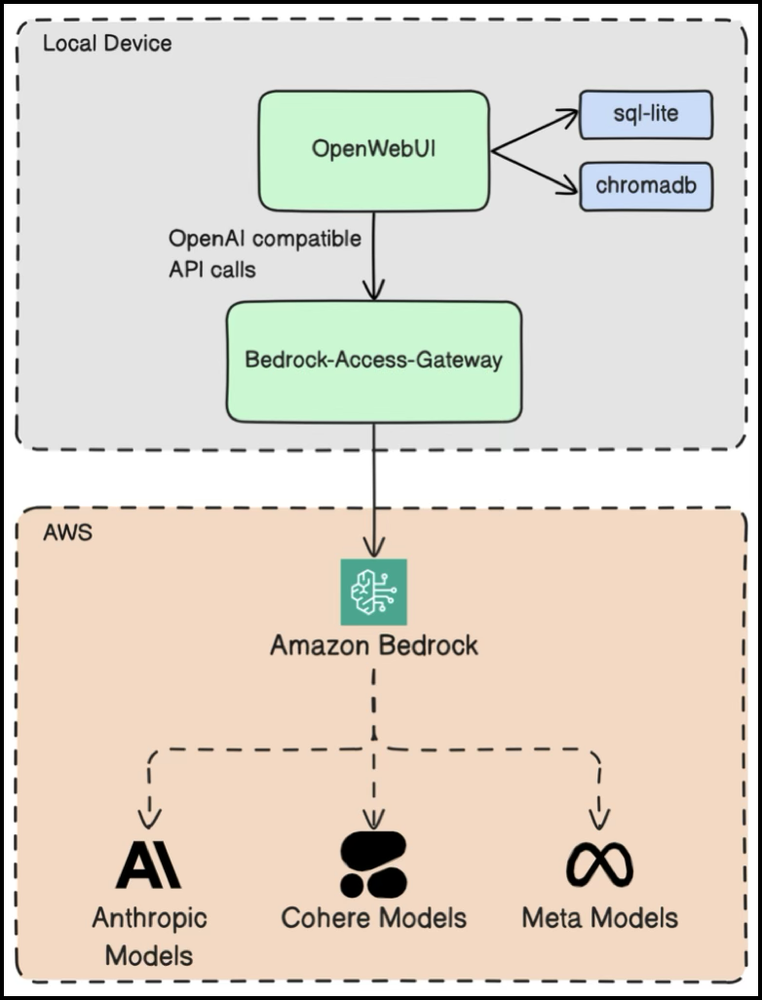
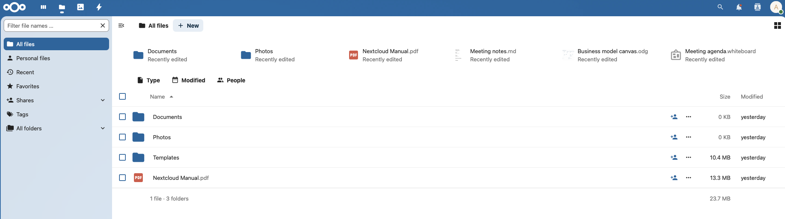
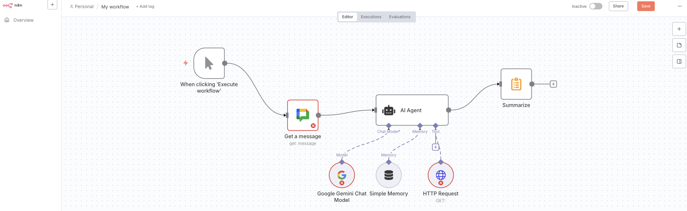
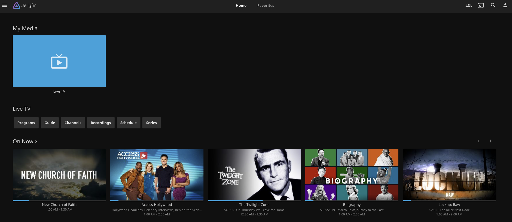

# Applications
User facing applications that are applied thru ArgoCD on top of the k3s tech stack


## PiHole: **Website:** [https://pi-hole.net](https://pi-hole.net)
- Network-wide DNS sinkhole for ads and tracking.
- Blocks ads at the network level (including in-app and smart-TV).
- Web admin interface and API; ideal on Raspberry Pi or any Linux box.



## OpenWebUI: **Website:** [https://open-webui.com](https://open-webui.com)
- Self-hosted web UI for local/remote LLMs.
- Works offline; supports multiple LLM runners; chat, RAG, and extensions.
- Installable as a PWA for a smooth mobile experience.

<p align="center">
  
  &nbsp;&nbsp;&nbsp;
  
</p>


## AWS Bedrock Access Gateway: **Website/Repo:** [https://github.com/aws-samples/bedrock-access-gateway](https://github.com/aws-samples/bedrock-access-gateway)
- Open-source gateway that exposes **OpenAI-compatible REST APIs** for **Amazon Bedrock**.
- Lets existing OpenAI SDKs/tools (e.g., OpenAI Python/JS, LangChain-OpenAI, AutoGen) work with Bedrock **without code changes**.
- Supports **SSE streaming**, **Chat Completions**, **Embeddings**, **Tool/function calling**, **Multimodal**, **Models API**, **Cross-region inference**, and **Application Inference Profiles**.
- **Easy deployment:** 1-click CloudFormation to **ALB + Lambda** or **ALB + Fargate**; also runs **locally** or in **containers/Kubernetes**.
- Regions & models: follows **Bedrock-supported regions**; use the **Models API** to discover availability.

### Deployment Architecture
- **Automated Upstream Tracking:** GitHub Actions workflow rebuilds image every 6 hours from [aws-samples/bedrock-access-gateway](https://github.com/aws-samples/bedrock-access-gateway)
- **Multi-arch Support:** Built for `linux/amd64` and `linux/arm64` (Raspberry Pi 5 compatible)
- **Image Registry:** `ghcr.io/seadogger-tech/aws-bedrock-gateway:latest`
- **Access:** MetalLB LoadBalancer at `192.168.1.242:6880`
- **Integration:** Works seamlessly with OpenWebUI for chat interface

### Configuration Requirements
1. **AWS Bedrock Model Access:**
   - Enable models in AWS Bedrock console for the deployment region (us-west-2)
   - Cross-region inference profiles (`us.*` prefix) require separate access grants
   - Example: `us.anthropic.claude-opus-4-1-20250805-v1:0` requires both base model and inference profile access

2. **IAM Permissions:**
   - User must have `AmazonBedrockFullAccess` policy or equivalent
   - Credentials stored as Kubernetes secret in `bedrock-gateway` namespace
   - Environment variables: `AWS_ACCESS_KEY_ID`, `AWS_SECRET_ACCESS_KEY`, `AWS_REGION`

3. **Gateway Authentication:**
   - **API_KEY:** `bedrock` (used by clients to authenticate to the gateway)
   - Clients must include header: `Authorization: Bearer bedrock`
   - This is separate from AWS credentials (gateway → Bedrock authentication)

4. **Container Configuration:**
   - Container listens on port **8080** (upstream default as of 2025)
   - Service exposes externally on port **6880** via MetalLB

5. **Known Issues & Solutions:**
   - **Model returns AccessDeniedException:** Enable the specific model in AWS Bedrock console for us-west-2
   - **Requests hang without response:** Restart deployment to pull latest gateway image (`kubectl rollout restart deployment/bedrock-access-gateway -n bedrock-gateway`)
   - **Parameter validation errors:** Upstream fixes auto-deployed (e.g., Claude Sonnet 4.5 temperature/top_p conflict fixed in latest)
   - **Pod CrashLoopBackOff "API Key not configured":** Ensure `API_KEY` env var is set (upstream removed default in Feb 2025)




## NextCloud: **Website:** [https://nextcloud.com](https://nextcloud.com)
- Open-source, self-hosted content-collaboration and file-sync platform.
- Files & sharing, Office (collaborative editing), Calendar, Contacts, Talk (chat/video).
- Desktop & mobile clients; extensible via a large app ecosystem.


## HDHomeRun Guide Utility

A tiny Python utility that pulls the HDHomeRun XMLTV guide and stores it locally.  
It can be run with:

```bash
# Default (no target, saves to xmltv.xml in current directory)
./fetch_hdhomerun_guide.py \
    --discover-url http://192.168.1.70/discover.json

# Save to a specific location
./fetch_hdhomerun_guide.py \
    --discover-url http://192.168.1.70/discover.json \
    --target /media/data/HomeMedia/files/Live_TV_Guide/xmltv.xml
```

The script lives in `seadogger-homelab-pro/core/useful_scripts/fetch_hdhomerun_guide.py` and is documented in the wiki page **[HDHomeRun Guide Utility](20-HDHomeRun-Guide.md)**.


## N8N: **Website:** [https://n8n.io](https://n8n.io)
- Source-available, self-hostable workflow-automation platform.
- Visual editor + optional code; 500+ integrations and webhooks/triggers.
- Run self-hosted (Docker/Kubernetes) or use n8n Cloud.
- Great for API automations and AI/agent workflows.



## JellyFin: **Website:** [https://jellyfin.org](https://jellyfin.org)
- Free, open-source, self-hosted media server.
- Lets you organize and stream movies, TV, music, and photos to many devices.
- Runs on Windows, Linux, macOS, Docker, and more.
- Web UI and apps; supports Live TV/DVR and DLNA.
- Hardware-accelerated transcoding via FFmpeg when available.
- 100% free—no tracking and no premium tiers.



## Minecraft Bedrock Server: **Website:** [https://www.minecraft.net](https://www.minecraft.net)
- Self-hosted Minecraft Bedrock Edition server for ARM64 (Raspberry Pi 5).
- Uses **itzg/minecraft-bedrock-server** container with **box64** ARM64 support.
- **UDP LoadBalancer** at `192.168.1.247:19132` (MetalLB).
- **Filebrowser** pack manager UI at `minecraft.seadogger-homelab` (HTTPS).
- **TLS certificates** via cert-manager `internal-local-issuer`.
- **Storage:** 10Gi PVC on `ceph-fs-data-ec` (CephFS with 2+1 erasure coding) for world saves and packs.

### Features
- **Cross-platform play:** Connect from Windows, iOS, Android, Xbox, PlayStation, Nintendo Switch
- **Pack management:** Upload behavior packs, resource packs, and world templates via Filebrowser web UI
- **Auto-extract .mcpack files:** CronJob automatically extracts uploaded .mcpack files every 2 minutes
- **Blockbench support:** Upload custom models/textures directly from Blockbench as .mcpack files
- **Persistent storage:** World data and server config saved to Ceph RBD
- **Automated deployment:** ArgoCD Application with sync-wave 3
- **Easy updates:** Change `VERSION` env var in deployment to upgrade server version

### Configuration
- **Server properties:** Managed via environment variables in [deployment.yaml](../deployments/minecraft-bedrock/base/deployment.yaml)
- **World settings:** Edit `server.properties` via Filebrowser or kubectl exec

### Uploading Custom Packs (Blockbench/mcpack)
1. **Access Filebrowser:** Go to `https://minecraft.seadogger-homelab` and log in
2. **Navigate to pack directory:**
   - Resource packs (textures, models, sounds): `/data/resource_packs/`
   - Behavior packs (gameplay mechanics): `/data/behavior_packs/`
3. **Upload .mcpack file:** Use the upload button to select your file from Blockbench
4. **Wait for auto-extraction:** A CronJob runs every 2 minutes and automatically:
   - Extracts the .mcpack file to the appropriate directory
   - Removes the .mcpack file after extraction
5. **Restart server (if needed):** Most packs load automatically; if not, restart via:
   ```bash
   kubectl rollout restart deployment/minecraft-bedrock -n minecraft-bedrock
   ```

### Connecting to the Server

#### From PC/Mobile (Windows, iOS, Android)
1. Open Minecraft Bedrock Edition
2. Go to **Play** → **Servers** → **Add Server**
3. Enter server details:
   - **Server Name:** SeaDogger Homelab
   - **Server Address:** `192.168.1.247`
   - **Port:** `19132`
4. Save and connect

#### From Xbox/PlayStation/Nintendo Switch
**Option 1: LAN Discovery (Easiest)**
1. Open Minecraft Bedrock Edition
2. Go to **Play** → **Friends** tab
3. Scroll down to **LAN Games** section
4. Look for **"SeaDogger Homelab"** in the list
5. Select and join

**Option 2: Via Mobile/PC First**
1. Add the server to a mobile device or Windows 10 PC using the steps above
2. Connect to the server once from that device
3. The server will now appear in the **Friends/Servers** list on Xbox/PlayStation/Switch
4. Join from your console

**Note:** Xbox/PlayStation/Switch don't allow direct server entry without using Xbox Insider or connecting from another device first.


## See Also

- **[[18-Setting-Up-n8n-Connections]]** - N8N configuration guide
- **[[20-HDHomeRun-Guide]]** - Jellyfin live TV setup
- **[[06-Storage-Rook-Ceph]]** - Application storage backends
- **[[08-Security-and-Certificates]]** - Application TLS certificates

**Setup Guides:**
- [#34 - Get passwords](https://github.com/seadogger-tech/seadogger-homelab/issues/34)
- [#35 - PiHole whitelist](https://github.com/seadogger-tech/seadogger-homelab/issues/35)
- [#36 - OpenWebUI Bedrock](https://github.com/seadogger-tech/seadogger-homelab/issues/36)
- [#37 - Jellyfin XMLTV](https://github.com/seadogger-tech/seadogger-homelab/issues/37)
- [#38 - Nextcloud setup](https://github.com/seadogger-tech/seadogger-homelab/issues/38)
- [#39 - N8N workflows](https://github.com/seadogger-tech/seadogger-homelab/issues/39)
