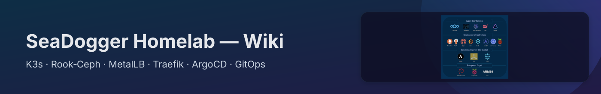
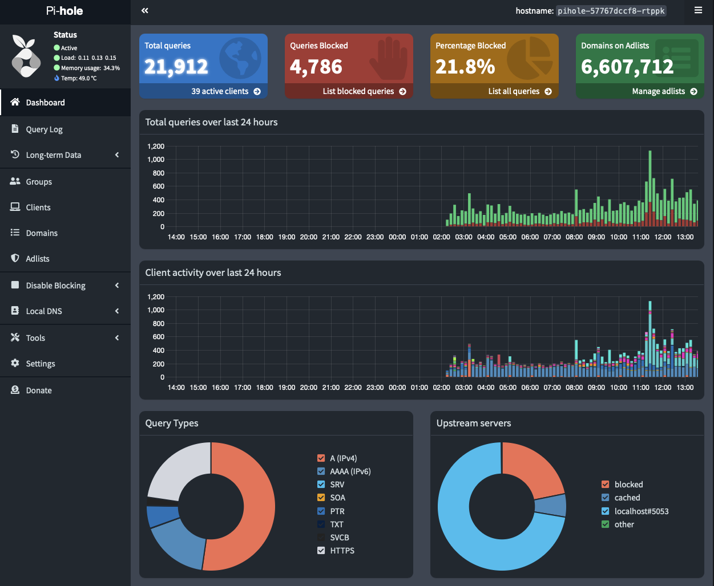
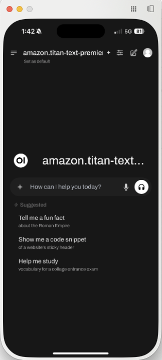
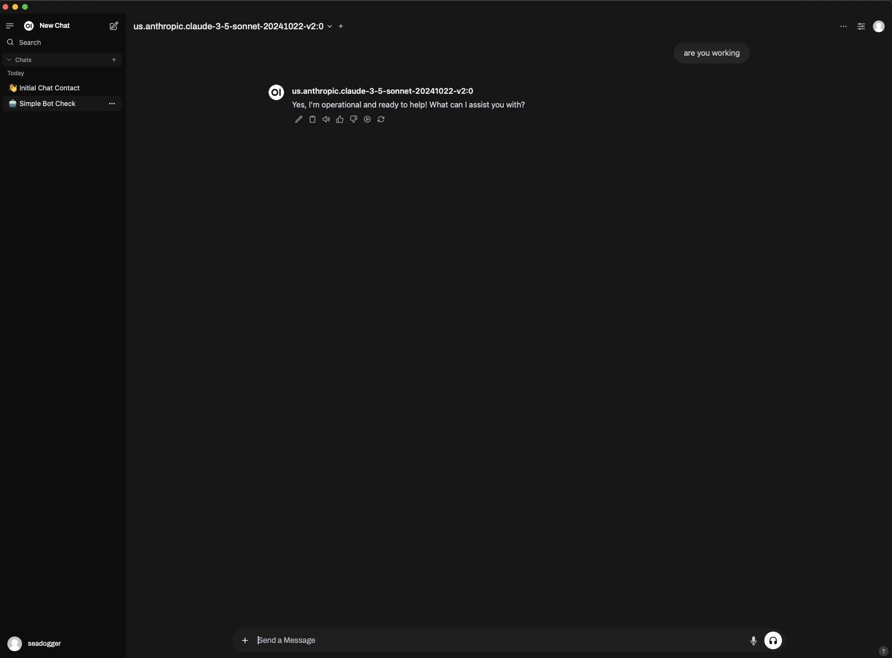
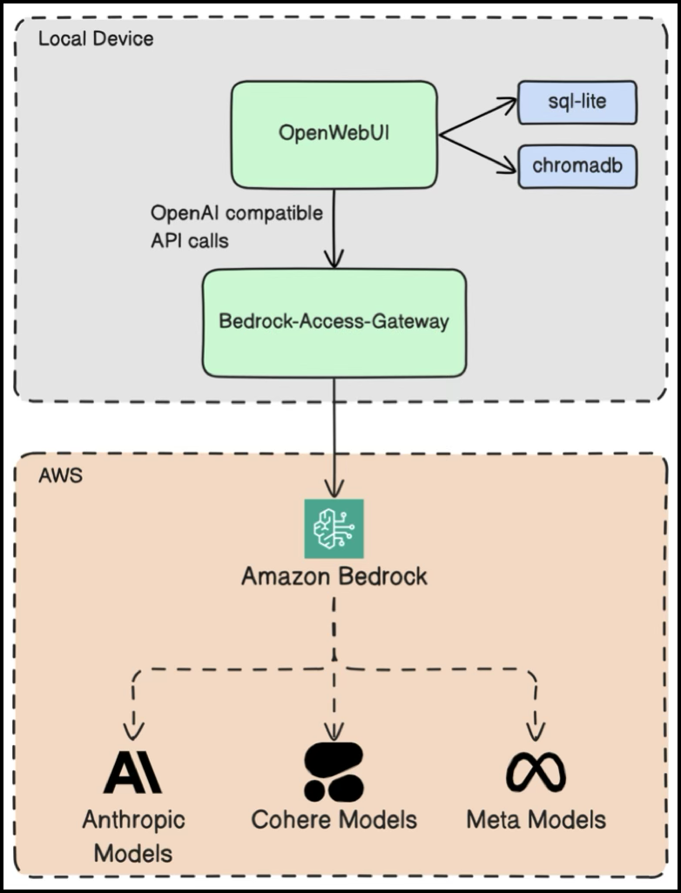
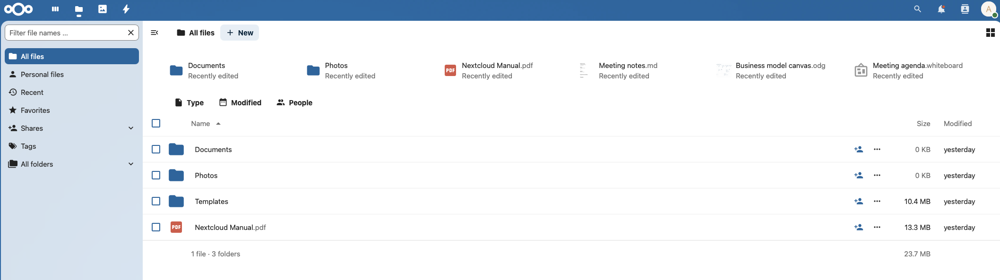
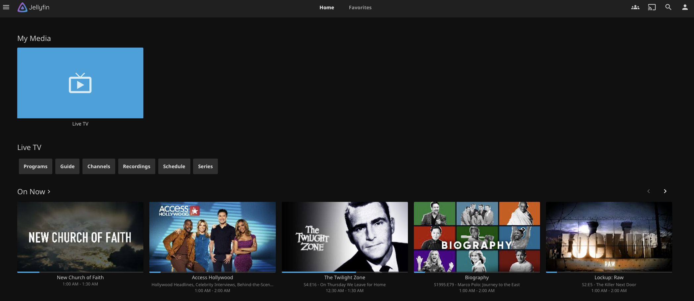

# Applications
User facing applications that are applied thru ArgoCD on top of the k3s tech stack


## PiHole: **Website:** [https://pi-hole.net](https://pi-hole.net)
- Network-wide DNS sinkhole for ads and tracking.
- Blocks ads at the network level (including in-app and smart-TV).
- Web admin interface and API; ideal on Raspberry Pi or any Linux box.
- All `*.seadogger-homelab` hostnames are static `dnsmasq` records defined in
  `core/deployments/pihole/pihole-values.yaml` (`dnsmasq.customDnsEntries`) —
  add a new app's hostname there, not through the Pi-hole UI, so it survives
  a redeploy.
- **30-Minute Pause button** on the portal calls a small backend
  (`deployments/pihole-toggle`, Pro repo) that holds the Pi-hole admin
  password server-side and calls Pi-hole's v6 API
  (`POST /api/dns/blocking`) — the password never reaches the browser.



## Home Assistant: **Website:** [https://www.home-assistant.io](https://www.home-assistant.io)
- Home automation hub, deployed via the community
  [pajikos/home-assistant-helm-chart](https://github.com/pajikos/home-assistant-helm-chart)
  (`deployments/home-assistant`, Pro repo) — chart version pinned explicitly.
- **Container mode, no Supervisor:** Core + HACS only. There is no
  add-on store — anything you'd install as a Supervisor add-on
  (Mosquitto, Zigbee2MQTT, ESPHome) needs to run as its own pod instead.
- **No `hostNetwork`, no node-pinning:** standard pod networking, since
  no USB Zigbee/Z-Wave radio is attached. mDNS-based discovery (HomeKit,
  Chromecast, local device auto-discovery) will not work without
  `hostNetwork: true` — revisit if that's ever needed.
- **Reverse-proxy trust required:** HA rejects requests from a reverse
  proxy it doesn't recognize (`400 Bad Request`, "not set-up for reverse
  proxies"). Since we route via our own Traefik `IngressRoute` rather
  than the chart's own `Ingress`, `ingress.external: true` +
  `configuration.enabled: true` in the values file is what makes HA emit
  the `http.use_x_forwarded_for` / `trusted_proxies` config — without it,
  every request 400s.
- **`configuration.yaml` is only regenerated if missing** — the chart's
  init container copies its templated config to the PVC once and never
  again once the file exists. After changing `configuration.templateConfig`
  values, you must delete `/config/configuration.yaml` from the running
  pod and restart it for the new template to actually apply.
- **HACS install:** `wget -O - https://get.hacs.xyz | bash -` run inside
  the pod (`kubectl exec ... -- bash -c "..."`), then restart the pod.
  Not pre-installed by default.
- **Dashboard editing via code:** see **[[17-Runbooks]]** →
  "Edit a Home Assistant Dashboard via Code" for a reusable script
  (`core/useful_scripts/ha_dashboard_edit.py`) that edits Lovelace
  dashboards through HA's own WebSocket API (`lovelace/config` /
  `lovelace/config/save`) instead of hand-editing the live `.storage`
  file.
- Storage: `ceph-block-data` (RBD), single replica — HA's SQLite recorder
  DB needs a single writer.


## Mealie: **Website:** [https://mealie.io](https://mealie.io)
- Self-hosted recipe manager and meal planner
  ([mealie-recipes/mealie](https://github.com/mealie-recipes/mealie)).
- Plain hand-written manifests (`deployments/mealie`, Pro repo), not a
  Helm chart — no third-party chart for Mealie has real community
  adoption, so this follows the same pattern as Jellyfin/Signal-CLI.
- SQLite backend (default, no separate Postgres needed) on
  `ceph-block-data`, `Recreate` deploy strategy (single writer).
- Image pinned (not `:latest`) — bump deliberately, verify after.


## OpenWebUI: **Website:** [https://open-webui.com](https://open-webui.com)
- Self-hosted web UI for local/remote LLMs.
- Works offline; supports multiple LLM runners; chat, RAG, and extensions.
- Installable as a PWA for a smooth mobile experience.

<p align="center">
  
  &nbsp;&nbsp;&nbsp;
  
</p>


## AWS Bedrock Access Gateway: **Website/Repo:** [https://github.com/aws-samples/bedrock-access-gateway](https://github.com/aws-samples/bedrock-access-gateway)
- Open-source gateway that exposes **OpenAI-compatible REST APIs** for **Amazon Bedrock**.
- Lets existing OpenAI SDKs/tools (e.g., OpenAI Python/JS, LangChain-OpenAI, AutoGen) work with Bedrock **without code changes**.
- Supports **SSE streaming**, **Chat Completions**, **Embeddings**, **Tool/function calling**, **Multimodal**, **Models API**, **Cross-region inference**, and **Application Inference Profiles**.
- **Easy deployment:** 1-click CloudFormation to **ALB + Lambda** or **ALB + Fargate**; also runs **locally** or in **containers/Kubernetes**.
- Regions & models: follows **Bedrock-supported regions**; use the **Models API** to discover availability.

### Deployment Architecture
- **Automated Upstream Tracking:** GitHub Actions workflow rebuilds image every 6 hours from [aws-samples/bedrock-access-gateway](https://github.com/aws-samples/bedrock-access-gateway)
- **Multi-arch Support:** Built for `linux/amd64` and `linux/arm64` (Raspberry Pi 5 compatible)
- **Image Registry:** `ghcr.io/seadogger-tech/aws-bedrock-gateway:latest`
- **Access:** MetalLB LoadBalancer at `192.168.1.242:6880`
- **Integration:** Works seamlessly with OpenWebUI for chat interface

### Configuration Requirements
1. **AWS Bedrock Model Access:**
   - Enable models in AWS Bedrock console for the deployment region (us-west-2)
   - Cross-region inference profiles (`us.*` prefix) require separate access grants
   - Example: `us.anthropic.claude-opus-4-1-20250805-v1:0` requires both base model and inference profile access

2. **IAM Permissions:**
   - User must have `AmazonBedrockFullAccess` policy or equivalent
   - Credentials stored as Kubernetes secret in `bedrock-gateway` namespace
   - Environment variables: `AWS_ACCESS_KEY_ID`, `AWS_SECRET_ACCESS_KEY`, `AWS_REGION`

3. **Gateway Authentication:**
   - **API_KEY:** `bedrock` (used by clients to authenticate to the gateway)
   - Clients must include header: `Authorization: Bearer bedrock`
   - This is separate from AWS credentials (gateway → Bedrock authentication)

4. **Container Configuration:**
   - Container listens on port **8080** (upstream default as of 2025)
   - Service exposes externally on port **6880** via MetalLB

5. **Known Issues & Solutions:**
   - **Model returns AccessDeniedException:** Enable the specific model in AWS Bedrock console for us-west-2
   - **Requests hang without response:** Restart deployment to pull latest gateway image (`kubectl rollout restart deployment/bedrock-access-gateway -n bedrock-gateway`)
   - **Parameter validation errors:** Upstream fixes auto-deployed (e.g., Claude Sonnet 4.5 temperature/top_p conflict fixed in latest)
   - **Pod CrashLoopBackOff "API Key not configured":** Ensure `API_KEY` env var is set (upstream removed default in Feb 2025)




## NextCloud: **Website:** [https://nextcloud.com](https://nextcloud.com)
- Open-source, self-hosted content-collaboration and file-sync platform.
- Files & sharing, Office (collaborative editing), Calendar, Contacts, Talk (chat/video).
- Desktop & mobile clients; extensible via a large app ecosystem.


## HDHomeRun Guide Utility

A tiny Python utility that pulls the HDHomeRun XMLTV guide and stores it locally.  
It can be run with:

```bash
# Default (no target, saves to xmltv.xml in current directory)
./fetch_hdhomerun_guide.py \
    --discover-url http://192.168.1.70/discover.json

# Save to a specific location
./fetch_hdhomerun_guide.py \
    --discover-url http://192.168.1.70/discover.json \
    --target /media/data/HomeMedia/files/Live_TV_Guide/xmltv.xml
```

The script lives in `seadogger-homelab-pro/core/useful_scripts/fetch_hdhomerun_guide.py` and is documented in the wiki page **[HDHomeRun Guide Utility](20-HDHomeRun-Guide.md)**.


## Ember Trail
- Family road-trip planner — custom app (`deployments/ember-trail`, Pro
  repo), a small Python state server behind Caddy, not a third-party project.


## Signal-CLI
- Headless Signal messenger client
  ([AsamK/signal-cli](https://github.com/AsamK/signal-cli)) exposed as an
  HTTP daemon, used by Hermes agents to send/receive Signal messages.
- Built via `core/deployments/signal-cli/Dockerfile`, rebuilt automatically
  every time upstream cuts a release (`core/.github/workflows/upstream-rebuild-signal-cli.yaml`).
- The daemon's own HTTP server rejects requests carrying a Kubernetes
  Service `Host` header (`421`), so an nginx sidecar rewrites the `Host`
  header before proxying to it.


## Cameras
- RTSP camera viewer. [go2rtc](https://github.com/AlexxIT/go2rtc) restreams
  camera feeds, a small Caddy-served page (`cameras.html`) displays them.
- **Known limitation:** browser playback is 2-3fps JPEG polling, not real
  video — a real fix would mean switching the frontend to WebRTC/MSE
  playback against go2rtc's stream endpoints instead of polling snapshots.


## Terminal
- Browser-accessible cluster shell:
  [ttyd](https://github.com/tsl0922/ttyd) serving a terminal with `kubectl`
  pre-installed (copied in from the `bitnami/kubectl` image at pod start),
  bound to a `ServiceAccount` via RBAC (`deployments/terminal/rbac.yaml`)
  rather than requiring a separate login.


## JellyFin: **Website:** [https://jellyfin.org](https://jellyfin.org)
- Free, open-source, self-hosted media server.
- Lets you organize and stream movies, TV, music, and photos to many devices.
- Runs on Windows, Linux, macOS, Docker, and more.
- Web UI and apps; supports Live TV/DVR and DLNA.
- Hardware-accelerated transcoding via FFmpeg when available.
- 100% free—no tracking and no premium tiers.



## Minecraft Bedrock Server: **Website:** [https://www.minecraft.net](https://www.minecraft.net)
- Self-hosted Minecraft Bedrock Edition server for ARM64 (Raspberry Pi 5).
- Uses **itzg/minecraft-bedrock-server** container with **box64** ARM64 support.
- **UDP LoadBalancer** at `192.168.1.247:19132` (MetalLB) with **hostNetwork** for LAN Discovery.
- **Web Interfaces:**
  - **Pack Manager UI** at `minecraft-packs.seadogger-homelab` (Flask web app with dark portal theme)
  - **FileBrowser** at `minecraft.seadogger-homelab` (browse/upload all server files)
- **TLS certificates** via cert-manager `internal-local-issuer`.
- **Storage:** 10Gi PVC on `ceph-fs-data-ec` (CephFS with 2+1 erasure coding) for world saves and packs.

### Features
- **Cross-platform play:** Connect from Windows, iOS, Android, Xbox, PlayStation, Nintendo Switch
- **Pack Manager Web UI:**
  - Upload `.mcpack` files and auto-register to world
  - **Enable/Disable packs** with toggle button (updates `world_resource_packs.json`)
  - **Permanently delete** pack folders with trash button
  - View all packs with active status (✓ indicator)
  - One-click server restart
  - Real-time server status monitoring
  - Dark theme matching portal UI
- **Auto-extract .mcpack files:** CronJob automatically extracts uploaded .mcpack files every 2 minutes
- **Blockbench support:** Upload custom models/textures directly from Blockbench as .mcpack files
- **LAN Discovery:** Xbox/Switch/PlayStation can discover server via Friends → LAN Games
- **FileBrowser:** Browse all server files, upload packs manually to `/data/resource_packs/` or `/data/behavior_packs/`
- **File browser:** Full access to server files, world saves, and configuration
- **Persistent storage:** World data and server config saved to Ceph erasure-coded filesystem
- **Automated deployment:** ArgoCD Application with sync-wave 3
- **Easy updates:** Change `VERSION` env var in deployment to upgrade server version

### Configuration
- **Server properties:** Managed via environment variables in [deployment.yaml](../deployments/minecraft-bedrock/base/deployment.yaml)
- **World settings:** Edit `server.properties` via FileBrowser or kubectl exec
- **Pack Manager UI:** `https://minecraft-packs.seadogger-homelab`
- **FileBrowser:** `https://minecraft.seadogger-homelab`

### Web Interfaces

#### Pack Manager UI (`minecraft-packs.seadogger-homelab`)
Modern web interface for pack management:
- **Upload & Install:** Select pack type (Resource/Behavior), upload .mcpack, auto-extract & restart server
- **Extract All:** Manually trigger extraction of all .mcpack files in pack directories
- **Restart Server:** One-click server restart with confirmation prompt
- **Live Status:** Real-time server status (Running/Ready) with auto-refresh every 10 seconds
- **Features:**
  - No login required (uses Kubernetes RBAC ServiceAccount)
  - Upload progress indicators
  - Success/error notifications
  - Mobile-responsive design

#### FileBrowser (`minecraft.seadogger-homelab`)
Full file system access:
- Browse `/data/resource_packs/`, `/data/behavior_packs/`, `/data/worlds/`
- Upload .mcpack files manually
- Edit server configuration files
- Download world backups
- **Login:** Password is ephemeral (generated on pod restart), retrieve from logs:
  ```bash
  kubectl logs -n minecraft-bedrock -l app=minecraft-pack-manager | grep "Admin password"
  ```

### Uploading Custom Packs (Blockbench/mcpack)

#### Method 1: Pack Manager UI (Recommended)
1. **Access Pack Manager:** Go to `https://minecraft-packs.seadogger-homelab`
2. **Select pack type:** Choose "Resource Pack" or "Behavior Pack" from dropdown
3. **Upload & Install:**
   - Click "Upload, Extract & Restart" button
   - Server automatically restarts with the new pack loaded

#### Method 2: FileBrowser (Manual)
1. **Access FileBrowser:** Go to `https://minecraft.seadogger-homelab`
2. **Get password:** Retrieve ephemeral password from logs (changes on pod restart)
3. **Navigate to pack directory:**
   - Resource packs: `/data/resource_packs/`
   - Behavior packs: `/data/behavior_packs/`
4. **Upload .mcpack file:** Use the upload button
5. **Wait for extraction:** CronJob runs every 2 minutes, or trigger manually via Pack Manager UI
6. **Restart server:** Use Pack Manager UI or kubectl
7. **Reconnect to server:** Wait ~30 seconds for server to restart, then reconnect from your game client

### Connecting to the Server

#### From PC/Mobile (Windows, iOS, Android)
1. Open Minecraft Bedrock Edition
2. Go to **Play** → **Servers** → **Add Server**
3. Enter server details:
   - **Server Name:** SeaDogger Homelab
   - **Server Address:** `192.168.1.247`
   - **Port:** `19132`
4. Save and connect

#### From Xbox/PlayStation/Nintendo Switch
**Option 1: LAN Discovery (Easiest)**
1. Open Minecraft Bedrock Edition
2. Go to **Play** → **Friends** tab
3. Scroll down to **LAN Games** section
4. Look for **"SeaDogger Homelab"** in the list
5. Select and join

**Option 2: Via Mobile/PC First**
1. Add the server to a mobile device or Windows 10 PC using the steps above
2. Connect to the server once from that device
3. The server will now appear in the **Friends/Servers** list on Xbox/PlayStation/Switch
4. Join from your console

**Note:** Xbox/PlayStation/Switch don't allow direct server entry without using Xbox Insider or connecting from another device first.


## See Also

- **[[18-Setting-Up-n8n-Connections]]** - N8N configuration guide
- **[[20-HDHomeRun-Guide]]** - Jellyfin live TV setup
- **[[06-Storage-Rook-Ceph]]** - Application storage backends
- **[[08-Security-and-Certificates]]** - Application TLS certificates

**Setup Guides:**
- [#34 - Get passwords](https://github.com/seadogger-tech/seadogger-homelab/issues/34)
- [#35 - PiHole whitelist](https://github.com/seadogger-tech/seadogger-homelab/issues/35)
- [#36 - OpenWebUI Bedrock](https://github.com/seadogger-tech/seadogger-homelab/issues/36)
- [#37 - Jellyfin XMLTV](https://github.com/seadogger-tech/seadogger-homelab/issues/37)
- [#38 - Nextcloud setup](https://github.com/seadogger-tech/seadogger-homelab/issues/38)
- [#39 - N8N workflows](https://github.com/seadogger-tech/seadogger-homelab/issues/39)
