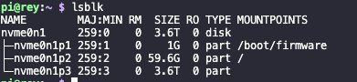
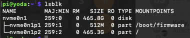

# Benchmarking

See the README file within the `benchmarks` folder.  **Credit and Thanks to [Jeff Geerling](https://www.jeffgeerling.com)**

#### [SDCard Vs. NVMe IO Performance](https://forums.raspberrypi.com/viewtopic.php?t=362903)

