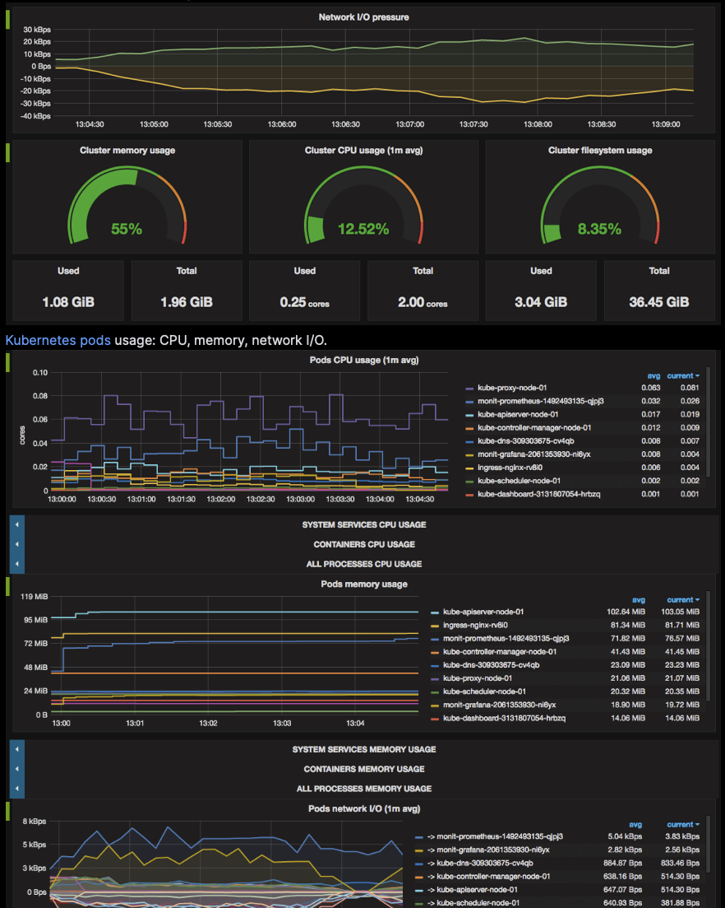
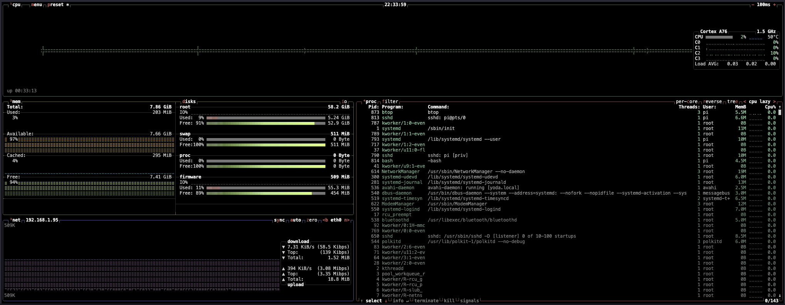

# Monitoring with Prometheus, Alertmanager, Grafana

The Prometheus monitoring stack has been successfully deployed and verified in the k3s cluster. The deployment includes Prometheus, Grafana, and Alertmanager.

Note: Prefer exposing these UIs via Ingress + TLS (cert-manager) at the Traefik VIP (recommended), and use direct MetalLB LoadBalancer IPs only where Ingress is not appropriate.




## Components


### Core Services
1. Prometheus
   - LoadBalancer IP: 192.168.1.244:9090
   - 2 replicas running
   - Accessible via web interface

2. Grafana
   - LoadBalancer IP: 192.168.1.245:3000
   - Single replica
   - Login page accessible

3. Alertmanager
   - LoadBalancer IP: 192.168.1.246:9093
   - 3 replicas for high availability
   - Web interface accessible


### Supporting Components
- node-exporter: Running on all nodes
- kube-state-metrics: Collecting cluster metrics
- blackbox-exporter: For external service monitoring
- prometheus-adapter: For custom metrics API


## Network Configuration


### Network Policies
Custom network policies have been implemented to allow external access while maintaining security:
```yaml
# Prometheus External Access
apiVersion: networking.k8s.io/v1
kind: NetworkPolicy
metadata:
  name: allow-prometheus-external
  namespace: monitoring
spec:
  podSelector:
    matchLabels:
      app.kubernetes.io/name: prometheus
  policyTypes:
    - Ingress
  ingress:
    - ports:
        - port: 9090

# Similar policies for Grafana (3000) and Alertmanager (9093)
```


### LoadBalancer Services
Services are configured with static IPs through MetalLB:
- Prometheus: 192.168.1.244
- Grafana: 192.168.1.245
- Alertmanager: 192.168.1.246


## Deployment Method
The stack is deployed through ArgoCD using the kube-prometheus manifests, with additional customization for LoadBalancer services and network policies managed through our Ansible playbook.


## Verification Steps
1. All pods running successfully in monitoring namespace
2. LoadBalancer services assigned correct IPs
3. Network policies allowing external access
4. UI accessibility verified for all components:
   - Prometheus query interface accessible
   - Grafana login page reachable
   - Alertmanager interface working


## Next Steps
1. Configure Grafana dashboards
2. Set up alerting rules in Prometheus
3. Configure external service monitoring through blackbox-exporter


## Other Monitoring Tools

### btop



## UPS Monitoring (NUT)

A Phoenixtec/Voltronic "Smart-Battery" UPS (USB `06da:ffff`) is attached to
yoda and monitored by **Network UPS Tools** via the `usbhid-ups` driver.
Deployed by `ansible/tasks/nut_ups_deploy.yml`, enabled with
`manual_install_nut_ups` in `config.yml`.

### Monitor only - by design

`nut-monitor` is **disabled and masked**, so no power event can trigger an
automatic shutdown. This is deliberate: the readings were proven first, and
coordinated cluster shutdown (ordering workers before the control plane,
stopping Ceph OSDs cleanly) is a separate piece of work that has not been
attempted. Masking makes an accidental cluster poweroff impossible rather
than merely unconfigured.

Home Assistant consumes `upsd` through the NUT integration. HA runs
`hostNetwork` pinned to yoda, so `127.0.0.1:3493` reaches it with no service
or ingress involved.

### The USB quirk that looks like dying hardware

With nothing polling it, this UPS **resets its USB HID interface every ~151
seconds** - 108 re-enumerations in 4.5 hours, the device number climbing on
every cycle. It is not the cable and not Pi 5 USB power. Once `usbhid-ups`
holds the interface open it stops completely (0 disconnects across a window
covering ~1.6 expected cycles).

> If the UPS starts flapping again, confirm `nut-driver@homelab-ups` is
> actually running **before** suspecting hardware.

### Measured runtime (2026-08-08, full cluster load)

A controlled mains-pull from 92% to 24%, sampled every 60s (70 samples):

```
92→82  1.00 %/min      overall     0.992 %/min
82→72  1.00 %/min      full 100→0  101 min
72→62  0.95 %/min
62→52  1.00 %/min      >=50%       0.987 %/min
52→42  1.00 %/min      <50%        0.999 %/min
42→32  1.00 %/min
32→24  1.00 %/min
```

**Discharge is linear across the entire range** - no knee below 50%, so a
linear projection is trustworthy anywhere. The UPS's own `battery.runtime`
tracked measured reality within 1-3 minutes at every sampled point.

Caveat: `battery.runtime` is **charge-derived, not load-aware** (roughly
`charge% x 1 min`). It matches today because the cluster happens to draw
~1%/min. Add hardware and the estimate silently becomes optimistic while
actual runtime shortens - drive any future threshold off `battery.charge`
plus a re-measured rate, not off `battery.runtime`.

### Key numbers for a future shutdown policy

| Value | Measured |
|-------|----------|
| Runtime from full | **101 min** |
| Discharge rate | **~1.0 %/min** |
| `LB` (low battery) asserted at | **29%** (~29 min remaining) |

The UPS raises `LB` at 29%, which is generous - a full cluster shutdown
needs perhaps 3-5 minutes. If coordinated shutdown is ever enabled, `LB`
alone is a sound trigger with a wide margin; no custom percentage threshold
is required.

### Available data is limited

Only `battery.charge`, `battery.runtime`, and `ups.status` are reported.
There is **no load, input voltage, or output voltage** - so no brownout
detection, which matters given that a weak 120V leg caused the 2026-08-07
flickering. `battery.voltage` and `battery.runtime` ship **disabled** in the
HA integration and must be enabled by hand.

### Verifying

```bash
ssh pi@192.168.1.95 'upsc homelab-ups'
```

`ups.status: OL` = on mains, `OB DISCHRG` = on battery, trailing `LB` = low
battery. If `upsc` errors, check `nut-driver@homelab-ups` and `nut-server`.

### The dashboard card

Lives on the **HomeLab view** of the `dashboard-family` dashboard. One
`vertical-stack` occupying a full-width grid slot (`columns: 36`):

```
vertical-stack
├── entities            Status · Runtime remaining · Charge
└── horizontal-stack
    ├── gauge           Battery  (0-100 %)
    └── gauge           Runtime  (0-120 min)
```

**Every threshold is minutes or the UPS's own `LB` flag - no percentages.**
Charge % is displayed but never decided on: a percentage is a fuel gauge,
minutes are what you act on. As the pack ages, 90% of a degraded battery may
only be 60 minutes, and thresholds written in percent would silently rot.

| Element | Condition | Colour |
|---------|-----------|--------|
| Battery gauge + all borders | `LB` asserted | 🔴 `#e53935` |
| | On battery | 🟠 `#ff8f00` |
| | On mains | 🟢 `#43a047` |
| Runtime gauge + its border | `LB` asserted | 🔴 `#e53935` |
| | <= 60 min | 🟠 `#ff8f00` |
| | > 60 min | 🟢 `#43a047` |

**Pulse** (battery gauge only, 2.5s fade to 30% opacity): `LB` asserted, or
charging with < 90 min runtime. Red pulse = act now; green pulse = mains is
back but the reserve has not returned.

`LB` is the single definition of "critical" for both gauges. It is the UPS's
own judgement and moves as the battery degrades - a pack that starts
asserting `LB` at 45 minutes instead of 29 turns the card red at the right
moment with no edit. **60 minutes** is the only hand-chosen number, and it is
a preference ("warn me before I'm down to an hour"), not a hardware claim.

### How the colours actually work (card-mod)

Three non-obvious things, each of which cost a failed attempt:

1. **Do not override `--gauge-color`.** HA sets it *inline* on the gauge
   element, so a `ha-card { --gauge-color: ... }` rule loses the cascade and
   the gauge falls back to the theme default (purple).
2. **Override what the severity bands resolve to instead.** HA maps
   `severity` to `var(--error-color)` / `var(--warning-color)` /
   `var(--success-color)`. Redefining those on `ha-card` works because the
   inline `var()` resolves through the cascade.
3. **Pin the gauge to a single band** so the template owns the colour
   outright - `severity: {red: -1, yellow: 0, green: <max+1>}` puts every
   value in the "yellow" band, then `--warning-color` is set from Jinja.

```yaml
severity: {red: -1, yellow: 0, green: 121}
card_mod:
  style: |
    
    
    
    ha-card {
      border: 2px solid {{ rcol }};
      --warning-color: {{ rcol }};
    }
```

`LB` is read from `sensor.homelab_ups_status_data` (raw NUT flags such as
`OB DISCHRG LB`) rather than the friendly `sensor.homelab_ups_status`, and
matched as a substring so no status combination is missed.

### Editing it

**Use the WebSocket API, not `/config/.storage/*`.** Home Assistant holds
the entity registry in memory and flushes it over file edits on shutdown -
enabling two NUT sensors by editing `core.entity_registry` was silently
reverted. Dashboard (`lovelace.*`) edits happen to survive, but only because
HA rewrites those solely on UI changes; that is luck, not a guarantee.

`sensor.homelab_ups_battery_runtime` is displayed in **minutes** via a
registry option (`unit_of_measurement: min`, `suggested_display_precision: 0`),
not a template - NUT reports seconds. This converts everywhere, including
history graphs.

> When changing the unit of a sensor, check every template that referenced
> it. The on-battery banner kept dividing by 60 after the switch and showed
> "2 min" instead of 106. Gauges and entity rows were immune because they do
> no arithmetic.


## See Also

- **[[10-Benchmarking]]** - Performance testing and metrics
- **[[12-Troubleshooting]]** - Using metrics for debugging
- **[[02-Architecture]]** - C4 Container diagram with monitoring
- **[[21-Deployment-Dependencies]]** - Prometheus deployment dependencies

**Related Issues:**
- [#49 - Convert Prometheus to Ingress](https://github.com/seadogger-tech/seadogger-homelab/issues/49) - Remove LoadBalancer IPs
- [#24 - Disaster Recovery](https://github.com/seadogger-tech/seadogger-homelab/issues/24) - Backup monitoring alerts
