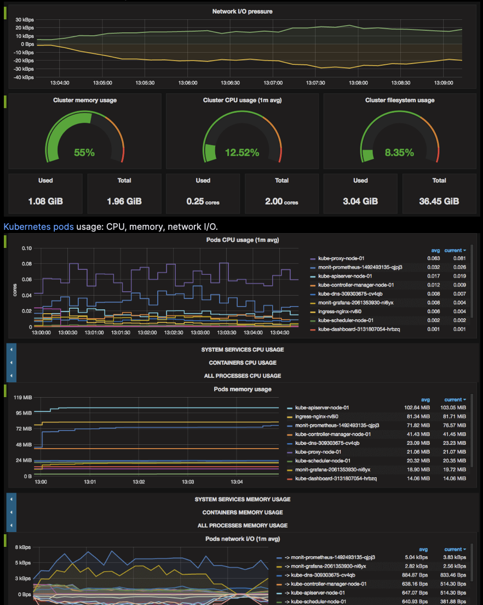

# Monitoring with Prometheus, Alertmanager, Grafana

The Prometheus monitoring stack has been successfully deployed and verified in the k3s cluster. The deployment includes Prometheus, Grafana, and Alertmanager.

Note: Prefer exposing these UIs via Ingress + TLS (cert-manager) at the Traefik VIP (recommended), and use direct MetalLB LoadBalancer IPs only where Ingress is not appropriate.




## Components


### Core Services
1. Prometheus
   - LoadBalancer IP: 192.168.1.244:9090
   - 2 replicas running
   - Accessible via web interface

2. Grafana
   - LoadBalancer IP: 192.168.1.245:3000
   - Single replica
   - Login page accessible

3. Alertmanager
   - LoadBalancer IP: 192.168.1.246:9093
   - 3 replicas for high availability
   - Web interface accessible


### Supporting Components
- node-exporter: Running on all nodes
- kube-state-metrics: Collecting cluster metrics
- blackbox-exporter: For external service monitoring
- prometheus-adapter: For custom metrics API


## Network Configuration


### Network Policies
Custom network policies have been implemented to allow external access while maintaining security:
```yaml
# Prometheus External Access
apiVersion: networking.k8s.io/v1
kind: NetworkPolicy
metadata:
  name: allow-prometheus-external
  namespace: monitoring
spec:
  podSelector:
    matchLabels:
      app.kubernetes.io/name: prometheus
  policyTypes:
    - Ingress
  ingress:
    - ports:
        - port: 9090

# Similar policies for Grafana (3000) and Alertmanager (9093)
```


### LoadBalancer Services
Services are configured with static IPs through MetalLB:
- Prometheus: 192.168.1.244
- Grafana: 192.168.1.245
- Alertmanager: 192.168.1.246


## Deployment Method
The stack is deployed through ArgoCD using the kube-prometheus manifests, with additional customization for LoadBalancer services and network policies managed through our Ansible playbook.


## Verification Steps
1. All pods running successfully in monitoring namespace
2. LoadBalancer services assigned correct IPs
3. Network policies allowing external access
4. UI accessibility verified for all components:
   - Prometheus query interface accessible
   - Grafana login page reachable
   - Alertmanager interface working


## Next Steps
1. Configure Grafana dashboards
2. Set up alerting rules in Prometheus
3. Configure external service monitoring through blackbox-exporter


## Other Monitoring Tools

### btop


## See Also

- **[[10-Benchmarking]]** - Performance testing and metrics
- **[[12-Troubleshooting]]** - Using metrics for debugging
- **[[02-Architecture]]** - C4 Container diagram with monitoring
- **[[21-Deployment-Dependencies]]** - Prometheus deployment dependencies

**Related Issues:**
- [#49 - Convert Prometheus to Ingress](https://github.com/seadogger-tech/seadogger-homelab/issues/49) - Remove LoadBalancer IPs
- [#24 - Disaster Recovery](https://github.com/seadogger-tech/seadogger-homelab/issues/24) - Backup monitoring alerts
