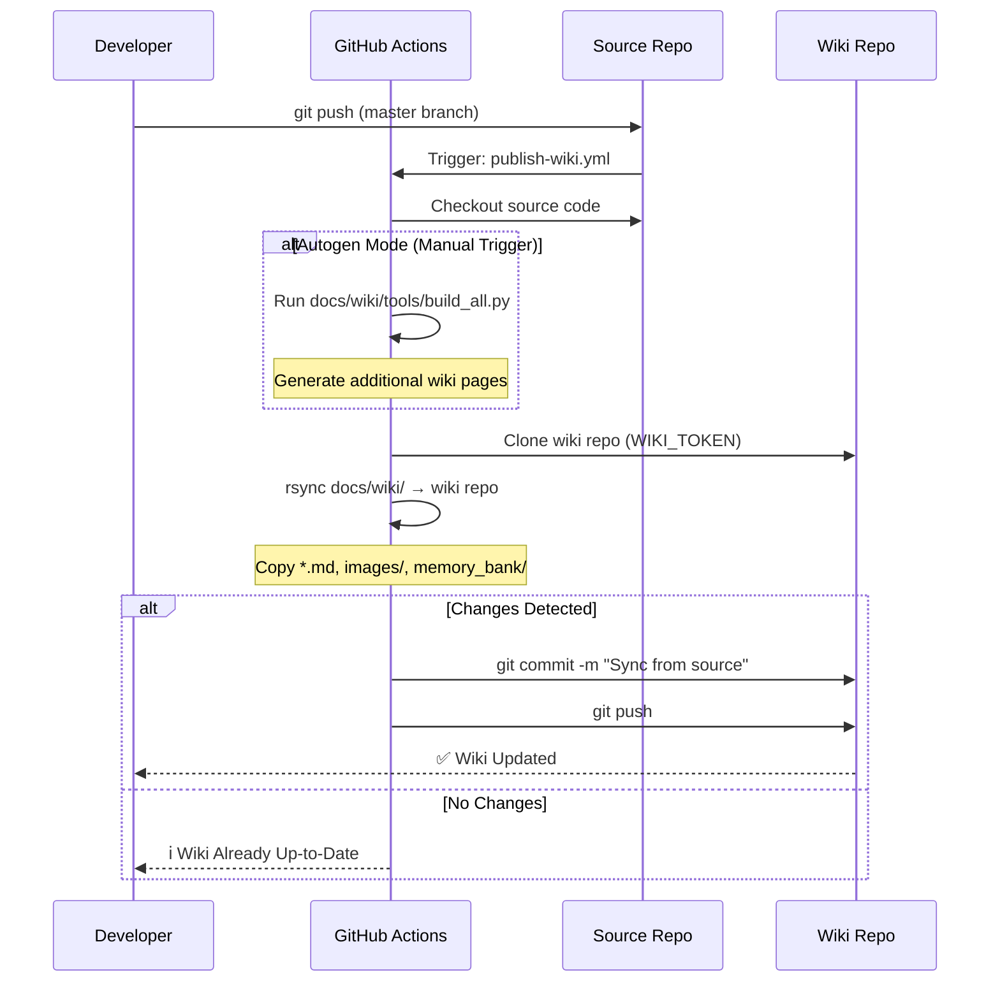
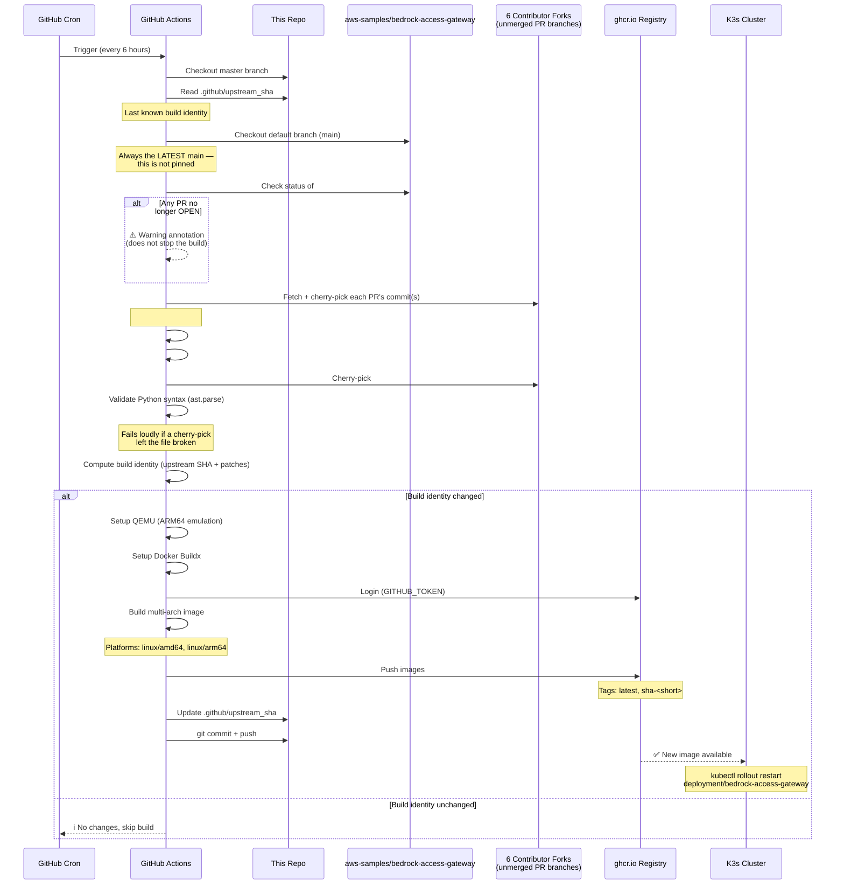
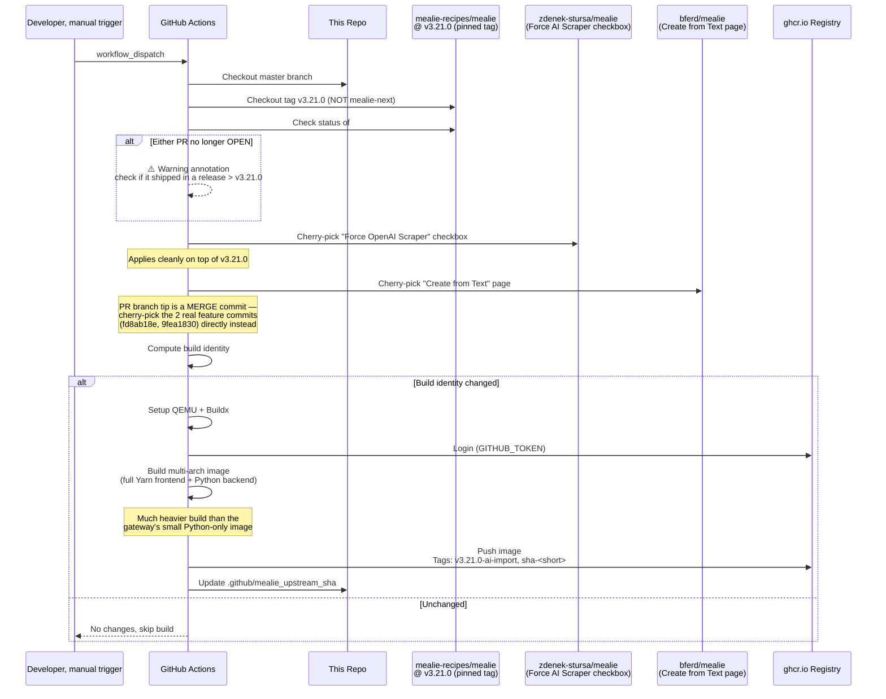

# CI/CD and GitHub Actions

This repository uses three main GitHub Actions workflows for automation: **Publish Wiki** (syncs documentation on every push), **Upstream Bedrock Gateway Rebuild** (keeps the AWS gateway up-to-date every 6 hours, with 6 unmerged upstream PRs cherry-picked in), and **Mealie AI-Import Rebuild** (a pinned-tag build with 2 unmerged upstream PRs cherry-picked in, rebuilt only on demand). The latter two both follow the same "adopting unmerged upstream PRs" pattern — see [ADR-011](13-ADR-Index.md#adr-011-adopting-unmerged-upstream-prs-reusable-pattern) for the full rationale.


---
> **🌙 Diagram Viewing Recommendation**
>
> The interactive Mermaid diagrams below are **optimized for GitHub Dark Mode** to provide maximum readability and visual impact.
>
> **To enable Dark Mode:** GitHub Settings → Appearance → Theme → **Dark default**
>
> *Light mode users can still view the diagrams, though colors may appear less vibrant.*
---

## Overview Diagram


```mermaid
graph TB
    subgraph Triggers["🔔 Workflow Triggers"]
        Push[Git Push to master]
        Schedule[Cron: Every 6 hours]
        Manual[Manual Trigger]
    end

    subgraph WikiFlow["📚 Publish Wiki Workflow"]
        WikiTrigger[On Push: master branch]
        Checkout1[Checkout Source Repo]
        BuildCheck{Autogen Mode?}
        BuildScript[Run build_all.py]
        CloneWiki[Clone Wiki Repo<br/>using WIKI_TOKEN]
        Rsync[rsync: Copy MD + Images]
        CommitWiki[Commit & Push to Wiki]
    end

    subgraph BedrockFlow["🐋 Bedrock Gateway Rebuild"]
        BedrockTrigger[Every 6 hours / Manual]
        Checkout2[Checkout This Repo]
        CheckUpstream[Checkout Upstream main<br/>aws-samples/bedrock-access-gateway]
        PRStatus{Any adopted PR<br/>merged/closed?}
        WarnPR[⚠️ Emit warning annotation<br/>does not stop build]
        CherryPick[Cherry-pick 6 unmerged PRs<br/>#255 #246 #247 #239 #198 #249]
        ResolveConflicts[Resolve 2 known conflicts via<br/>resolve_bedrock_gateway_conflicts.py]
        SyntaxCheck{Valid Python<br/>syntax?}
        CompareSSHA{Build identity<br/>changed?}
        SetupBuildx[Setup QEMU + Buildx]
        BuildPush[Build Multi-Arch<br/>linux/amd64,arm64]
        PushGHCR[Push to ghcr.io]
        UpdateSHA[Commit New Identity<br/>to .github/upstream_sha]
    end

    subgraph MealieFlow["🍲 Mealie AI-Import Rebuild"]
        MealieTrigger[Manual / on cherry-pick change]
        Checkout3[Checkout This Repo]
        CheckoutTag[Checkout upstream Mealie<br/>@ pinned tag v3.21.0]
        MealiePRStatus{Adopted PR<br/>merged/closed?}
        MealieCherryPick[Cherry-pick 2 unmerged PRs<br/>#7618 #7825]
        MealieBuild[Build Multi-Arch<br/>Yarn frontend + Python backend]
        MealiePush[Push to ghcr.io<br/>mealie:v3.21.0-ai-import]
    end

    Push --> WikiTrigger
    Manual --> WikiTrigger
    Schedule --> BedrockTrigger
    Manual --> BedrockTrigger
    Manual --> MealieTrigger

    WikiTrigger --> Checkout1
    Checkout1 --> BuildCheck
    BuildCheck -->|Yes| BuildScript
    BuildCheck -->|No| CloneWiki
    BuildScript --> CloneWiki
    CloneWiki --> Rsync
    Rsync --> CommitWiki

    BedrockTrigger --> Checkout2
    Checkout2 --> CheckUpstream
    CheckUpstream --> PRStatus
    PRStatus -->|Yes| WarnPR
    PRStatus -->|No| CherryPick
    WarnPR --> CherryPick
    CherryPick --> ResolveConflicts
    ResolveConflicts --> SyntaxCheck
    SyntaxCheck -->|Fail| BuildFail1[❌ Fail build loudly]
    SyntaxCheck -->|Pass| CompareSSHA
    CompareSSHA -->|Changed| SetupBuildx
    CompareSSHA -->|No Change| End1[Skip Build]
    SetupBuildx --> BuildPush
    BuildPush --> PushGHCR
    PushGHCR --> UpdateSHA

    MealieTrigger --> Checkout3
    Checkout3 --> CheckoutTag
    CheckoutTag --> MealiePRStatus
    MealiePRStatus -->|Yes| MealieCherryPick
    MealiePRStatus -->|No| MealieCherryPick
    MealieCherryPick --> MealieBuild
    MealieBuild --> MealiePush

    style WikiFlow fill:#2d5016,stroke:#5a9216,stroke-width:3px
    style BedrockFlow fill:#1e3a5f,stroke:#4a90e2,stroke-width:3px
    style MealieFlow fill:#8b4513,stroke:#c17a3d,stroke-width:3px
    style Triggers fill:#ff9900,stroke:#ff9900,stroke-width:3px
```


## Publish Wiki Workflow

**Purpose:** Automatically sync documentation from `docs/wiki/` to the GitHub Wiki on every push.

**File Location:** `core/.github/workflows/publish-wiki.yml`

### Workflow Details


```mermaid
sequenceDiagram
    participant Dev as Developer
    participant GH as GitHub Actions
    participant Source as Source Repo
    participant Wiki as Wiki Repo

    Dev->>Source: git push (master branch)
    Source->>GH: Trigger: publish-wiki.yml
    GH->>Source: Checkout source code

    alt Autogen Mode (Manual Trigger)
        GH->>GH: Run docs/wiki/tools/build_all.py
        Note over GH: Generate additional wiki pages
    end

    GH->>Wiki: Clone wiki repo (WIKI_TOKEN)
    GH->>GH: rsync docs/wiki/ → wiki repo
    Note over GH: Copy *.md, images/, memory_bank/

    alt Changes Detected
        GH->>Wiki: git commit -m "Sync from source"
        GH->>Wiki: git push
        Wiki-->>Dev: ✅ Wiki Updated
    else No Changes
        GH-->>Dev: ℹ️ Wiki Already Up-to-Date
    end
```

### Configuration

**Trigger Events:**
- **Automatic:** Every push to `master` branch
- **Manual:** `workflow_dispatch` with optional `autogen=true` flag

**Requirements:**
- Repository secret: `WIKI_TOKEN` (fine-grained PAT with wiki write permissions)
- Safety guard: Only runs on `seadogger-tech/seadogger-homelab` repository

**Steps:**
1. **Checkout source** (without default credentials to prevent recursion)
2. **Optional: Generate pages** - Run `build_all.py` if `autogen=true`
3. **Clone wiki repo** - Use PAT to authenticate
4. **Sync content** - `rsync` markdown files, images, and memory_bank
5. **Commit & push** - Only if changes detected

**Key Files Synced:**
- `docs/wiki/**/*.md` → Wiki root
- `docs/wiki/images/` → Wiki images/
- `docs/wiki/memory_bank/` → Wiki memory_bank/


## Upstream Bedrock Gateway Rebuild

**Purpose:** Monitor AWS Bedrock Gateway upstream repository, cherry-pick 6 real-but-unmerged upstream PRs on top, and automatically rebuild our multi-arch container image when anything changes.

**File Location:** `core/.github/workflows/upstream-rebuild.yaml`

**Why cherry-picks at all:** the plain upstream image is missing fixes two active clients of this gateway actually need — Mealie (AI recipe import/parsing) needs schema-enforced structured output, and OpenWebUI (confirmed connected at `192.168.1.242:6880`) needs tool-calling reliability fixes and Claude Opus 4.7 support. All 6 are real, currently-open, community PRs — not something we wrote from scratch. See [ADR-011](13-ADR-Index.md#adr-011-adopting-unmerged-upstream-prs-reusable-pattern) for the full list and rationale, and [09-Apps.md § Adopted Unmerged Upstream PRs](09-Apps.md#adopted-unmerged-upstream-prs) for verification details.

### Workflow Details


```mermaid
sequenceDiagram
    participant Cron as GitHub Cron
    participant GH as GitHub Actions
    participant This as This Repo
    participant Upstream as aws-samples/bedrock-access-gateway
    participant PRs as 6 Contributor Forks<br/>(unmerged PR branches)
    participant GHCR as ghcr.io Registry
    participant K8s as K3s Cluster

    Cron->>GH: Trigger (every 6 hours)
    GH->>This: Checkout master branch
    GH->>This: Read .github/upstream_sha
    Note over GH: Last known build identity

    GH->>Upstream: Checkout default branch (main)
    Note over GH: Always the LATEST main —<br/>this is not pinned

    GH->>Upstream: Check status of #255,#246,#247,#239,#198,#249
    alt Any PR no longer OPEN
        GH-->>GH: ⚠️ Warning annotation<br/>(does not stop the build)
    end

    GH->>PRs: Fetch + cherry-pick each PR's commit(s)
    Note over GH: #255,#246,#247 apply cleanly
    GH->>GH: #239 conflicts with #255 (adjacent branches)<br/>→ resolved by resolve_bedrock_gateway_conflicts.py
    GH->>GH: #198 conflicts with #239 (same log line)<br/>→ resolved by resolve_bedrock_gateway_conflicts.py
    GH->>PRs: Cherry-pick #249 (Opus 4.7)
    GH->>GH: Validate Python syntax (ast.parse)
    Note over GH: Fails loudly if a cherry-pick<br/>left the file broken

    GH->>GH: Compute build identity (upstream SHA + patches)

    alt Build identity changed
        GH->>GH: Setup QEMU (ARM64 emulation)
        GH->>GH: Setup Docker Buildx
        GH->>GHCR: Login (GITHUB_TOKEN)

        GH->>GH: Build multi-arch image
        Note over GH: Platforms: linux/amd64, linux/arm64

        GH->>GHCR: Push images
        Note over GHCR: Tags: latest, sha-<short>

        GH->>This: Update .github/upstream_sha
        GH->>This: git commit + push

        GHCR-->>K8s: ✅ New image available
        Note over K8s: kubectl rollout restart<br/>deployment/bedrock-access-gateway
    else Build identity unchanged
        GH-->>Cron: ℹ️ No changes, skip build
    end
```

### Configuration

**Trigger Events:**
- **Automatic:** Every 6 hours (cron: `0 */6 * * *`)
- **Manual:** `workflow_dispatch` for immediate rebuild

**Container Registry:**
- **Registry:** `ghcr.io/seadogger-tech/aws-bedrock-gateway`
- **Tags:**
  - `latest` - Always points to most recent build
  - `sha-<short>` - Specific commit from upstream (e.g., `sha-a1b2c3d`)
- **Architectures:** `linux/amd64`, `linux/arm64`

**Change Detection:**
- Stores last built identity (upstream SHA + patch state) in `.github/upstream_sha`
- Skips build if unchanged (saves CI minutes and resources)
- Because upstream `main` is checked out fresh every run, the identity changes whenever *either* upstream advances *or* any adopted PR's branch changes — both trigger a rebuild

**Steps:**
1. **Checkout this repo** (branch `master`) to read/write `.github/upstream_sha` and load `.github/scripts/resolve_bedrock_gateway_conflicts.py`
2. **Checkout upstream repo** (default branch, always latest — not pinned)
3. **Check adopted-PR status** — warns (doesn't fail) if any of the 6 cherry-picked PRs has merged/closed upstream
4. **Cherry-pick all 6 PRs**, resolving 2 known conflicts via the committed Python script rather than inline shell/Python (more testable, avoids YAML-escaping fragility)
5. **Validate syntax** — `ast.parse()` on the patched file; fails the build loudly rather than shipping broken code
6. **Compare build identity** - Skip remaining steps if unchanged
7. **Setup build environment** - QEMU for ARM64 emulation, Buildx for multi-arch
8. **Login to GHCR** - Use `GITHUB_TOKEN` for authentication
9. **Build & push** - Multi-arch build for AMD64 and ARM64
10. **Update tracking file** - Commit new build identity to `.github/upstream_sha`

**Why This Matters:**
- AWS Bedrock Gateway is actively developed by AWS samples team, but real, useful fixes often sit unreviewed for weeks — waiting on maintainer bandwidth isn't a substitute for having a working gateway today
- Automatic rebuilds keep our deployment current with both upstream security patches AND our adopted fixes
- ARM64 support critical for Raspberry Pi 5 cluster
- Build-identity tracking prevents unnecessary rebuilds (cost optimization)
- The merge-status warning step means adopted PRs don't silently rot forever once they land upstream for real


## Mealie AI-Import Rebuild

**Purpose:** Build a custom Mealie image with 2 unmerged upstream PRs cherry-picked in, giving a real "Force AI Import" button and a "Create from Text" page inside Mealie's own UI — the stock image has neither, and Mealie's scraper-selection logic is hardcoded server-side with no request-level override.

**File Location:** `core/.github/workflows/mealie-rebuild.yaml`

**Key architectural difference from the Bedrock workflow:** this pipeline checks out a **pinned upstream release tag** (`v3.21.0`), not the active development branch (`mealie-next`). Mealie holds real household data — recipes, meal plans — so unattended tracking of in-progress upstream commits every 6 hours would be inappropriate. This workflow has no cron schedule; it only runs on `workflow_dispatch` (manual) or when re-triggered after bumping `UPSTREAM_TAG` or the cherry-picked PRs change.

### Workflow Details


```mermaid
sequenceDiagram
    participant Dev as Developer, manual trigger
    participant GH as GitHub Actions
    participant This as This Repo
    participant Upstream as mealie-recipes/mealie<br/>@ v3.21.0 (pinned tag)
    participant PR7618 as zdenek-stursa/mealie<br/>(Force AI Scraper checkbox)
    participant PR7825 as bferd/mealie<br/>(Create from Text page)
    participant GHCR as ghcr.io Registry

    Dev->>GH: workflow_dispatch
    GH->>This: Checkout master branch
    GH->>Upstream: Checkout tag v3.21.0 (NOT mealie-next)

    GH->>Upstream: Check status of #7618, #7825
    alt Either PR no longer OPEN
        GH-->>GH: ⚠️ Warning annotation<br/>check if it shipped in a release > v3.21.0
    end

    GH->>PR7618: Cherry-pick "Force OpenAI Scraper" checkbox
    Note over GH: Applies cleanly on top of v3.21.0

    GH->>PR7825: Cherry-pick "Create from Text" page
    Note over GH: PR branch tip is a MERGE commit —<br/>cherry-pick the 2 real feature commits<br/>(fd8ab18e, 9fea1830) directly instead

    GH->>GH: Compute build identity

    alt Build identity changed
        GH->>GH: Setup QEMU + Buildx
        GH->>GHCR: Login (GITHUB_TOKEN)
        GH->>GH: Build multi-arch image<br/>(full Yarn frontend + Python backend)
        Note over GH: Much heavier build than the<br/>gateway's small Python-only image
        GH->>GHCR: Push image<br/>Tags: v3.21.0-ai-import, sha-<short>
        GH->>This: Update .github/mealie_upstream_sha
    else Unchanged
        GH-->>Dev: No changes, skip build
    end
```

### Configuration

**Trigger Events:**
- **Automatic:** None — no cron schedule (deliberate; see rationale above)
- **Manual:** `workflow_dispatch` only

**Container Registry:**
- **Registry:** `ghcr.io/seadogger-tech/mealie`
- **Tags:** `v3.21.0-ai-import`, `sha-<short>`

**Known cherry-pick gotcha:** PR #7825's contributor branch has a merge commit at its tip (upstream `mealie-next` was merged into the feature branch mid-review). `git cherry-pick` cannot replay a merge commit without `-m <parent>`, so the workflow targets the two actual feature commits (`fd8ab18e`, `9fea1830`) directly instead of the branch HEAD. If the contributor rebases/force-pushes, these SHAs may need updating — check `git log <branch>` for the real feature commits if this step starts failing.

**Status as of 2026-07-25:** first real build triggered and in progress at time of writing — not yet cut over to the live Mealie deployment. Per [ADR-011](13-ADR-Index.md#adr-011-adopting-unmerged-upstream-prs-reusable-pattern), verify in a throwaway test pod before touching production, since the live Mealie instance holds real recipes and meal-plan data.


## CI/CD Architecture Diagram


```mermaid
graph LR
    subgraph Developer["👨‍💻 Developer Workflow"]
        EditWiki[Edit docs/wiki/]
        EditCode[Update Bedrock Config]
        AdoptPR[Adopt a new unmerged<br/>upstream PR]
        Commit[git commit + push]
    end

    subgraph GitHub["🔄 GitHub Actions"]
        WikiAction[publish-wiki.yml]
        BedrockAction[upstream-rebuild.yaml<br/>cron: every 6h]
        MealieAction[mealie-rebuild.yaml<br/>manual only]
    end

    subgraph Outputs["📦 Outputs"]
        WikiSite[GitHub Wiki<br/>Updated Docs]
        GHCRBedrock[ghcr.io<br/>aws-bedrock-gateway image]
        GHCRMealie[ghcr.io<br/>mealie:v3.21.0-ai-import image]
    end

    subgraph Deployment["🚀 Deployment"]
        ArgoCD[ArgoCD]
        K3sCluster[K3s Cluster]
        BedrockPod[Bedrock Gateway Pod<br/>serves Mealie + OpenWebUI]
        MealiePod[Mealie Pod]
    end

    EditWiki --> Commit
    EditCode --> Commit
    AdoptPR --> Commit
    Commit --> WikiAction
    Commit -.->|Indirectly| BedrockAction
    Commit -.->|Indirectly| MealieAction

    WikiAction --> WikiSite
    BedrockAction --> GHCRBedrock
    MealieAction --> GHCRMealie

    GHCRBedrock --> ArgoCD
    GHCRMealie -.->|Manual cutover only —<br/>not yet in prod| K3sCluster
    ArgoCD --> K3sCluster
    K3sCluster --> BedrockPod
    K3sCluster --> MealiePod
    BedrockPod -.->|API calls| MealiePod

    style Developer fill:#2d5016,stroke:#5a9216,stroke-width:3px
    style GitHub fill:#1e3a5f,stroke:#4a90e2,stroke-width:3px
    style Outputs fill:#ff9900,stroke:#ff9900,stroke-width:3px
    style Deployment fill:#7b1fa2,stroke:#9c27b0,stroke-width:3px
```


## Key Secrets and Permissions

### Wiki Publisher
- **Secret:** `WIKI_TOKEN` (repository secret)
  - Type: Fine-grained Personal Access Token (PAT)
  - Permissions: `wiki:write` on `seadogger-tech/seadogger-homelab`
  - Why: GitHub Actions default token cannot write to wiki repos
  - Setup: GitHub Settings → Developer Settings → Personal Access Tokens → Fine-grained tokens

### Bedrock Gateway Rebuild
- **Token:** `GITHUB_TOKEN` (automatic)
  - Type: Workflow-scoped token (provided by GitHub Actions)
  - Permissions: `packages:write`, `contents:write` (declared in workflow)
  - Why: Push container images to GHCR, commit `.github/upstream_sha`, and query adopted-PR merge status via `gh pr view`
  - Setup: No action required (automatic)

### Mealie AI-Import Rebuild
- **Token:** `GITHUB_TOKEN` (automatic)
  - Type: Workflow-scoped token (provided by GitHub Actions)
  - Permissions: `packages:write`, `contents:write` — same shape as the Bedrock workflow
  - Setup: No action required (automatic)


## Adapting/Extending

### Use Wiki Publisher in Another Repo

1. Copy `publish-wiki.yml` to your `.github/workflows/`
2. Update the safety guard condition:
   ```yaml
   if: github.repository == 'your-org/your-repo'
   ```
3. Create a fine-grained PAT with wiki write access
4. Add PAT as repository secret named `WIKI_TOKEN`
5. Ensure your wiki content is in `docs/wiki/`

### Customize Bedrock Gateway Rebuild

**Change Build Schedule:**
```yaml
schedule:
  - cron: '0 */12 * * *'  # Every 12 hours instead of 6
```

**Change Image Registry:**
```yaml
env:
  IMAGE: ghcr.io/your-org/your-image-name
```

**Add Additional Platforms:**
```yaml
platforms: linux/amd64,linux/arm64,linux/arm/v7
```

**Requirements:**
- Workflow must have `packages: write` permission
- Repository must enable GitHub Container Registry
- QEMU/Buildx required for cross-platform builds

### Adopt a New Unmerged Upstream PR (either workflow)

Follow this checklist — established as ADR-011 — before adding a new cherry-pick to either workflow:

1. **Verify the PR is real and current.** Check `gh pr view <N> --repo <upstream> --json mergeable,updatedAt` — `MERGEABLE` and recently updated is a good sign; `CONFLICTING` means it's already stale against current upstream and needs its own rebase first.
2. **Test the cherry-pick locally first**, against a fresh clone, using the exact commands you intend to put in the workflow — not an approximation. `git clone` the upstream repo, add the contributor's fork as a remote, `git fetch` their branch, `git cherry-pick` the commit(s).
3. **If it conflicts** with another already-adopted PR, resolve it and write the resolution as a **separate, committed, testable Python script** (see `.github/scripts/resolve_bedrock_gateway_conflicts.py` for the pattern) — do not embed the fix as an inline Python heredoc inside the workflow's YAML `run:` block; that approach is fragile and broke silently once already during this pattern's development.
4. **Check for merge commits.** If `git log <branch>` shows the PR branch's tip is a merge commit (upstream was merged into the feature branch mid-review), `git cherry-pick` will refuse it (`is a merge but no -m option was given`). Cherry-pick the actual feature commit(s) directly instead — find them via `git log <branch>`.
5. **Add a merge-status check** for the new PR number in the "Check adopted-PR status" step, so its eventual merge gets flagged.
6. **Add an explanatory comment** at the cherry-pick step: which PR, why, which real client/use-case needs it, and what to do once it merges.
7. **Add a syntax/sanity check** after all cherry-picks apply (e.g. `python3 -c "import ast; ast.parse(...)"` for Python targets).
8. **Document it** in the relevant app's wiki section and in the ADR-011 table.


## Monitoring Workflows

### Check Workflow Status

**Via GitHub UI:**
1. Navigate to repository → **Actions** tab
2. Select workflow: "Publish Wiki", "Rebuild from aws-samples on change", or "Rebuild Mealie with unmerged AI-import PRs"
3. View run history, logs, and artifacts

**Via GitHub CLI:**
```bash
# List recent workflow runs
gh run list --workflow=publish-wiki.yml
gh run list --workflow=upstream-rebuild.yaml
gh run list --workflow=mealie-rebuild.yaml

# View specific run details
gh run view <run-id>

# View run logs
gh run view <run-id> --log

# Check a specific job's step-by-step status while it's still running
# (gh run view --log only works after the run completes)
gh api repos/seadogger-tech/seadogger-homelab/actions/jobs/<job-id> \
  --jq '.steps[] | "\(.name): \(.status) \(.conclusion)"'
```

### Common Issues

**Wiki Publish Fails:**
- **Symptom:** "Authentication failed" error
- **Fix:** Check `WIKI_TOKEN` secret is valid and has wiki write permissions
- **Verify:** Token hasn't expired (fine-grained tokens expire)

**Bedrock/Mealie Rebuild Fails on Docker build:**
- **Symptom:** "buildx failed with: ERROR: failed to solve"
- **Fix:** Check Dockerfile in upstream repo is valid
- **Common cause:** Upstream introduced ARM64-incompatible dependencies

**Bedrock/Mealie Rebuild Fails on a Cherry-Pick Step:**
- **Symptom:** `::error::Cherry-pick of PR #N (<sha>) failed — likely diverged from upstream main`
- **Cause:** Upstream has changed the same lines the adopted PR touches, since the last time the cherry-pick was verified
- **Fix:** Re-run the cherry-pick locally against current upstream, resolve the new conflict, update `.github/scripts/resolve_bedrock_gateway_conflicts.py` (or the workflow's inline logic for a one-off conflict) accordingly
- **Also check:** whether the PR's own branch was rebased/force-pushed — if so, the hardcoded commit SHA in the workflow is stale; get the current SHA from `git log <branch>` on the contributor's fork

**Adopted-PR Merge Warning Appears:**
- **Symptom:** `::warning::...#N is now MERGED/CLOSED upstream. The cherry-pick step below is likely no longer needed`
- **Expected:** This is not a failure — it's the intended signal from the pattern in [ADR-011](13-ADR-Index.md#adr-011-adopting-unmerged-upstream-prs-reusable-pattern)
- **Action:** Remove that PR's cherry-pick step from the workflow (and its entry from the ADR-011 table), then verify the next build still produces a working image

**No Changes Detected:**
- **Symptom:** Workflow runs but commits nothing
- **Expected:** When no actual changes exist in wiki, upstream, or the adopted-PR branches
- **Action:** No action needed - this is normal behavior


## See Also

- **[[02-Architecture]]** - System architecture showing CI/CD integration
- **[[05-GitOps-and-IaC]]** - ArgoCD deployment workflow
- **[[09-Apps]]** - Bedrock Gateway and Mealie application details, including the full adopted-PR table and text-to-image/image-to-text capability status
- **[[13-ADR-Index]]** - ADR-011: the "Adopting Unmerged Upstream PRs" reusable pattern
- **[[21-Deployment-Dependencies]]** - Understanding deployment order

**Related Issues:**
- [#48 - Pure GitOps Refactor](https://github.com/seadogger-tech/seadogger-homelab/issues/48) - Eliminate deployment dependencies
- [Pro #6 - OAuth2 Improvements](https://github.com/seadogger-tech/seadogger-homelab-pro/issues/6) - Future CI/CD for OAuth credential management