```mermaid
sequenceDiagram
    participant Dev as Developer
    participant GH as GitHub Actions
    participant Source as Source Repo
    participant Wiki as Wiki Repo

    Dev->>Source: git push (master branch)
    Source->>GH: Trigger: publish-wiki.yml
    GH->>Source: Checkout source code

    alt Autogen Mode (Manual Trigger)
        GH->>GH: Run docs/wiki/tools/build_all.py
        Note over GH: Generate additional wiki pages
    end

    GH->>Wiki: Clone wiki repo (WIKI_TOKEN)
    GH->>GH: rsync docs/wiki/ → wiki repo
    Note over GH: Copy *.md, images/, memory_bank/

    alt Changes Detected
        GH->>Wiki: git commit -m "Sync from source"
        GH->>Wiki: git push
        Wiki-->>Dev: ✅ Wiki Updated
    else No Changes
        GH-->>Dev: ℹ️ Wiki Already Up-to-Date
    end
```

```mermaid
sequenceDiagram
    participant Cron as GitHub Cron
    participant GH as GitHub Actions
    participant This as This Repo
    participant Upstream as aws-samples/bedrock-access-gateway
    participant GHCR as ghcr.io Registry
    participant K8s as K3s Cluster

    Cron->>GH: Trigger (every 6 hours)
    GH->>This: Checkout master branch
    GH->>This: Read .github/upstream_sha
    Note over GH: Last known SHA: abc123...

    GH->>Upstream: Checkout default branch
    GH->>Upstream: Get current SHA
    Note over GH: Current SHA: def456...

    alt SHA Changed (abc123 → def456)
        GH->>GH: Setup QEMU (ARM64 emulation)
        GH->>GH: Setup Docker Buildx
        GH->>GHCR: Login (GITHUB_TOKEN)

        GH->>GH: Build multi-arch image
        Note over GH: Platforms: linux/amd64, linux/arm64

        GH->>GHCR: Push images
        Note over GHCR: Tags: latest, sha-def456

        GH->>This: Update .github/upstream_sha
        GH->>This: git commit + push

        GHCR-->>K8s: ✅ New image available
        Note over K8s: Manual or auto-deploy
    else SHA Unchanged
        GH-->>Cron: ℹ️ No changes, skip build
    end
```

# CI/CD and GitHub Actions

This repository uses two main GitHub Actions workflows for automation: **Publish Wiki** (syncs documentation on every push) and **Upstream Bedrock Gateway Rebuild** (keeps AWS gateway up-to-date every 6 hours).


## Overview Diagram


## Publish Wiki Workflow

**Purpose:** Automatically sync documentation from `docs/wiki/` to the GitHub Wiki on every push.

**File Location:** `core/.github/workflows/publish-wiki.yml`

### Workflow Details



### Configuration

**Trigger Events:**
- **Automatic:** Every push to `master` branch
- **Manual:** `workflow_dispatch` with optional `autogen=true` flag

**Requirements:**
- Repository secret: `WIKI_TOKEN` (fine-grained PAT with wiki write permissions)
- Safety guard: Only runs on `seadogger-tech/seadogger-homelab` repository

**Steps:**
1. **Checkout source** (without default credentials to prevent recursion)
2. **Optional: Generate pages** - Run `build_all.py` if `autogen=true`
3. **Clone wiki repo** - Use PAT to authenticate
4. **Sync content** - `rsync` markdown files, images, and memory_bank
5. **Commit & push** - Only if changes detected

**Key Files Synced:**
- `docs/wiki/**/*.md` → Wiki root
- `docs/wiki/images/` → Wiki images/
- `docs/wiki/memory_bank/` → Wiki memory_bank/


## Upstream Bedrock Gateway Rebuild

**Purpose:** Monitor AWS Bedrock Gateway upstream repository and automatically rebuild our multi-arch container image when changes are detected.

**File Location:** `core/.github/workflows/upstream-rebuild.yaml`

### Workflow Details



### Configuration

**Trigger Events:**
- **Automatic:** Every 6 hours (cron: `0 */6 * * *`)
- **Manual:** `workflow_dispatch` for immediate rebuild

**Container Registry:**
- **Registry:** `ghcr.io/seadogger-tech/aws-bedrock-gateway`
- **Tags:**
  - `latest` - Always points to most recent build
  - `sha-<short>` - Specific commit from upstream (e.g., `sha-a1b2c3d`)
- **Architectures:** `linux/amd64`, `linux/arm64`

**Change Detection:**
- Stores last built SHA in `.github/upstream_sha`
- Compares with current upstream SHA
- Skips build if no changes (saves CI minutes and resources)

**Steps:**
1. **Checkout this repo** (branch `master`) to read/write `.github/upstream_sha`
2. **Checkout upstream repo** (default branch) to compute current SHA
3. **Compare SHAs** - Skip if unchanged
4. **Setup build environment** - QEMU for ARM64 emulation, Buildx for multi-arch
5. **Login to GHCR** - Use `GITHUB_TOKEN` for authentication
6. **Build & push** - Multi-arch build for AMD64 and ARM64
7. **Update tracking file** - Commit new SHA to `.github/upstream_sha`

**Why This Matters:**
- AWS Bedrock Gateway is actively developed by AWS samples team
- Automatic rebuilds keep our deployment current with security patches
- ARM64 support critical for Raspberry Pi 5 cluster
- SHA tracking prevents unnecessary rebuilds (cost optimization)


## CI/CD Architecture Diagram

```mermaid
graph LR
    subgraph Developer["👨‍💻 Developer Workflow"]
        EditWiki[Edit docs/wiki/]
        EditCode[Update Bedrock Config]
        Commit[git commit + push]
    end

    subgraph GitHub["🔄 GitHub Actions"]
        WikiAction[publish-wiki.yml]
        BedrockAction[upstream-rebuild.yaml]
    end

    subgraph Outputs["📦 Outputs"]
        WikiSite[GitHub Wiki<br/>Updated Docs]
        GHCRImage[ghcr.io<br/>Bedrock Gateway Image]
    end

    subgraph Deployment["🚀 Deployment"]
        ArgoCD[ArgoCD]
        K3sCluster[K3s Cluster]
        BedrockPod[Bedrock Gateway Pod]
    end

    EditWiki --> Commit
    EditCode --> Commit
    Commit --> WikiAction
    Commit -.->|Indirectly| BedrockAction

    WikiAction --> WikiSite
    BedrockAction --> GHCRImage

    GHCRImage --> ArgoCD
    ArgoCD --> K3sCluster
    K3sCluster --> BedrockPod

    style Developer fill:#e8f5e9,stroke:#4caf50,stroke-width:3px,color:#000
    style GitHub fill:#e3f2fd,stroke:#2196f3,stroke-width:3px,color:#000
    style Outputs fill:#fff3e0,stroke:#ff9800,stroke-width:3px,color:#000
    style Deployment fill:#f3e5f5,stroke:#9c27b0,stroke-width:3px,color:#000
```




## Key Secrets and Permissions

### Wiki Publisher
- **Secret:** `WIKI_TOKEN` (repository secret)
  - Type: Fine-grained Personal Access Token (PAT)
  - Permissions: `wiki:write` on `seadogger-tech/seadogger-homelab`
  - Why: GitHub Actions default token cannot write to wiki repos
  - Setup: GitHub Settings → Developer Settings → Personal Access Tokens → Fine-grained tokens

### Bedrock Gateway Rebuild
- **Token:** `GITHUB_TOKEN` (automatic)
  - Type: Workflow-scoped token (provided by GitHub Actions)
  - Permissions: `packages:write` (declared in workflow)
  - Why: Push container images to GHCR
  - Setup: No action required (automatic)


## Adapting/Extending

### Use Wiki Publisher in Another Repo

1. Copy `publish-wiki.yml` to your `.github/workflows/`
2. Update the safety guard condition:
   ```yaml
   if: github.repository == 'your-org/your-repo'
   ```
3. Create a fine-grained PAT with wiki write access
4. Add PAT as repository secret named `WIKI_TOKEN`
5. Ensure your wiki content is in `docs/wiki/`

### Customize Bedrock Gateway Rebuild

**Change Build Schedule:**
```yaml
schedule:
  - cron: '0 */12 * * *'  # Every 12 hours instead of 6
```

**Change Image Registry:**
```yaml
env:
  IMAGE: ghcr.io/your-org/your-image-name
```

**Add Additional Platforms:**
```yaml
platforms: linux/amd64,linux/arm64,linux/arm/v7
```

**Requirements:**
- Workflow must have `packages: write` permission
- Repository must enable GitHub Container Registry
- QEMU/Buildx required for cross-platform builds


## Monitoring Workflows

### Check Workflow Status

**Via GitHub UI:**
1. Navigate to repository → **Actions** tab
2. Select workflow: "Publish Wiki" or "Upstream Bedrock Gateway Rebuild"
3. View run history, logs, and artifacts

**Via GitHub CLI:**
```bash
# List recent workflow runs
gh run list --workflow=publish-wiki.yml
gh run list --workflow=upstream-rebuild.yaml

# View specific run details
gh run view <run-id>

# View run logs
gh run view <run-id> --log
```

### Common Issues

**Wiki Publish Fails:**
- **Symptom:** "Authentication failed" error
- **Fix:** Check `WIKI_TOKEN` secret is valid and has wiki write permissions
- **Verify:** Token hasn't expired (fine-grained tokens expire)

**Bedrock Rebuild Fails:**
- **Symptom:** "buildx failed with: ERROR: failed to solve"
- **Fix:** Check Dockerfile in upstream repo is valid
- **Common cause:** Upstream introduced ARM64-incompatible dependencies

**No Changes Detected:**
- **Symptom:** Workflow runs but commits nothing
- **Expected:** When no actual changes exist in wiki or upstream SHA
- **Action:** No action needed - this is normal behavior


## See Also

- **[[02-Architecture]]** - System architecture showing CI/CD integration
- **[[05-GitOps-and-IaC]]** - ArgoCD deployment workflow
- **[[09-Apps]]** - Bedrock Gateway application details
- **[[21-Deployment-Dependencies]]** - Understanding deployment order

**Related Issues:**
- [#48 - Pure GitOps Refactor](https://github.com/seadogger-tech/seadogger-homelab/issues/48) - Eliminate deployment dependencies
- [Pro #6 - OAuth2 Improvements](https://github.com/seadogger-tech/seadogger-homelab-pro/issues/6) - Future CI/CD for OAuth credential management