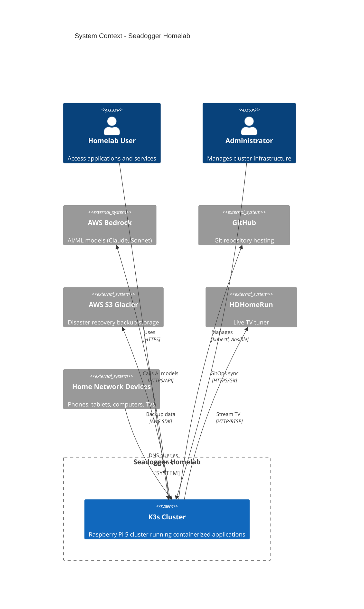
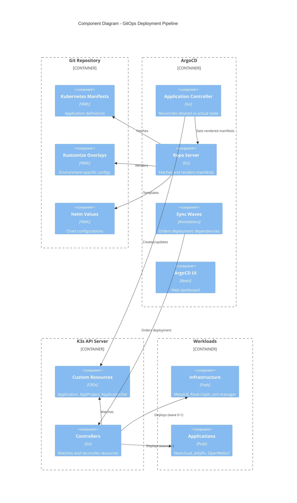
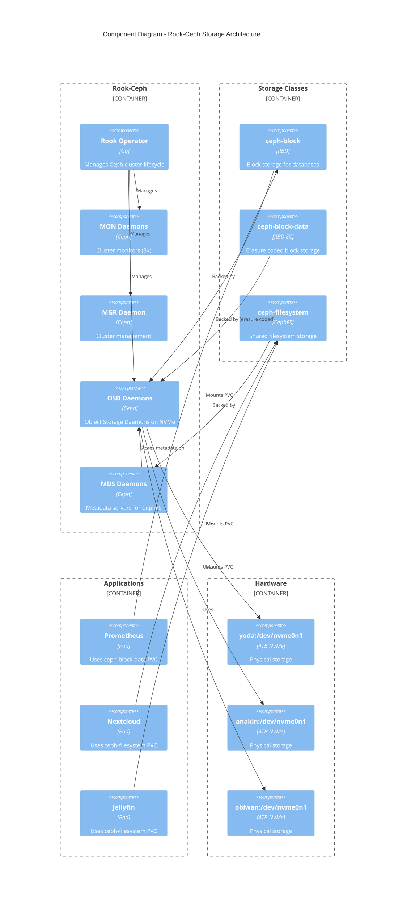
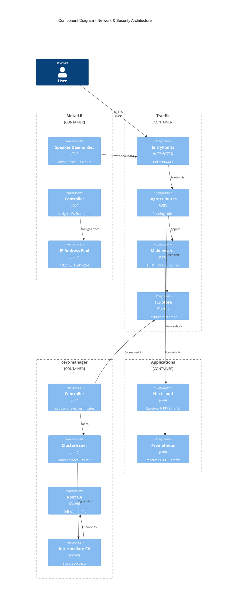

# C4 Architecture Diagrams

These diagrams follow the C4 model (Context, Containers, Components, Code) to visualize the Seadogger Homelab architecture at different levels of abstraction.

> **💡 Tip:** These diagrams are built with Mermaid and render interactively on GitHub. The diagrams may take a moment to load.

## Level 1: System Context



## Level 2: Container Diagram

```mermaid
C4Container
    title Container Diagram - K3s Cluster Infrastructure

    Person(user, "User")

    Container_Boundary(k3s, "K3s Cluster") {
        Container(traefik, "Traefik", "Ingress Controller", "Routes HTTPS traffic to services")
        Container(pihole, "PiHole", "DNS", "Network DNS and ad-blocking")
        Container(argocd, "ArgoCD", "GitOps", "Manages application deployments")
        Container(prometheus, "Prometheus Stack", "Monitoring", "Metrics, alerts, dashboards")
        Container(certmanager, "cert-manager", "PKI", "Issues and manages TLS certificates")
        Container(ceph, "Rook-Ceph", "Storage", "Distributed block and file storage")
        Container(metallb, "MetalLB", "Load Balancer", "Provides LoadBalancer IPs")

        Container_Boundary(apps, "Applications") {
            Container(nextcloud, "Nextcloud", "File Storage", "Personal cloud storage")
            Container(jellyfin, "Jellyfin", "Media", "Movies, music, live TV")
            Container(openwebui, "OpenWebUI", "AI", "LLM chat interface")
            Container(n8n, "N8N", "Automation", "Workflow automation")
            Container(portal, "Portal", "Dashboard", "Single pane of glass")
        }
    }

    System_Ext(github, "GitHub")
    System_Ext(aws, "AWS Bedrock")
    System_Ext(s3, "AWS S3")

    Rel(user, traefik, "HTTPS requests", "443")
    Rel(user, pihole, "DNS queries", "53")
    Rel(traefik, apps, "Routes to")
    Rel(argocd, apps, "Deploys/manages")
    Rel(argocd, github, "Syncs from")
    Rel(apps, ceph, "Stores data")
    Rel(certmanager, traefik, "Provides TLS certs")
    Rel(metallb, traefik, "Assigns IP")
    Rel(metallb, pihole, "Assigns IP")
    Rel(prometheus, apps, "Scrapes metrics")
    Rel(openwebui, aws, "AI requests")
    Rel(nextcloud, s3, "Backup")
```

## Level 3: Component Diagram - GitOps Pipeline



## Level 3: Component Diagram - Storage Architecture



## Level 3: Component Diagram - Network & Security



## Legend

- **Person**: External users or administrators
- **System**: External systems (AWS, GitHub, etc.)
- **Container**: High-level technology/service (applications, databases, etc.)
- **Component**: Lower-level building blocks within containers
- **Boundary**: Logical grouping of related elements

## Notes

- All diagrams can be viewed on GitHub as it renders Mermaid natively
- These diagrams represent the **target architecture** after GitOps migration (see [[21-Deployment-Dependencies]])
- Current state still has some infrastructure deployed via Ansible (being migrated)
- Sync waves enforce deployment order: Wave 0 (operators) → Wave 1 (clusters) → Wave 2+ (applications)

## How to View These Diagrams

### On GitHub Wiki
1. Navigate to this page on GitHub: https://github.com/seadogger-tech/seadogger-homelab/wiki/22-C4-Architecture-Diagrams
2. GitHub automatically renders Mermaid diagrams
3. Diagrams may take 5-10 seconds to render (be patient!)

### In VS Code
1. Install the "Markdown Preview Mermaid Support" extension
2. Open this file and press `Cmd+Shift+V` (macOS) or `Ctrl+Shift+V` (Windows/Linux)
3. Diagrams render inline

### Online Mermaid Editor
If diagrams don't render, you can view/edit them at:
- https://mermaid.live/
- Copy any `mermaid` code block and paste into the editor


## See Also

- **[[02-Architecture]]** - High-level architecture overview
- **[[21-Deployment-Dependencies]]** - Deployment order and dependencies
- **[[13-ADR-Index]]** - Architecture Decision Records
- **[[14-Design-Deep-Dives]]** - Technical deep dives

**Related Issues:**
- [#48 - Deployment Dependencies Refactor](https://github.com/seadogger-tech/seadogger-homelab/issues/48) - GitOps migration to match target architecture
- [#50 - Move infrastructure to ArgoCD](https://github.com/seadogger-tech/seadogger-homelab/issues/50) - Implementing sync waves shown in diagrams
