# Architecture Diagrams

Visual representations of the Seadogger Homelab architecture at different levels of abstraction, following the C4 model principles.

> **💡 Tip:** These diagrams use Mermaid and render natively on GitHub. They work in both light and dark modes.

## Level 1: System Context

Shows the homelab system and its external interactions.

```mermaid
graph TB
    User([👤 Homelab User])
    Admin([👤 Administrator])

    subgraph Homelab["🏠 Seadogger Homelab"]
        K3s[K3s Cluster<br/>Raspberry Pi 5 Cluster]
    end

    AWS[☁️ AWS Bedrock<br/>AI/ML Models]
    GitHub[🔧 GitHub<br/>Git Repository]
    S3[💾 AWS S3 Glacier<br/>Backup Storage]
    HDHomeRun[📺 HDHomeRun<br/>Live TV Tuner]
    Devices[📱 Home Devices<br/>Phones, Tablets, TVs]

    User -->|HTTPS| K3s
    Admin -->|kubectl/Ansible| K3s
    K3s -->|AI API| AWS
    K3s -->|GitOps Sync| GitHub
    K3s -->|Backup| S3
    K3s -->|Stream TV| HDHomeRun
    Devices -->|DNS Queries| K3s

    style Homelab fill:#1e3a5f,stroke:#4a90e2,stroke-width:3px
    style K3s fill:#2c5aa0,stroke:#4a90e2,color:#fff
    style AWS fill:#ff9900,stroke:#ff9900,color:#000
    style GitHub fill:#24292e,stroke:#ffffff,color:#fff
    style S3 fill:#569a31,stroke:#569a31,color:#fff
```

## Level 2: Container Diagram - K3s Infrastructure

Shows the major services and applications within the K3s cluster.

```mermaid
graph TB
    User([👤 User])

    subgraph K3s["K3s Cluster"]
        subgraph Infrastructure["🏗️ Infrastructure"]
            Traefik[Traefik<br/>Ingress Controller]
            MetalLB[MetalLB<br/>Load Balancer]
            Ceph[Rook-Ceph<br/>Distributed Storage]
            CertMgr[cert-manager<br/>TLS Certificates]
            ArgoCD[ArgoCD<br/>GitOps Engine]
            Prom[Prometheus Stack<br/>Monitoring]
            PiHole[PiHole<br/>DNS & Ad-Blocking]
        end

        subgraph Apps["📦 Applications"]
            Nextcloud[Nextcloud<br/>File Storage]
            Jellyfin[Jellyfin<br/>Media Server]
            OpenWebUI[OpenWebUI<br/>AI Chat]
            N8N[N8N<br/>Automation]
            Portal[Portal<br/>Dashboard]
        end
    end

    GitHub[🔧 GitHub]
    AWS[☁️ AWS Bedrock]
    S3[💾 S3 Glacier]

    User -->|HTTPS:443| Traefik
    User -->|DNS:53| PiHole

    Traefik --> Nextcloud
    Traefik --> Jellyfin
    Traefik --> OpenWebUI
    Traefik --> N8N
    Traefik --> Portal
    Traefik --> Prom

    ArgoCD -->|Deploys| Apps
    ArgoCD -->|Syncs| GitHub

    MetalLB -->|Assigns IP| Traefik
    MetalLB -->|Assigns IP| PiHole

    CertMgr -->|TLS Certs| Traefik

    Nextcloud --> Ceph
    Jellyfin --> Ceph
    Prom --> Ceph

    Prom -->|Scrapes| Apps
    OpenWebUI -->|AI API| AWS
    Nextcloud -->|Backup| S3

    style Infrastructure fill:#1e3a5f,stroke:#4a90e2,stroke-width:2px
    style Apps fill:#2d5016,stroke:#5a9216,stroke-width:2px
    style K3s fill:#0d1b2a,stroke:#4a90e2,stroke-width:3px
```

## Level 3: GitOps Deployment Pipeline

Shows how ArgoCD deploys applications from Git to the cluster.

```mermaid
graph LR
    subgraph Git["📁 Git Repository"]
        Manifests[Kubernetes<br/>Manifests]
        Kustomize[Kustomize<br/>Overlays]
        Helm[Helm<br/>Values]
    end

    subgraph ArgoCD["🔄 ArgoCD"]
        RepoServer[Repo Server<br/>Fetch & Render]
        AppController[Application<br/>Controller]
        SyncWaves[Sync Waves<br/>Wave 0→1→2+]
    end

    subgraph K3s["☸️ K3s API"]
        CRDs[Custom Resources<br/>Application CRDs]
        Controllers[K8s Controllers<br/>Reconcile]
    end

    subgraph Cluster["🚀 Running Workloads"]
        Infra[Infrastructure<br/>Wave 0-1]
        Applications[Applications<br/>Wave 2+]
    end

    Manifests --> RepoServer
    Kustomize --> RepoServer
    Helm --> RepoServer

    RepoServer --> AppController
    AppController --> CRDs

    CRDs --> Controllers
    SyncWaves -.->|Orders| Controllers

    Controllers -->|Deploy| Infra
    Controllers -->|Deploy| Applications

    style Git fill:#24292e,stroke:#ffffff,stroke-width:2px,color:#fff
    style ArgoCD fill:#ef7b4d,stroke:#ef7b4d,stroke-width:2px
    style K3s fill:#326ce5,stroke:#326ce5,stroke-width:2px
    style Cluster fill:#2d5016,stroke:#5a9216,stroke-width:2px
```

## Level 3: Storage Architecture

Shows Rook-Ceph distributed storage with 3×4TB NVMe drives.

## Level 3: Network & Security

Shows traffic flow through MetalLB, Traefik, and cert-manager.

```mermaid
graph TB
    User([👤 User])

    subgraph MetalLB["⚖️ MetalLB"]
        Speaker[Speaker<br/>DaemonSet]
        Controller[Controller<br/>IP Assignment]
        IPPool[IP Pool<br/>192.168.1.241-254]
    end

    subgraph Traefik["🔀 Traefik Ingress"]
        EntryPoint[EntryPoints<br/>:80 :443]
        Router[IngressRoutes<br/>Routing Rules]
        Middleware[Middlewares<br/>HTTP→HTTPS]
        TLSStore[TLS Store<br/>Certificates]
    end

    subgraph CertManager["🔐 cert-manager"]
        CMController[Controller<br/>Issue Certs]
        Issuer[ClusterIssuer<br/>internal-local-issuer]
        RootCA[Root CA<br/>Self-Signed]
        IntermediateCA[Intermediate CA<br/>Signs App Certs]
    end

    subgraph Apps["📦 Applications"]
        Nextcloud[Nextcloud]
        Prometheus[Prometheus]
        Jellyfin[Jellyfin]
    end

    User -->|HTTPS:443| EntryPoint

    Controller --> IPPool
    Speaker --> EntryPoint

    EntryPoint --> Router
    Router --> Middleware
    Middleware --> Nextcloud
    Middleware --> Prometheus
    Middleware --> Jellyfin

    Router --> TLSStore

    CMController --> Issuer
    Issuer --> IntermediateCA
    IntermediateCA --> RootCA
    CMController --> TLSStore

    style MetalLB fill:#1565c0,stroke:#1976d2,stroke-width:2px
    style Traefik fill:#0d47a1,stroke:#1976d2,stroke-width:2px
    style CertManager fill:#2e7d32,stroke:#43a047,stroke-width:2px
    style Apps fill:#2d5016,stroke:#5a9216,stroke-width:2px
```

## Deployment Order (Sync Waves)

Shows the order in which components are deployed via ArgoCD sync waves.

```mermaid
graph TD
    subgraph Wave0["🌊 Wave 0: Operators & Base"]
        MetalLB[MetalLB]
        RookOp[Rook-Ceph<br/>Operator]
        CertMgr[cert-manager]
    end

    subgraph Wave1["🌊 Wave 1: Clusters & PKI"]
        RookCluster[Rook-Ceph<br/>Cluster]
        PKI[Internal PKI<br/>CA + ClusterIssuer]
    end

    subgraph Wave2["🌊 Wave 2: Monitoring"]
        Prometheus[Prometheus<br/>Stack]
    end

    subgraph Wave3["🌊 Wave 3+: Applications"]
        Apps[Nextcloud, Jellyfin<br/>OpenWebUI, N8N<br/>Portal, PiHole]
    end

    Wave0 --> Wave1
    Wave1 --> Wave2
    Wave2 --> Wave3

    style Wave0 fill:#1e3a5f,stroke:#4a90e2,stroke-width:2px
    style Wave1 fill:#2c5aa0,stroke:#4a90e2,stroke-width:2px
    style Wave2 fill:#3d70b2,stroke:#4a90e2,stroke-width:2px
    style Wave3 fill:#2d5016,stroke:#5a9216,stroke-width:2px
```

## Diagram Legend

| Symbol | Meaning |
|--------|---------|
| 👤 | User or Administrator |
| ☁️ | External Cloud Service |
| 🔧 | External Tool/Platform |
| 🏠 | System Boundary |
| 📦 | Application/Container |
| 🗄️ | Storage System |
| ⚖️ | Load Balancer |
| 🔀 | Ingress/Router |
| 🔐 | Security/Certificates |
| 🌊 | Deployment Wave |

## Notes

- **Dark Mode Compatible:** All diagrams use colors that work in both light and dark themes
- **Target Architecture:** These represent the architecture after full GitOps migration (see [[21-Deployment-Dependencies]])
- **Current State:** Some infrastructure still deployed via Ansible during migration
- **Sync Waves:** ArgoCD uses wave annotations to enforce deployment order automatically

## How to View These Diagrams

### On GitHub Wiki (Recommended)
1. Navigate to: https://github.com/seadogger-tech/seadogger-homelab/wiki/22-C4-Architecture-Diagrams
2. Diagrams render automatically (may take 2-3 seconds)
3. Works in both light and dark mode

### In VS Code
1. Install "Markdown Preview Mermaid Support" extension
2. Open this file: `22-C4-Architecture-Diagrams.md`
3. Press `Cmd+Shift+V` (macOS) or `Ctrl+Shift+V` (Windows/Linux)
4. Diagrams render inline

### Online Mermaid Editor
For editing or troubleshooting:
1. Visit https://mermaid.live/
2. Copy any diagram code block
3. Paste and edit interactively
4. Export as PNG/SVG if needed

## See Also

- **[[02-Architecture]]** - Architecture overview and design decisions
- **[[21-Deployment-Dependencies]]** - Detailed dependency analysis
- **[[13-ADR-Index]]** - Architecture Decision Records
- **[[14-Design-Deep-Dives]]** - Technical deep dives

**Related Issues:**
- [#48 - Deployment Dependencies Refactor](https://github.com/seadogger-tech/seadogger-homelab/issues/48) - GitOps migration progress
- [#50 - Move infrastructure to ArgoCD](https://github.com/seadogger-tech/seadogger-homelab/issues/50) - Implementing sync waves