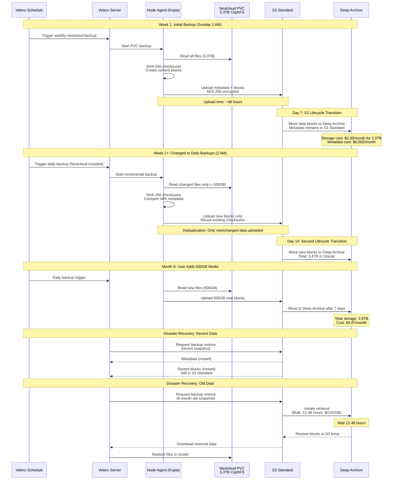

# 23. Disaster Recovery and Restore Procedures

## Overview

This guide covers disaster recovery procedures for restoring data from Velero backups stored in AWS S3 Glacier Deep Archive. Velero uses Kopia for incremental, deduplicated file-level backups of all PVCs and Kubernetes resources.

**IMPORTANT**: S3 Deep Archive has a 12-48 hour retrieval time for bulk retrieval. Plan disaster recovery operations accordingly.

### Backup Architecture Diagram

The following C4 Container diagram shows the complete Velero backup system architecture:

---
> **🌙 Diagram Viewing Recommendation**
>
> The interactive Mermaid diagrams below are **optimized for GitHub Dark Mode** to provide maximum readability and visual impact.
>
> **To enable Dark Mode:** GitHub Settings → Appearance → Theme → **Dark default**
>
> *Light mode users can still view the diagrams, though colors may appear less vibrant.*
---



```mermaid
graph TB
    subgraph K8s["🎯 Kubernetes Cluster"]
        direction TB
        subgraph VeleroNS["velero namespace"]
            VeleroServer["Velero Server<br/>Orchestration & Scheduling"]
            VeleroUI["Velero UI<br/>Management Interface"]
        end

        subgraph Nodes["Worker Nodes"]
            NodeAgent1["Node Agent (yoda)<br/>Kopia Uploader"]
            NodeAgent2["Node Agent (anakin)<br/>Kopia Uploader"]
            NodeAgent3["Node Agent (obiwan)<br/>Kopia Uploader"]
            NodeAgent4["Node Agent (rey)<br/>Kopia Uploader"]
        end

        subgraph Apps["Application Namespaces"]
            NextcloudPVC["Nextcloud PVC<br/>3.3TB CephFS EC"]
            N8NPVC["N8N PVC<br/>RBD Block"]
            JellyfinPVC["Jellyfin PVCs<br/>config + cache"]
            OtherPVCs["Other PVCs<br/>OpenWebUI, PiHole, etc."]
        end

        subgraph Storage["Rook-Ceph Storage"]
            CephFS["CephFS<br/>ceph-fs-data-ec"]
            CephRBD["RBD Block<br/>ceph-block-data"]
        end
    end

    subgraph AWS["☁️ AWS Cloud"]
        S3Bucket["S3 Bucket<br/>seadogger-homelab-backup<br/>us-east-1"]
        S3Standard["S3 Standard<br/>Kopia Metadata<br/>~100MB"]
        DeepArchive["Glacier Deep Archive<br/>Data Blocks<br/>~3.3TB"]
    end

    VeleroServer -->|"Schedule Trigger<br/>daily-backup: 2 AM<br/>weekly-nextcloud: 2 AM Sun"| NodeAgent1
    VeleroServer --> NodeAgent2
    VeleroServer --> NodeAgent3
    VeleroServer --> NodeAgent4

    NodeAgent1 -->|"Read PVC Data"| NextcloudPVC
    NodeAgent2 -->|"Read PVC Data"| N8NPVC
    NodeAgent3 -->|"Read PVC Data"| JellyfinPVC
    NodeAgent4 -->|"Read PVC Data"| OtherPVCs

    NextcloudPVC --> CephFS
    N8NPVC --> CephRBD
    JellyfinPVC --> CephFS

    NodeAgent1 -->|"Upload via Kopia<br/>AES-256 Encrypted<br/>Deduplicated"| S3Bucket
    NodeAgent2 --> S3Bucket
    NodeAgent3 --> S3Bucket
    NodeAgent4 --> S3Bucket

    S3Bucket -->|"Initial Upload"| S3Standard
    S3Standard -->|"Lifecycle: 7 days"| DeepArchive
    DeepArchive -->|"Keep Forever<br/>No Deletion"| DeepArchive

    style K8s fill:#1e3a5f,stroke:#4a90e2,stroke-width:3px
    style VeleroNS fill:#2d5016,stroke:#5a9216,stroke-width:2px
    style Nodes fill:#7b1fa2,stroke:#9c27b0,stroke-width:2px
    style Apps fill:#8b4513,stroke:#d2691e,stroke-width:2px
    style Storage fill:#2d5016,stroke:#5a9216,stroke-width:2px
    style AWS fill:#1e3a5f,stroke:#4a90e2,stroke-width:3px
    style S3Bucket fill:#2d5016,stroke:#5a9216,stroke-width:2px
    style DeepArchive fill:#7b1fa2,stroke:#9c27b0,stroke-width:2px
```

### Backup Workflow Sequence

The following sequence diagram shows the complete backup lifecycle including Week 1 initial backup strategy and ongoing incremental backups:



## Prerequisites for Restore

### 1. Access Velero UI

Velero UI provides a visual interface for managing backups and restores:

```
https://velero.seadogger-homelab
```

### 2. S3 Glacier Deep Archive Retrieval

For backups older than 7 days (stored in Deep Archive), initiate retrieval:

```bash
# Check which lifecycle class objects are in
aws s3api head-object \
  --bucket seadogger-homelab-backup \
  --key <object-key>

# Initiate bulk retrieval (12-48 hours, $0.02/GB)
aws s3api restore-object \
  --bucket seadogger-homelab-backup \
  --key <object-key> \
  --restore-request Days=1,GlacierJobParameters={Tier=Bulk}

# Check retrieval status
aws s3api head-object \
  --bucket seadogger-homelab-backup \
  --key <object-key> \
  | jq '.Restore'
```

**Key Points:**
- **Week 1**: Weekly Nextcloud backup (Sunday 2 AM) to allow 48-hour initial upload
- **Week 2+**: Switch to daily backups for all apps including Nextcloud
- **Deduplication**: Kopia stores each unique data block once via SHA-256 checksums
- **Lifecycle**: 7 days in S3 Standard → Glacier Deep Archive forever
- **Metadata**: Stays in S3 Standard for instant snapshot queries (~100MB)
- **Recovery Time**: Recent backups (instant), Old backups (12-48 hours)

### Backup Architecture

- **Operator**: Velero v1.17.0 deployed via Helm
- **Node Agent**: Kopia uploader for file-level PVC backups
- **Backend**: AWS S3 with Glacier Deep Archive lifecycle
- **Storage**: AWS S3 bucket `seadogger-homelab-backup` (us-east-1)
- **Lifecycle**: 7 days in S3 Standard → Glacier Deep Archive
- **Encryption**: AES-256 server-side encryption (AWS S3)
- **Deduplication**: Kopia content-addressable storage
- **Monitoring**: Prometheus metrics enabled


### Viewing Backups

**Velero UI**:
```
https://velero.seadogger-homelab
```

**CLI - List Backups**:
```bash
ssh pi@yoda.local
kubectl get backups -n velero
kubectl get schedules -n velero
```

**CLI - View Backup Details**:
```bash
# Get backup details
kubectl describe backup <backup-name> -n velero

# Get backup logs
kubectl logs deployment/velero -n velero

# Get node-agent status
kubectl get pods -n velero -l name=node-agent
```

### Backup Schedule

**Week 1 Strategy** (Initial 3.3TB Upload):
| Schedule | Namespaces | Frequency | Time | TTL |
|----------|-----------|-----------|------|-----|
| `weekly-nextcloud-backup` | nextcloud | Weekly (Sunday) | 2:00 AM | 30 days |
| `daily-backup` | openwebui, n8n, jellyfin | Daily | 2:00 AM | 30 days |

**Week 2+ Strategy** (After Initial Upload):
| Schedule | Namespaces | Frequency | Time | TTL |
|----------|-----------|-----------|------|-----|
| `daily-backup` | nextcloud, openwebui, n8n, jellyfin | Daily | 2:00 AM | 30 days |

**Notes**:
- Jellyfin media volume (read-only Nextcloud mount) excluded via `backup.velero.io/backup-volumes-excludes: media`
- Week 1: Nextcloud weekly to allow 48-hour initial 3.3TB upload window
- Week 2+: Change Nextcloud to daily after initial backup completes
- All PVCs backed up automatically via `defaultVolumesToFsBackup: true`


## Verification Status

| Application | Restore Procedure | Verified | Notes |
|-------------|------------------|----------|-------|
| OpenWebUI | Restore Procedure #1 | ✅ | Validated on 10-05-2025 and verified all users, chats, models, and settings were restored. |
| N8N | Procedure #1 | ❌ | **ENCRYPTION KEY MISMATCH**: N8N stores encryption key in both `/home/node/.n8n/config` (PVC) and Kubernetes secret. Restored config file encryption key doesn't match Helm-generated secret causing "Mismatching encryption keys" error. See [Issue #7](https://github.com/seadogger-tech/seadogger-homelab-pro/issues/7) for resolution. |
| Jellyfin | Procedure #1 | ⏳ | **NOT TESTED**: Needs verification. Special consideration: AWS Glacier retrieval for media files (3TB+). |
| Nextcloud | Procedure #1 | ⏳ | **NOT TESTED**: Large backup (~3.3TB). Requires separate testing due to size and AWS Glacier retrieval time. |
| Pihole | NA | ✅ | This is a stateless app. |
| Portal | NA | ✅ | This is a stateless app. |

### Restore Procedure #1: Standard Application Restore

This procedure applies to most ArgoCD-managed applications that store data in PVCs.

**Steps**:
1. Delete ArgoCD Application: `kubectl delete application <app-name> -n argocd`
2. Delete namespace: `kubectl delete namespace <namespace>`
3. Create Velero restore:
   ```bash
   cat <<EOF | kubectl create -f -
   apiVersion: velero.io/v1
   kind: Restore
   metadata:
     name: <app>-restore-$(date +%Y%m%d-%H%M%S)
     namespace: velero
   spec:
     backupName: <backup-name>
   EOF
   ```
4. Wait for restore to complete: `kubectl get restore -n velero -w`
5. Set Ansible deployment variable to `true` in `ansible/config.yml`
6. Run Ansible playbook: `ansible-playbook ansible/main.yml --tags <app>`
7. Verify pod is running: `kubectl get pods -n <namespace>`


## Quick Reference: Common Restore Scenarios

### Scenario 1: "I Deleted Something - Restore from Latest Backup"

**Goal**: Restore App to most recent backup (within last 7 days)
**Time**: 5-10 minutes

```bash
# Step 1: List available backups
kubectl get backups -n velero | grep openwebui

# Step 2: Scale down openwebui (prevents conflicts)
kubectl scale deployment openwebui -n openwebui --replicas=0

# Step 3: Create restore from latest backup
velero restore create openwebui-restore-$(date +%Y%m%d-%H%M%S) \
  --from-backup daily-backup-20251004020000 \
  --include-namespaces openwebui

# Step 4: Watch restore progress
velero restore describe openwebui-restore-20251004-120000
kubectl get restore -n velero -w

# Step 5: Verify and restart openwebui
kubectl get pods -n openwebui
kubectl scale deployment openwebui -n openwebui --replicas=1
```

### Scenario 2: "Restore Nextcloud from Last Week"

**Goal**: Restore Nextcloud to a point-in-time backup

```bash
# Step 1: List all Nextcloud backups
kubectl get backups -n velero | grep nextcloud

# Or use Velero CLI for detailed info
velero backup get | grep nextcloud

# Step 2: Scale down Nextcloud
kubectl scale deployment nextcloud -n nextcloud --replicas=0

# Step 3: Restore from specific backup
velero restore create nextcloud-restore-$(date +%Y%m%d-%H%M%S) \
  --from-backup weekly-nextcloud-backup-20251001020000 \
  --include-namespaces nextcloud

# Step 4: Monitor restore (3.3TB may take 1-2 hours)
velero restore logs nextcloud-restore-20251004-120000
kubectl get pods -n nextcloud -w

# Step 5: Restart Nextcloud
kubectl scale deployment nextcloud -n nextcloud --replicas=1
```

### Scenario 3: "Test Restore Without Overwriting Production"

**Goal**: Verify backup integrity without touching live data

```bash
# Step 1: Create temporary test namespace
kubectl create namespace openwebui-test

# Step 2: Restore to test namespace
velero restore create openwebui-test-restore \
  --from-backup daily-backup-20251004020000 \
  --include-namespaces openwebui \
  --namespace-mappings openwebui:openwebui-test

# Step 3: Verify restored data
kubectl get all -n openwebui-test
kubectl exec -it <pod-name> -n openwebui-test -- ls -lah /data

# Step 4: Cleanup when done
kubectl delete namespace openwebui-test
```

### Scenario 4: "Which Backups Are Available?"

**Goal**: List all backups with dates to choose specific restore point

```bash
# Method 1: Velero UI
# Navigate to https://velero.seadogger-homelab

# Method 2: kubectl
kubectl get backups -n velero

# Method 3: Velero CLI with details
velero backup get
velero backup describe daily-backup-20251004020000

# Filter by namespace
kubectl get backups -n velero -o json | jq '.items[] | select(.spec.includedNamespaces[] == "nextcloud") | .metadata.name'
```

## Cost Considerations

### Backup Storage Costs

- **S3 Standard** (first 7 days): $0.023/GB/month
- **Glacier Deep Archive** (after 7 days): $0.00099/GB/month ($0.99/TB/month)
- **Kopia Metadata** (S3 Standard): ~$0.002/month (~100MB)

**Example - 3.3TB Nextcloud**:
- Month 1: ~$3.30/month (all in Deep Archive after week 1)
- Month 2+: ~$3.30/month (stable cost)

### Restore Costs

- **Recent backups** (<7 days in S3 Standard): Free retrieval
- **Bulk Retrieval** (Deep Archive): $0.02/GB + 12-48 hours wait
- **Standard Retrieval** (Deep Archive): $0.03/GB + 3-5 hours wait
- **Data Transfer Out**: First 100GB/month free, then $0.09/GB

**Example - Restoring 500GB backup**:
- Recent backup: $0 (instant)
- Bulk retrieval: ~$10 + 12-48 hours
- Standard retrieval: ~$15 + 3-5 hours

## Security Best Practices

1. **S3 Encryption**: All backups encrypted with AWS S3 AES-256 server-side encryption
2. **AWS Credentials**: IAM user with minimal S3 permissions (`velero-backup-user`)
3. **RBAC**: Velero service account has limited cluster permissions
4. **Access Control**: Limit who can create/delete backups and restores
5. **Audit**: All Velero operations logged in Kubernetes audit logs

## Related Documentation

- [06. Storage and Rook-Ceph](./06-Storage-Rook-Ceph.md) - Backup architecture and strategy
- [13. ADR Index - ADR-009](./13-ADR-Index.md) - K8up to Velero migration decision
- [Velero Documentation](https://velero.io/docs/v1.16/) - Official Velero docs
- [Kopia Documentation](https://kopia.io/docs/) - Official Kopia docs

---

**Last Updated**: 2025-10-04
**Maintained By**: Seadogger Homelab Team
**Review Frequency**: Quarterly
