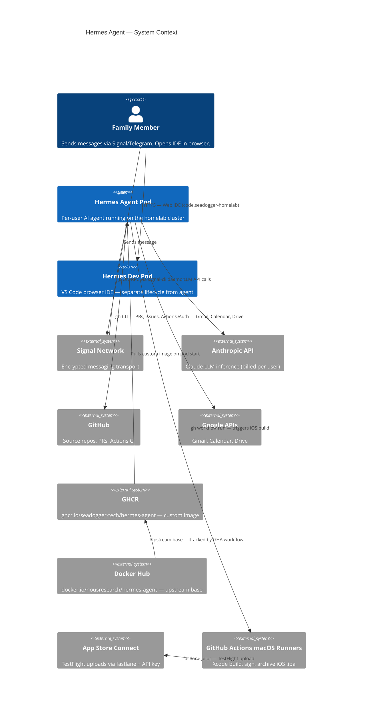
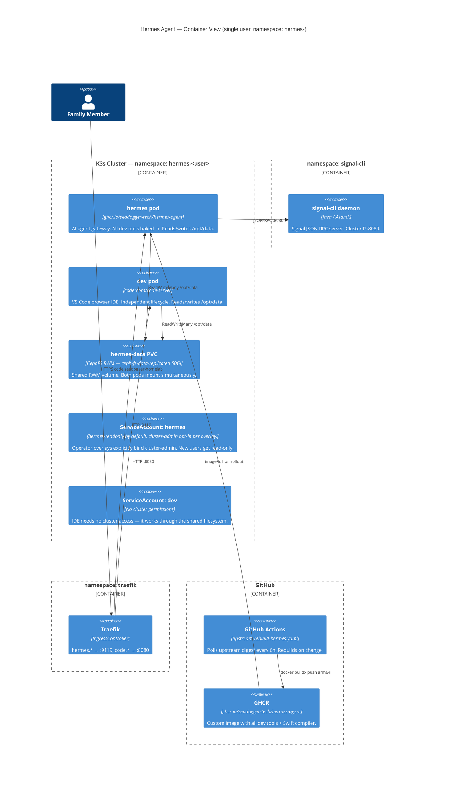
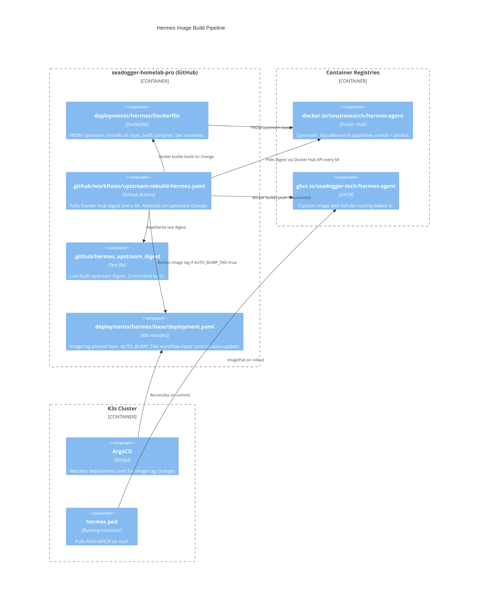

# Hermes Container Architecture

This page documents the full architecture of the Hermes agent container:
how the image is built, what tools are bundled, how state is preserved
across upgrades, the code-server IDE deployment, and the security model
including the privilege levels available to each pod.


## Design Decision: Separate Pods over Sidecar

### Options considered

**Option A — Sidecar (hermes + code-server in one pod, RWO PVC)**

Both containers in a single pod share volumes automatically. Only one pod mounts
the PVC, so `ReadWriteOnce` (RBD) works fine. Simpler manifest, fewer moving parts.

**Option B — Separate pods (hermes + dev as independent pods, RWM PVC)**

Each pod has its own lifecycle. The shared workspace requires `ReadWriteMany`
(CephFS) so both pods can mount simultaneously.

### Why Option B was chosen

The deciding factor is **update frequency**. Both hermes-agent and code-server
are under active development. When a pod restarts, every container in it restarts:

- Sidecar model: a hermes image update kills your IDE session — dropped terminals,
  lost editor state, forced reconnect. With weekly or more frequent hermes releases
  this becomes a constant disruption.
- Separate pods: hermes restarts on its own schedule, the IDE session is completely
  unaffected. code-server updates on its own schedule, the agent keeps running.

The sidecar model is the right choice when two workloads are **coupled by lifecycle**
(e.g. a log shipper that must restart with its app). hermes and code-server are
coupled by **data** (the shared workspace) but independent by lifecycle — that is
exactly the pattern that separate pods with a shared RWM volume is designed for.

The Nextcloud/Jellyfin deployment in this cluster is the same pattern: two
independent workloads, different update schedules, sharing one CephFS RWM volume.

```
Pod: hermes (namespace: hermes-<user>)      Pod: dev (namespace: hermes-<user>)
└── container: hermes-agent                 └── container: code-server
    updates independently                       updates independently
    restarts don't affect IDE                   restarts don't affect agent

         └──────── CephFS RWM PVC (/opt/data) ────────┘
                   ceph-fs-data-replicated (3× replicated)
                   both pods read/write simultaneously
```

### Why RWM over RWO

`ceph-block-data` (RBD) is `ReadWriteOnce` — Kubernetes enforces that only one
pod may mount it at a time. With two separate pods both needing `/opt/data`,
RWO would cause the second pod to fail to schedule.

`ceph-fs-data-replicated` (CephFS) is `ReadWriteMany` — multiple pods mount it
concurrently with full read/write access. It is already provisioned on this
cluster and is the correct storage class for this use case. The 3× replication
matches the existing `ceph-block-data` durability level.


## C4 Level 1 — System Context




## C4 Level 2 — Container View




## C4 Level 3 — Image Build Pipeline




## Repository Layout

```
deployments/hermes/
  Dockerfile                        # Custom image — FROM upstream + all tools
  base/                             # kustomize base — hermes agent pod
    deployment.yaml                 # image: ghcr.io/seadogger-tech/hermes-agent:<tag>
    service.yaml                    # ClusterIP :9119
    pvc.yaml                        # 50Gi CephFS RWM (ceph-fs-data-replicated)
    rbac.yaml                       # ServiceAccount + read-only ClusterRole (default)
    ingressroutes.yml               # hermes.<user>.seadogger-homelab → :9119
    certificate.yml
    kustomization.yaml
  dev/                              # kustomize base — code-server IDE pod
    deployment.yaml                 # image: codercom/code-server
    service.yaml                    # ClusterIP :8080
    rbac.yaml                       # ServiceAccount, no cluster permissions
    ingressroutes.yml               # code.<user>.seadogger-homelab → :8080
    certificate.yml
    kustomization.yaml
  overlays/
    <user>/
      kustomization.yaml            # patches namespace + hostnames + cert dnsNames
      rbac.yaml                     # cluster-admin opt-in (operator overlays only)

.github/
  hermes_upstream_digest            # last-built upstream digest (committed by CI)
  workflows/
    upstream-rebuild-hermes.yaml    # polls Docker Hub, rebuilds on change
```


## Tool Inventory

All tools baked into `ghcr.io/seadogger-tech/hermes-agent` via `deployments/hermes/Dockerfile`.

### Carried from upstream hermes-agent base
| Tool | Notes |
|------|-------|
| `curl` | HTTP client |
| `git` | Source control |
| `ssh` / `scp` | Remote access |
| `python3` (3.13) | Scripting + hermes venv |
| `node` (22) + `npm` | JavaScript runtime |
| `openssl` | TLS / cert inspection |

### Kubernetes & cluster tooling
| Tool | Notes |
|------|-------|
| `kubectl` | Pinned to match K3s version. Baked into image — no init container. |
| `gh` | GitHub CLI — PRs, issues, Actions, releases |
| `helm` | Inspect/diff Helm releases and chart values |
| `stern` | Multi-pod log tailing |
| `kustomize` | Build and diff kustomize overlays |
| `jq` | JSON parsing |
| `yq` | YAML manipulation (mikefarah binary) |

### Network & DNS
| Tool | Notes |
|------|-------|
| `dnsutils` (`dig`, `nslookup`) | DNS debugging |
| `netcat-openbsd` (`nc`) | Port/service reachability |
| `iputils-ping` | ICMP reachability |
| `traceroute` | Path tracing |

### Shell & filesystem
| Tool | Notes |
|------|-------|
| `tree` | Directory visualisation |
| `fd-find` (aliased `fd`) | Fast file finder |
| `bat` | Syntax-highlighted cat |
| `tmux` | Session multiplexer |
| `ripgrep` (`rg`) | Fast recursive grep |

### Python development
| Tool | Notes |
|------|-------|
| `uv` | Fast venv + package management |
| Django | Web framework |
| FastAPI + uvicorn | Async API framework |
| pytest | Testing |
| black / ruff | Formatting + linting |
| ipython | Interactive shell |

### JavaScript / TypeScript / React
| Tool | Notes |
|------|-------|
| `yarn`, `pnpm` | Package managers |
| TypeScript (`tsc`) | Compiler, installed globally |
| ESLint + Prettier | Linting + formatting |
| React toolchain | Available via `npx create-react-app` / `npx create vite` |

### Java
| Tool | Notes |
|------|-------|
| OpenJDK 21 (arm64) | LTS JDK |
| `gradle`, `maven` | Build tools |

### C / C++
| Tool | Notes |
|------|-------|
| `gcc` / `g++` | GNU compiler |
| `clang` / `clang++` | LLVM compiler |
| `cmake`, `make` | Build systems |
| `gdb` | Debugger |

### Swift / iOS (Linux arm64)
| Tool | Notes |
|------|-------|
| Swift toolchain | Full compiler on arm64 Linux. `swift build`, `swift test`. No UIKit/SwiftUI rendering. |
| `swiftlint` | Lint Swift source |
| `swift-format` | Auto-format Swift files |
| `fastlane` | App Store metadata, version bumps, TestFlight upload via API key |

### Security scanning
| Tool | Notes |
|------|-------|
| `trivy` | Image + filesystem vulnerability scanning |
| `grype` | Container vulnerability scanning |
| `syft` | SBOM generation |

### Deliberately excluded
| Tool | Reason |
|------|--------|
| `skopeo`, `cosign` | Situational — add when needed |
| Xcode / iOS Simulator | macOS only — cannot run on arm64 Linux |


## iOS Development Workflow

```
hermes pod (arm64 Linux)                    GitHub Actions (macOS runner)
─────────────────────────                   ─────────────────────────────
Edit Swift in code-server IDE
swiftlint → catch style issues
swift test → catch logic/type errors
swift-format → auto-format
gh pr create → open PR
                                    ←───── GHA triggers on PR / push
                                            xcodebuild archive
                                            xcodebuild -exportArchive (sign)
                                            fastlane pilot → TestFlight
gh run watch → monitor build
```

`fastlane deliver` / `fastlane pilot` can also run directly on Linux for
App Store Connect metadata and TestFlight uploads using the API key
(no Mac signing required for upload-only operations).


## State Persistence & Velero

**All state lives on the RWM PVC at `/opt/data`. Image updates never touch it.**

```
/opt/data/                          ← 50Gi CephFS RWM PVC (ceph-fs-data-replicated, 3×)
  .env                              ← ANTHROPIC_API_KEY, Signal account, gateway tokens
  auth.json                         ← Authenticated platform sessions
  config.yaml                       ← Full agent configuration
  state.db                          ← SQLite: conversation history, kanban, cron jobs
  memories/                         ← Long-term agent memory entries
  skills/                           ← Installed skill definitions
  sessions/                         ← Active session state
  cron/                             ← Scheduled agent tasks
  home/
    .ssh/                           ← SSH keys
    .git-credentials                ← Git auth tokens
    .gitconfig                      ← Git identity
    .config/gh/                     ← gh CLI auth
  google_token.json                 ← Google OAuth refresh token
  home/.local/share/code-server/    ← VS Code extensions + settings (persists across restarts)
```

### What changes on image update

| Layer | Behaviour |
|-------|-----------|
| Container filesystem (tools, binaries, OS) | Replaced by new image |
| `/opt/data` PVC | **Unchanged** — remounted as-is, zero data loss |
| VS Code extensions + settings | On PVC — persist across code-server restarts |
| Agent credentials + config | Read from PVC on startup — no re-provisioning needed |

### Velero coverage

`hermes-data` PVC uses `ceph-fs-data-replicated` (CephFS). The Ceph CSI driver
snapshots CephFS volumes as point-in-time clones — Velero captures the full PVC
contents including all state listed above. Container images are not snapshotted
(correct — they are reproducible from GHCR).

Restore path after cluster loss:
1. Velero restores the PVC from snapshot
2. ArgoCD reconciles both deployments (hermes + dev)
3. Both pods start and mount the restored PVC — agent and IDE resume with full state


## Security Model & RBAC

### Default: least-privilege

The base RBAC creates a ServiceAccount with a read-only ClusterRole.
New user overlays inherit this automatically — the agent can observe
the cluster but cannot modify anything.

```yaml
# base/rbac.yaml — default for all users
apiVersion: rbac.authorization.k8s.io/v1
kind: ClusterRole
metadata:
  name: hermes-readonly
rules:
  - apiGroups: ["*"]
    resources: ["*"]
    verbs: ["get", "list", "watch"]
```

### Opt-in: cluster-admin

Operator overlays explicitly add a `ClusterRoleBinding` to `cluster-admin`
in their overlay `rbac.yaml`. This is a named, deliberate, per-overlay
decision — not an inherited default.

### dev ServiceAccount

The code-server pod uses a separate ServiceAccount with **no cluster permissions**.
The IDE accesses the cluster only through the shared filesystem — it does not
need direct API access. This limits blast radius if code-server is compromised.

### RBAC summary

| Pod | ServiceAccount | Permissions | When |
|-----|---------------|-------------|------|
| hermes | `hermes` | `hermes-readonly` ClusterRole | Default (all users) |
| hermes | `hermes` | `cluster-admin` | Explicit opt-in (operator overlays) |
| dev | `dev` | None | Always — IDE needs no cluster API access |

### Risk register

| Risk | Impact | Mitigation |
|------|--------|------------|
| Pod compromise (RCE in hermes image) | cluster-admin overlay: full cluster control | Image rebuilt on every upstream change; SIGNAL_ALLOWED_USERS gating |
| Prompt injection via Signal/Telegram | Destructive kubectl command executed | Allowlist gating; agent confirms before destructive ops |
| PVC credential exfiltration | .env, auth.json, Google tokens exposed | Both pods are in the same namespace; access controlled at namespace level |
| Unauthorised code-server access | Full filesystem access via browser IDE | Internal IngressRoute only; protected by internal CA TLS |
| hermes restart kills IDE session | **Not a risk** — separate pods, independent lifecycles | By design |


## Portal Integration

| Tile | URL | Replaces |
|------|-----|---------|
| Hermes | `hermes.seadogger-homelab` | Existing — no change |
| Code | `code.seadogger-homelab` | Replaces Terminal tile |

The standalone terminal deployment (`core/deployments/terminal/`) is retired.
The code-server built-in terminal provides a superior experience — already inside
the pod, full dev tooling on PATH, persistent tmux sessions on the PVC.


## Upgrade Runbook

### Update a tool (Dockerfile change)
```bash
# Edit deployments/hermes/Dockerfile, commit to Pro repo
# GHA rebuilds and pushes new GHCR image automatically

# Manually bump tag in deployment.yaml (AUTO_BUMP_TAG=false by default):
git add deployments/hermes/base/deployment.yaml
git commit -m "chore(pro): bump hermes-agent to <new-tag>"
git push
# ArgoCD rolls hermes pod only — code-server IDE unaffected
```

### Force deploy without ArgoCD wait
```bash
kubectl apply -k /Users/jason/Desktop/Development/seadogger-homelab-pro/deployments/hermes/overlays/<user>/
kubectl -n hermes-<user> rollout restart deploy/hermes
kubectl -n hermes-<user> rollout status deploy/hermes --timeout=300s
# dev pod continues running throughout
```

### Force ArgoCD sync
```bash
kubectl -n argocd patch app hermes-<user> --type merge \
  -p '{"operation":{"initiatedBy":{"username":"admin"},"sync":{"revision":"HEAD","prune":true}}}'
```
