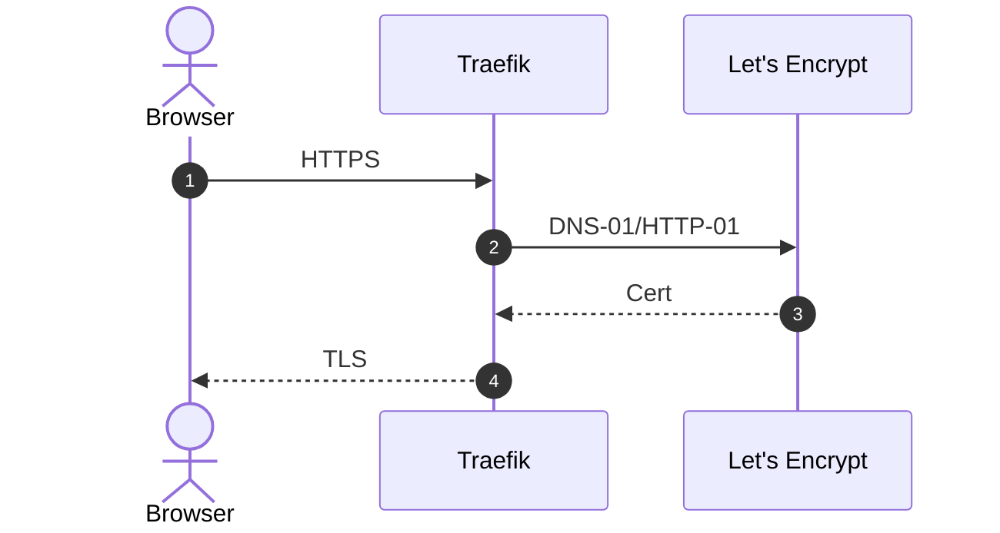

# Security & Certificates

%%{init: {'theme': 'neutral', 'themeVariables': {
  'primaryColor': '#1f2937',      'primaryTextColor': '#e5e7eb',
  'secondaryColor': '#0ea5e9',    'tertiaryColor': '#111827',
  'lineColor': '#7c3aed',         'noteBkgColor': '#111827',
  'noteTextColor': '#e5e7eb'
}}}%%

