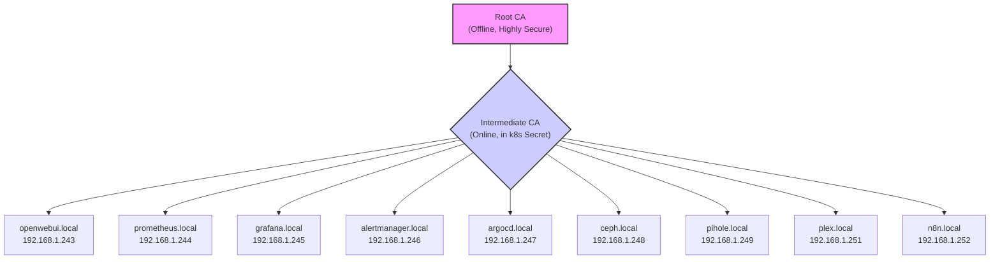
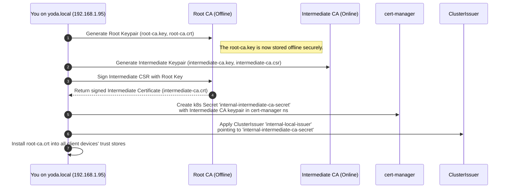
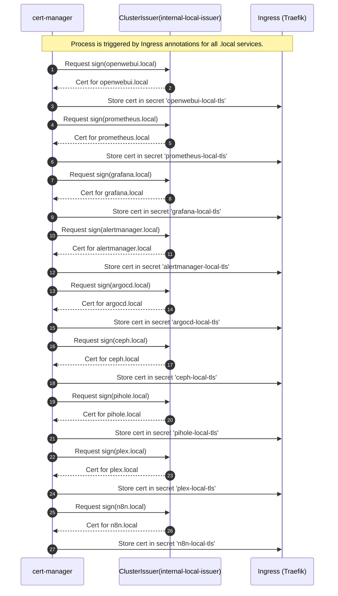
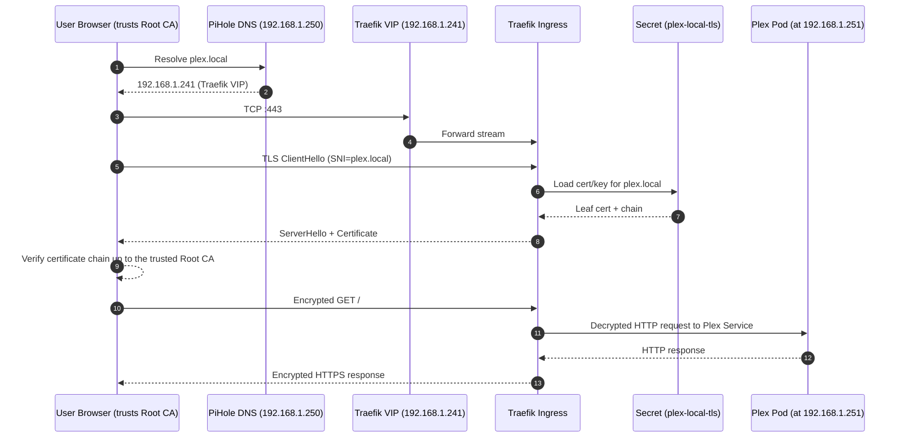
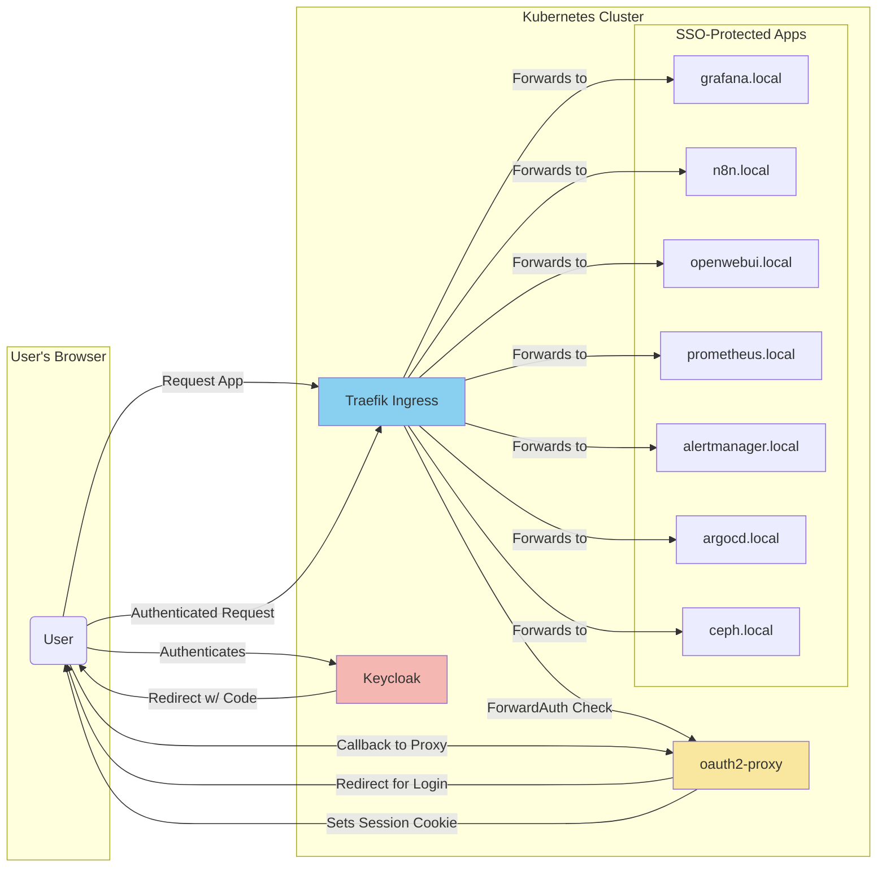
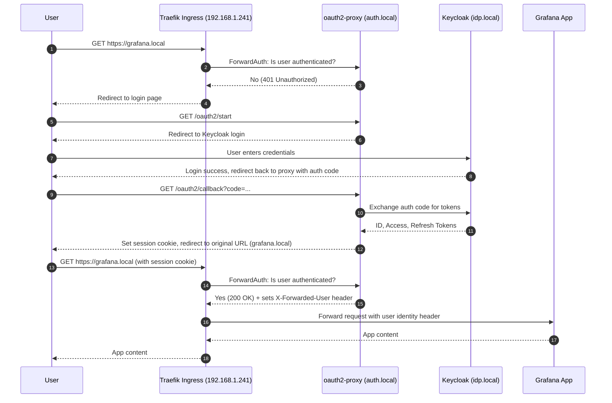
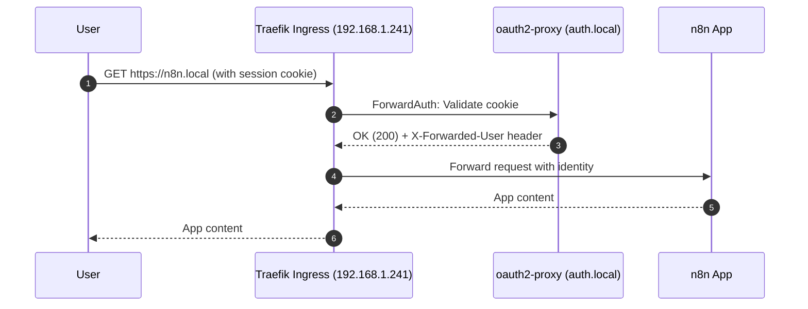
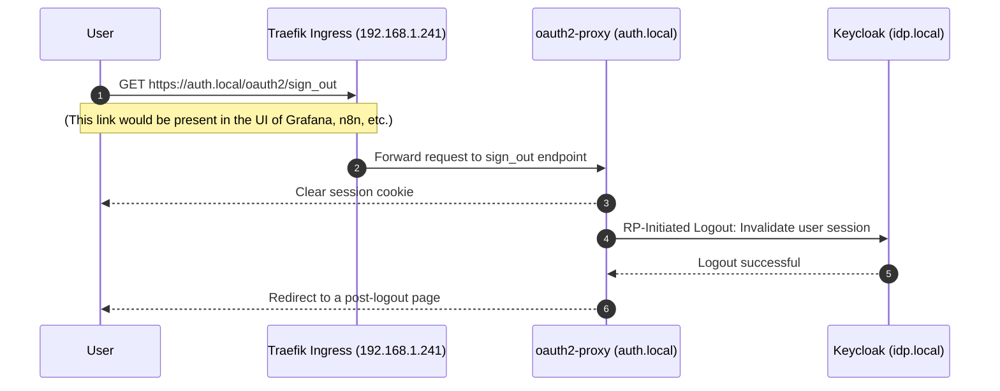

# Internal PKI and HTTPS Data Flow Architecture
## Date: 2025-08-12

This document outlines the definitive architecture for issuing and using TLS certificates for all internal services within the Kubernetes cluster. It follows the best practice of using a dedicated **Intermediate Certificate Authority (CA)** to sign service certificates, keeping the Root CA offline and secure. All internal services will use the `.local` top-level domain.

### 1. The CA Hierarchy and Full Service List

A two-tier trust chain will be established. The Intermediate CA will sign leaf certificates for the following exhaustive list of services:

### 2. Bootstrap the Private CA Hierarchy

This is a one-time setup process performed on `yoda.local` (192.168.1.95).

#### Certificate Generation and Secret Management

**Secret Names:**
- Root CA Secret: `internal-root-ca-secret`
- Intermediate CA Secret: `internal-intermediate-ca-secret`
- ClusterIssuer Name: `internal-local-issuer`

**Certificate Generation Parameters**

To ensure broad compatibility and security, the following certificate generation parameters have been standardized:

1. **Root CA**
   - Key Type: RSA
   - Key Length: 4096 bits
   - Validity Period: 10 years
   - Signature Algorithm: SHA-256
   - Secret Name: `internal-root-ca-secret`

2. **Intermediate CA**
   - Key Type: RSA
   - Key Length: 2048 bits
   - Validity Period: 2 years
   - Signature Algorithm: SHA-256
   - Secret Name: `internal-intermediate-ca-secret`

3. **Leaf Certificates**
   - Key Type: RSA
   - Key Length: 2048 bits
   - Validity Period: 1 year
   - Signature Algorithm: SHA-256
   - Secret Name Pattern: `{service-name}-local-tls`

These parameters ensure:
- Compatibility with modern browsers (Safari, Chrome)
- Strong cryptographic security
- Manageable certificate rotation cycles

### 3. Issuing All Leaf Certificates

This diagram shows the complete, exhaustive flow for issuing a certificate to every service.

### 4. HTTPS Request Path (Example: `plex.local`)

This flow is identical for all services. The user's browser connects to the single Traefik VIP, which then routes the request to the correct internal service IP.

---
# Next Steps: SSO Implementation Plan

This section outlines the plan for implementing Single Sign-On (SSO) using Keycloak as the Identity Provider (IdP), enforced at the edge by `oauth2-proxy` and Traefik's `ForwardAuth` middleware.

## Goal

Centralize login with Keycloak, enforce it uniformly at the edge with `oauth2-proxy` + Traefik, and pass user identity to backend applications via HTTP headers.

## Architecture and Hostnames

*   **Keycloak (IdP):** `idp.local` (will be assigned a new VIP, e.g., 192.168.1.253)
*   **oauth2-proxy:** `auth.local` (internal service, no dedicated VIP)
*   **Traefik (Ingress):** `192.168.1.241` (existing VIP)
*   **Protected Applications:** `grafana.local`, `n8n.local`, `openwebui.local`, `prometheus.local`, `alertmanager.local`, `argocd.local`, `ceph.local`.

### SSO Component Block Diagram

This diagram shows the high-level relationship between the components and explicitly lists all applications that will be protected.

## SSO Login Flow (First Time Access)

This diagram shows a user accessing a protected application (`grafana.local`) for the first time.

## Authenticated Request Flow

Once the user has a valid session cookie, every subsequent request is validated quickly at the edge.

## Global Logout Flow

This shows how logging out from one application logs the user out of the entire SSO session.

